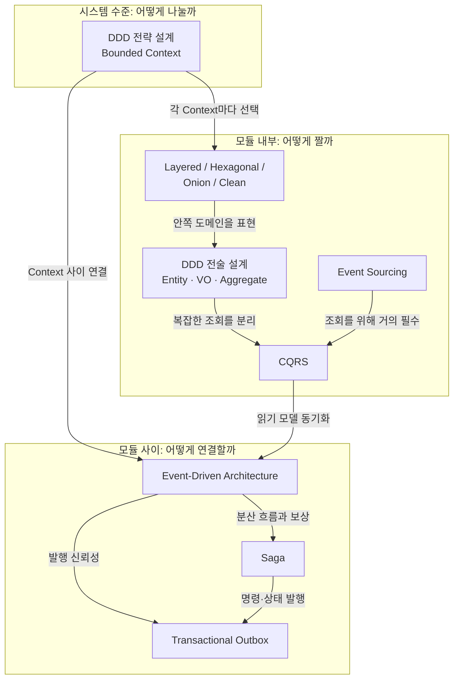
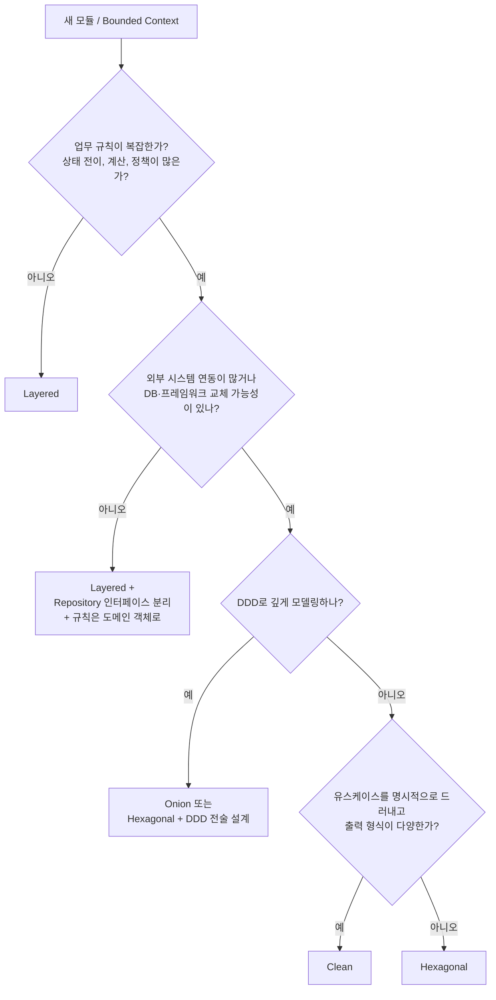
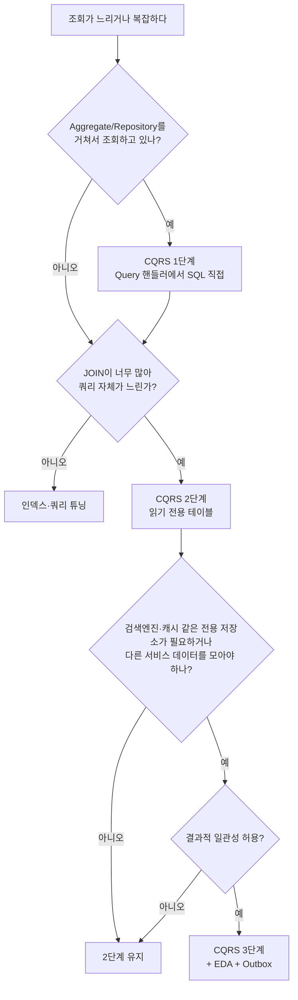
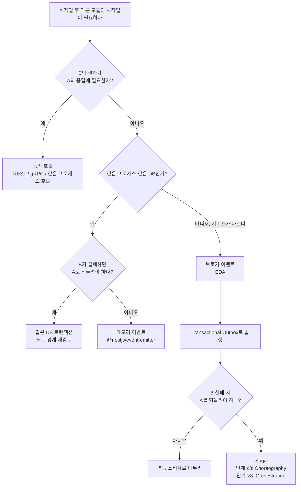
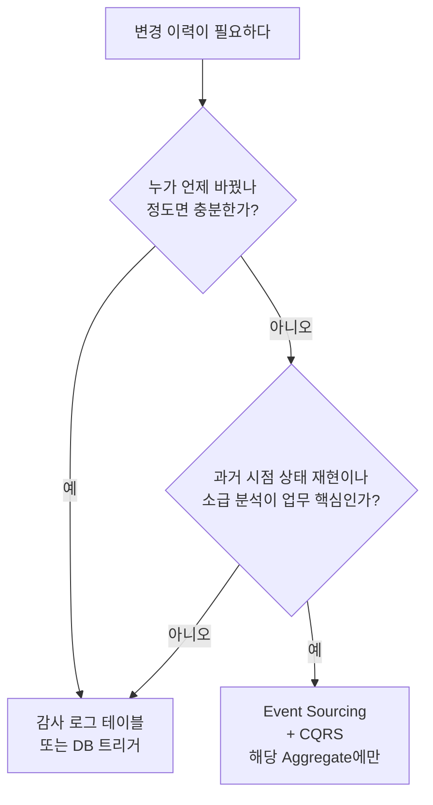

# 백엔드 아키텍처 선택 가이드

## 1. 이 문서의 목적

지금까지 살펴본 패턴들은 **서로 대체재가 아닙니다.** 각자 다른 질문에 답하기 때문에 **함께 조합해서** 씁니다. 이 문서는 각 패턴이 어떤 질문에 답하는지 정리하고, 상황에 따라 무엇을 얼마나 적용할지 고르는 기준을 제시합니다.

| 패턴 | 답하는 질문 | 문서 |
|---|---|---|
| DDD 전략 설계 | 시스템을 **어떤 경계로 나눌까?** | [[ddd]], [[ddd-strategic-design]] |
| DDD 전술 설계 | 경계 안의 **업무 규칙을 어떻게 코드로 표현할까?** | [[ddd-tactical-design]], [[ddd-aggregate]] |
| Layered / Hexagonal / Onion / Clean | 한 모듈 안의 **코드를 어떻게 배치하고, 의존을 어느 방향으로 둘까?** | [[layered-architecture]], [[hexagonal-architecture]], [[onion-architecture]], [[clean-architecture]], [[layered-vs-hexagonal-vs-onion-vs-clean]] |
| CQRS | **쓰기와 읽기를 같은 모델로 할까, 나눌까?** | [[cqrs]] |
| Event Sourcing | **현재 상태를 저장할까, 사건 이력을 저장할까?** | [[event-sourcing]] |
| Event-Driven Architecture | 컴포넌트끼리 **직접 호출할까, 이벤트로 알릴까?** | [[event-driven-architecture]] |
| Transactional Outbox | **저장과 이벤트 발행을 어떻게 함께 보장할까?** | [[transactional-outbox]] |
| Saga | 여러 서비스에 걸친 **흐름이 중간에 실패하면 어떻게 되돌릴까?** | [[saga-pattern]] |

## 2. 패턴들의 관계



읽는 방법은 이렇습니다.

1. **DDD 전략 설계**로 시스템을 Bounded Context로 나눕니다.
2. Context마다 복잡도에 맞는 **코드 구조**(Layered ~ Clean)를 고릅니다.
3. 복잡한 Context 안에서는 **DDD 전술 설계**로 도메인을 표현하고, 필요하면 **CQRS**, 드물게 **Event Sourcing**을 더합니다.
4. Context 사이는 **EDA**로 연결하고, 신뢰성은 **Outbox**, 분산 흐름은 **Saga**로 보완합니다.

## 3. 패턴별 도입 비용과 효과

| 패턴 | 도입 비용 | 운영 비용 | 효과가 큰 조건 | 과한 조건 |
|---|---|---|---|---|
| Layered | 매우 낮음 | 낮음 | CRUD, MVP | 규칙이 복잡하고 외부 연동이 많을 때 |
| Hexagonal | 중간 | 낮음 | 외부 연동이 많다, 테스트가 중요하다 | 단순 CRUD |
| Onion | 중간~높음 | 낮음 | DDD로 깊게 모델링한다 | 도메인 규칙이 적다 |
| Clean | 중간~높음 | 낮음 | 유스케이스가 많고 출력 형식이 다양하다 | 단순 API |
| DDD 전략 설계 | 중간 (대화 비용) | 낮음 | 여러 팀, 여러 부서의 업무가 얽혀 있다 | 1인 프로젝트, 단일 기능 |
| DDD 전술 설계 | 중간~높음 | 낮음 | 업무 규칙이 복잡한 Core 도메인 | Supporting, Generic 영역 |
| CQRS 1단계 | 낮음 | 낮음 | 조회가 복잡하다 | 화면과 테이블이 같은 모양 |
| CQRS 3단계 | 높음 | 높음 | 읽기 트래픽이 압도적, 전용 검색 저장소 필요 | 즉시 일관성이 필요 |
| Event Sourcing | 매우 높음 | 높음 | 이력 자체가 업무 가치 (원장, 감사) | 대부분의 일반 도메인 |
| EDA (모놀리스 내부) | 낮음 | 낮음 | 후속 작업 분리 | - |
| EDA (서비스 간 + 브로커) | 중간~높음 | 높음 | 여러 서비스가 한 사건에 반응 | 서비스가 하나뿐 |
| Transactional Outbox | 중간 | 중간 | 이벤트 유실이 업무 피해로 이어진다 | 메모리 이벤트로 충분 |
| Saga | 높음 | 높음 | 여러 서비스에 걸친 흐름 + 실패 시 보상 | 하나의 DB 트랜잭션으로 해결 가능 |

## 4. 상황별 선택

### 4-1. 시작점: 코드 구조 고르기



### 4-2. 조회가 문제일 때



### 4-3. 다른 모듈/서비스와 연결할 때



### 4-4. 이력이 중요할 때



## 5. 프로젝트 단계별 진화 경로

처음부터 모든 패턴을 쓰면 비용만 크고, 경계를 잘못 잡았을 때 되돌리기도 어렵습니다. **문제가 실제로 생겼을 때 다음 단계로** 갑니다.

```text
1단계: MVP / 초기
  - Layered
  - 모놀리스, DB 하나
  - 폴더는 업무 기준으로 (order/, payment/ ...)
        │  규칙이 늘고, 테스트가 무거워지고, 서비스가 비대해진다
        ▼
2단계: 성장기
  - 모듈 경계 정리 (DDD 전략 설계, 모듈러 모놀리스)
  - Core 모듈만 Hexagonal/Onion + 도메인 객체에 규칙 이동
  - 조회는 CQRS 1단계 (Query 핸들러 분리)
  - 후속 작업은 메모리 이벤트로 분리
        │  팀이 늘고, 배포가 충돌하고, 특정 모듈만 트래픽이 크다
        ▼
3단계: 확장기
  - 일부 Context를 서비스로 분리
  - 서비스 간 연결은 EDA (Kafka 등) + Transactional Outbox
  - 서비스에 걸친 흐름은 Saga
  - 대량 조회는 CQRS 2~3단계
        │  감사, 규제, 이력 분석이 업무 핵심인 영역이 있다
        ▼
4단계: 특수 요구
  - 해당 Aggregate에만 Event Sourcing
```

| 신호 | 다음에 고려할 것 |
|---|---|
| 서비스 클래스가 수천 줄이다 | 도메인 객체로 규칙 이동, 유스케이스별 분리 |
| 서비스 테스트에 DB가 필요하다 | Repository 인터페이스 분리 (Hexagonal) |
| 같은 단어를 팀마다 다르게 쓴다 | DDD 전략 설계, Bounded Context |
| 목록 화면 때문에 엔티티에 필드가 늘어난다 | CQRS 1단계 |
| 한 기능 장애가 주문까지 실패시킨다 | 이벤트로 후속 작업 분리 (EDA) |
| 가끔 이벤트가 사라진다 | Transactional Outbox |
| 서비스 A는 성공, 서비스 B는 실패해서 데이터가 어긋난다 | Saga |
| "그때 왜 이 상태였는지" 설명할 수 없다 | 감사 로그, 필요하면 Event Sourcing |

## 6. 대표 조합 예시

### 6-1. 스타트업 쇼핑몰 MVP

```text
구조:   Layered, 모놀리스, PostgreSQL 하나
이벤트: 없음 또는 메모리 이벤트 (주문 후 메일 발송)
조회:   ORM으로 직접
```

빠르게 만들고 검증하는 것이 목표입니다. 복잡한 패턴은 비용입니다.

### 6-2. 성장한 커머스 (모듈러 모놀리스)

```text
src/
├── ordering/    Hexagonal + DDD 전술 + CQRS 1단계     (Core)
├── payment/     Hexagonal (외부 PG 어댑터 + ACL)
├── catalog/     Layered + CQRS 2단계 (상품 목록 읽기 테이블)
├── admin/       Layered
└── notification/ Layered (메모리 이벤트 구독)

연결: @nestjs/event-emitter + Outbox 테이블 (서비스 분리 대비)
```

### 6-3. 마이크로서비스 커머스

```text
주문 서비스    Onion/Clean + DDD + CQRS + Outbox + 주문 Saga 오케스트레이터
재고 서비스    Hexagonal + Saga 참여자 (멱등한 예약/해제)
결제 서비스    Hexagonal + ACL (PG 연동) + Saga 참여자
배송 서비스    Hexagonal + EDA 구독
검색 서비스    CQRS 읽기 전용 (Elasticsearch, 이벤트로 동기화)
알림 서비스    Layered + EDA 구독

연결: Kafka + Outbox(Debezium) + 멱등 소비자 + DLQ + 분산 추적
```

### 6-4. 핀테크 원장 시스템

```text
계좌/원장      Event Sourcing + CQRS (모든 거래 이력이 원본)
송금           Saga (출금 계좌 → 입금 계좌, 실패 시 보상)
고객 정보      Layered (개인정보는 이벤트 밖에 저장)
리포트         CQRS 읽기 모델 (Projection으로 일별 잔액, 거래 통계)
```

## 7. 흔한 실수

| 실수 | 결과 | 대안 |
|---|---|---|
| 유행이라 처음부터 전부 도입 | 기능 하나에 파일 수십 개, 개발 속도 급감 | 문제가 생겼을 때 해당 패턴만 도입 |
| 모든 모듈에 같은 구조 강제 | 단순 모듈에도 비용 발생 | Context별 복잡도에 맞게 선택 |
| 경계 없이 마이크로서비스로 쪼갬 | 분산 모놀리스, Saga 지옥 | 모듈러 모놀리스로 경계를 먼저 검증 |
| CQRS = Event Sourcing으로 오해 | 불필요하게 Event Sourcing 도입 | CQRS 1단계만으로도 충분한 경우가 대부분 |
| EDA를 쓰면서 Outbox, 멱등성 생략 | 이벤트 유실, 중복 처리로 데이터 오류 | Outbox + 멱등 소비자는 세트 |
| 즉시 일관성이 필요한 곳에 비동기 이벤트 | "방금 결제했는데 주문이 없어요" | 그 부분은 동기 호출이나 같은 트랜잭션 |
| 패턴 이름을 붙였지만 의존 방향은 그대로 | Hexagonal 폴더 안에서 TypeORM import | import 방향을 린트로 검사 |

## 8. 체크리스트

새 기능이나 모듈을 설계할 때 순서대로 확인합니다.

- [ ] 이 기능은 어느 **Bounded Context**에 속하는가? 다른 Context와 단어 뜻이 다르지 않은가?
- [ ] 이 Context는 **Core / Supporting / Generic** 중 무엇인가?
- [ ] 업무 규칙이 복잡한가? → 복잡하면 **도메인 객체에 규칙**을, 아니면 Layered로
- [ ] 외부 시스템 의존이 있는가? → 있으면 **포트(인터페이스) + 어댑터**로 분리
- [ ] 조회 화면이 쓰기 모델과 모양이 많이 다른가? → **CQRS 1단계**부터
- [ ] 다른 모듈이 이 기능의 결과에 반응해야 하는가? → **이벤트**
- [ ] 이벤트가 유실되면 업무 피해가 있는가? → **Outbox + 멱등 소비자**
- [ ] 여러 서비스에 걸친 흐름이 실패 시 되돌려져야 하는가? → **Saga**
- [ ] 과거 시점 재현이 업무 핵심인가? → 그때만 **Event Sourcing**
- [ ] 각 결정에 대해 "**지금 이 문제가 실제로 있는가?**"를 다시 물었는가?

## 9. 핵심 정리

> 백엔드 설계 패턴들은 서로 대체재가 아니라 다른 질문에 답하는 도구다. DDD 전략 설계로 시스템의 경계를 나누고, 각 경계 안에서는 복잡도에 맞춰 Layered부터 Hexagonal·Onion·Clean까지 코드 구조를 고르며, 복잡한 도메인은 DDD 전술 설계로 표현한다. 조회가 문제면 CQRS를 단계적으로, 이력이 업무 가치면 그 영역에만 Event Sourcing을 쓴다. 경계 사이는 EDA로 느슨하게 연결하되 Outbox와 멱등 소비자로 신뢰성을 확보하고, 실패 시 되돌려야 하는 분산 흐름은 Saga로 다룬다. 가장 중요한 원칙은 지금 실제로 겪는 문제에 맞는 패턴만, 필요한 만큼만 도입하는 것이다.
