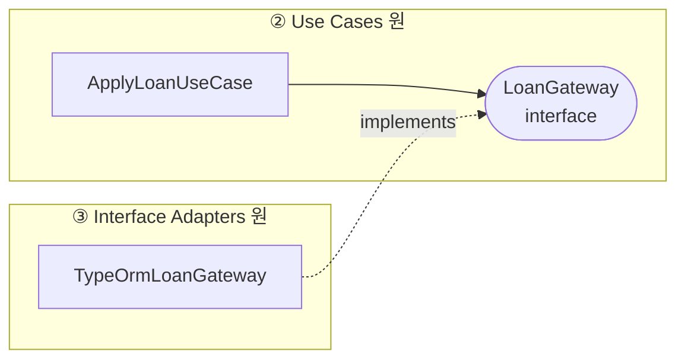
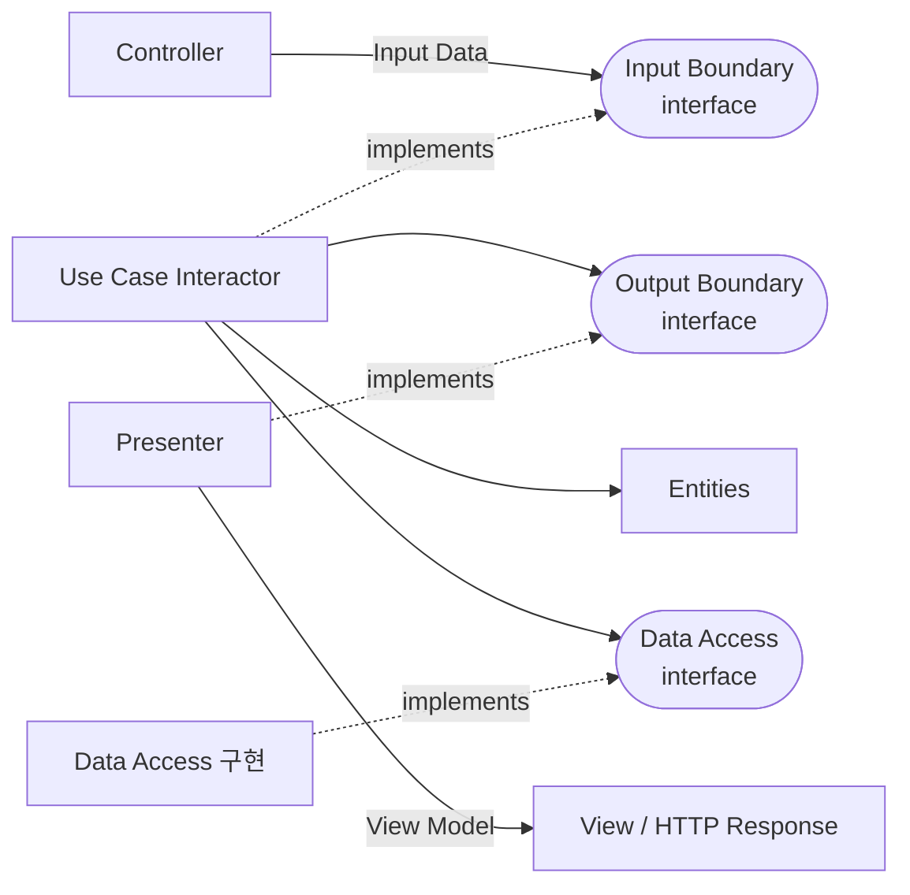
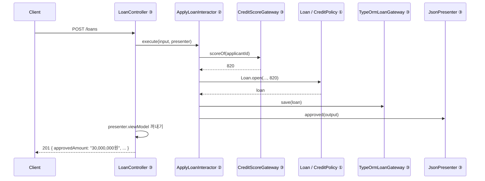
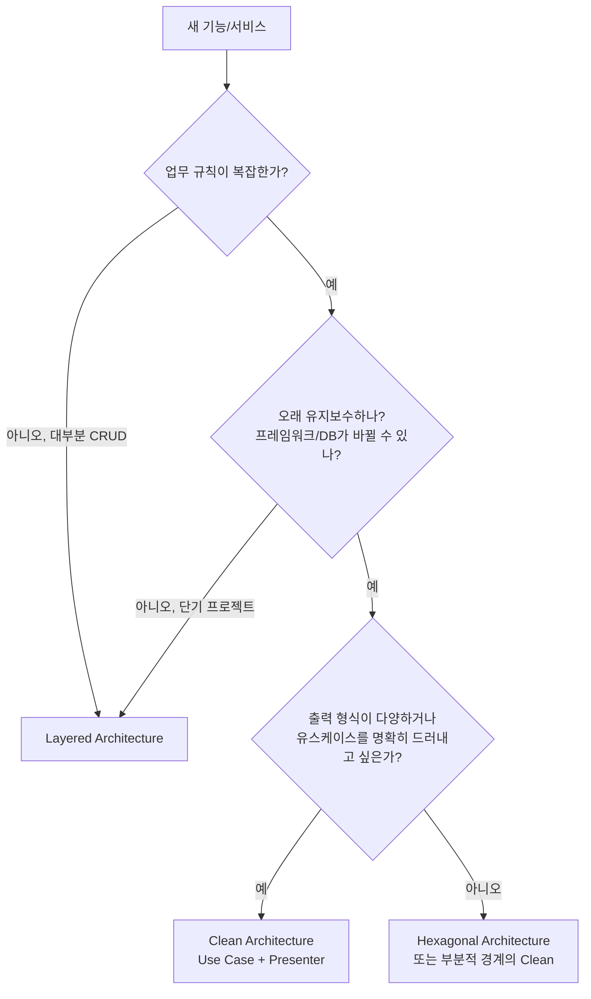

# Clean Architecture (클린 아키텍처)

## 1. Clean Architecture란?

**Clean Architecture**는 로버트 C. 마틴(Robert C. Martin, 흔히 "엉클 밥")이 2012년 블로그 글로 소개하고, 2017년 책 *Clean Architecture*로 정리한 소프트웨어 구조입니다.

핵심은 단 하나의 규칙입니다.

> **소스 코드의 의존성은 반드시 안쪽(고수준 정책)으로만 향해야 한다.**

이것을 **의존성 규칙(The Dependency Rule)**이라고 합니다. Clean Architecture의 나머지 내용은 전부 이 규칙을 어떻게 지킬지에 대한 설명입니다.

```text
┌──────────────────────────────────────────────────┐
│ ④ Frameworks & Drivers                           │
│    Nest.js, Express, TypeORM, PostgreSQL, Redis  │
│  ┌────────────────────────────────────────────┐  │
│  │ ③ Interface Adapters                       │  │
│  │    Controller, Presenter, Gateway(Repo 구현)│  │
│  │  ┌──────────────────────────────────────┐  │  │
│  │  │ ② Use Cases                          │  │  │
│  │  │    애플리케이션 고유의 업무 흐름     │  │  │
│  │  │  ┌────────────────────────────────┐  │  │  │
│  │  │  │ ① Entities                     │  │  │  │
│  │  │  │    핵심 업무 규칙              │  │  │  │
│  │  │  └────────────────────────────────┘  │  │  │
│  │  └──────────────────────────────────────┘  │  │
│  └────────────────────────────────────────────┘  │
└──────────────────────────────────────────────────┘
        의존성: 바깥 ──────> 안쪽 (반대 방향 금지)
```

안쪽으로 갈수록 **추상적이고 오래 변하지 않는 것**, 바깥으로 갈수록 **구체적이고 자주 바뀌는 것**이 위치합니다.

## 2. 왜 이런 구조가 나왔을까?

### 2-1. 좋은 아키텍처의 목표

엉클 밥은 좋은 아키텍처의 목표를 이렇게 정의합니다.

> 시스템을 만들고 유지보수하는 데 드는 **인력을 최소화**하는 것.

그리고 그 방법으로 **"결정을 미룰 수 있게 하라"**고 말합니다.

| 미룰 수 있어야 하는 결정 | 이유 |
|---|---|
| 어떤 DB를 쓸지 | 초기에는 데이터 접근 패턴을 모른다 |
| 어떤 웹 프레임워크를 쓸지 | 프레임워크는 도구일 뿐 업무와 무관하다 |
| REST로 할지 gRPC로 할지 | 전달 방식은 업무 규칙과 무관하다 |
| 어떤 외부 서비스를 쓸지 | 계약 조건, 비용에 따라 바뀐다 |

비즈니스 규칙이 이런 세부 사항에 의존하지 않으면, 세부 사항은 나중에 정하거나 언제든 바꿀 수 있습니다.

### 2-2. 세부 사항(Details)이라는 관점

Clean Architecture는 이렇게 주장합니다.

> **데이터베이스는 세부 사항이다. 웹은 세부 사항이다. 프레임워크는 세부 사항이다.**

처음 들으면 어색합니다. DB 없이 서비스가 돌아가나요? 물론 실제로는 DB가 필요합니다. 하지만 **"주문 총액은 50만 원을 넘을 수 없다"**는 규칙은 데이터를 MySQL에 저장하든, 엑셀에 저장하든, 종이에 적든 똑같이 지켜져야 합니다. 업무 규칙 입장에서 저장 방식은 갈아 끼울 수 있는 부품입니다.

### 2-3. 기존 아키텍처들의 공통점 정리

Clean Architecture는 이전에 나온 아키텍처들의 **공통점을 하나로 정리한 것**입니다.

| 기존 아키텍처 | 공통점 |
|---|---|
| [[hexagonal-architecture\|Hexagonal Architecture]] (2005) | 비즈니스를 가운데, 기술을 바깥에 |
| [[onion-architecture\|Onion Architecture]] (2008) | 동심원 계층, 의존은 안쪽으로 |
| DCI, BCE 등 | 유스케이스 중심 설계 |

이들 모두 다음 성질을 가진 시스템을 만들려고 합니다.

- **프레임워크 독립적**: 프레임워크를 도구로 쓸 뿐, 시스템을 프레임워크에 맞추지 않는다
- **테스트 가능**: UI, DB, 웹 서버 없이 비즈니스 규칙을 테스트할 수 있다
- **UI 독립적**: 웹 UI를 콘솔 UI로 바꿔도 비즈니스 규칙은 그대로다
- **DB 독립적**: PostgreSQL을 MongoDB로 바꿔도 비즈니스 규칙은 그대로다
- **외부 에이전시 독립적**: 비즈니스 규칙은 바깥 세상을 전혀 모른다

## 3. 네 개의 동심원

### 3-1. ① Entities (엔티티): 핵심 업무 규칙

**Entities**는 **컴퓨터가 없어도 존재하는 업무 규칙**입니다. 엉클 밥은 이것을 **핵심 업무 규칙(Critical Business Rules)**이라고 부릅니다.

은행을 예로 들면 "대출 이자는 원금 × 이율 × 기간으로 계산한다"는 규칙은 은행 직원이 종이와 계산기로 처리하던 시절에도 있었습니다. 소프트웨어는 그걸 자동화했을 뿐입니다.

```typescript
// entities/loan.ts
// 프레임워크, DB, HTTP를 전혀 모른다. 순수 TypeScript.
export class Loan {
  constructor(
    readonly principal: number,   // 원금
    readonly annualRate: number,  // 연 이율 (예: 0.05)
    private balance: number,
  ) {}

  monthlyInterest(): number {
    return Math.floor((this.balance * this.annualRate) / 12);
  }

  repay(amount: number): void {
    if (amount <= 0) throw new InvalidRepaymentError(amount);
    if (amount > this.balance) throw new OverRepaymentError(amount, this.balance);
    this.balance -= amount;
  }
}
```

> 주의: Clean Architecture의 "Entity"는 [[ddd-tactical-design|DDD의 Entity]](ID로 구별되는 객체)나 TypeORM의 `@Entity`(테이블 매핑)와 **다른 개념**입니다. 여기서는 "핵심 업무 규칙을 담은 객체나 함수의 모음" 전체를 가리킵니다. DDD의 Entity, Value Object, Aggregate, Domain Service가 모두 이 원에 들어갑니다.

### 3-2. ② Use Cases (유스케이스): 애플리케이션 업무 규칙

**Use Cases**는 **이 애플리케이션이기 때문에 존재하는 업무 흐름**입니다. 엉클 밥은 이것을 **애플리케이션 업무 규칙(Application-specific Business Rules)**이라고 부릅니다.

같은 대출 규칙(Entity)을 쓰더라도 "모바일 앱에서 대출 신청하기"라는 흐름은 소프트웨어가 있어야 생깁니다.

```text
대출 신청하기 유스케이스
1. 신청자의 신용 점수를 조회한다
2. 신용 점수가 500점 미만이면 거절한다
3. 대출 한도를 계산한다 (Entity 규칙 사용)
4. 대출을 생성하고 저장한다
5. 승인 결과를 돌려준다
```

유스케이스가 하는 일은 다음과 같습니다.

- Entity들을 꺼내고, Entity의 규칙을 실행시키고, 결과를 저장하는 **흐름을 조율**합니다.
- 입력 데이터를 받고 출력 데이터를 돌려줍니다.
- HTTP, JSON, SQL 같은 단어는 전혀 등장하지 않습니다.

| 구분 | Entities | Use Cases |
|---|---|---|
| 질문 | 업무의 본질적 규칙은? | 이 앱에서 사용자가 하는 일은? |
| 예 | 이자 계산, 잔액은 음수 불가 | 대출 신청, 대출 상환, 한도 조회 |
| 변경 이유 | 업무 자체가 바뀔 때 (드물다) | 앱의 기능이 바뀔 때 |
| 재사용 | 여러 앱에서 재사용 가능 | 이 앱 전용 |

### 3-3. ③ Interface Adapters (인터페이스 어댑터): 변환기

**Interface Adapters**는 **안쪽(유스케이스, 엔티티)이 쓰기 편한 형식과 바깥(웹, DB)이 쓰기 편한 형식 사이를 변환**합니다.

| 구성 요소 | 방향 | 하는 일 |
|---|---|---|
| **Controller** | 바깥 → 안 | HTTP 요청을 유스케이스 입력 데이터로 변환 |
| **Presenter** | 안 → 바깥 | 유스케이스 출력 데이터를 화면/응답용 형식(ViewModel)으로 변환 |
| **Gateway** | 안 ↔ 바깥 | 유스케이스가 정의한 저장 인터페이스를 구현해 SQL/ORM으로 변환 |

통역사에 비유할 수 있습니다. 안쪽은 "업무 언어"만, 바깥은 "기술 언어(HTTP, SQL)"만 말합니다. 어댑터가 둘 사이를 통역합니다.

### 3-4. ④ Frameworks & Drivers (프레임워크와 드라이버): 세부 사항

가장 바깥 원입니다. **Nest.js, Express, TypeORM, PostgreSQL 드라이버, Redis 클라이언트, AWS SDK** 등이 여기 있습니다.

이 원에는 코드를 거의 쓰지 않습니다. 프레임워크 설정, DB 연결 설정, 서버 시작 코드 정도가 들어갑니다. 엉클 밥은 이것을 **"접착 코드(glue code)"**라고 부릅니다.

### 3-5. 원은 꼭 4개여야 할까?

아닙니다. 엉클 밥도 "네 개라는 숫자에 특별한 의미는 없다"고 말합니다. 프로젝트에 따라 원이 더 많거나 적을 수 있습니다. **지켜야 하는 것은 의존성 규칙 하나**입니다.

## 4. 의존성 규칙 자세히 보기

### 4-1. 규칙

> 안쪽 원은 바깥쪽 원에 대해 **아무것도 몰라야** 한다.
> 바깥 원에서 선언된 **이름**(클래스, 함수, 변수, 타입)은 안쪽 원 코드에 **등장해서는 안 된다**.

```typescript
// (X) Use Case가 바깥 원의 이름을 알고 있다
import { Repository } from 'typeorm';             // ④ Frameworks
import { Request } from 'express';                // ④ Frameworks
import { LoanOrmEntity } from '../db/loan.orm';   // ③ Adapters

export class ApplyLoanUseCase {
  constructor(private repo: Repository<LoanOrmEntity>) {}
  async execute(req: Request) { /* ... */ }
}
```

```typescript
// (O) Use Case는 자기 원과 안쪽 원의 이름만 안다
import { Loan } from '../entities/loan';                       // ① 안쪽
import { LoanGateway } from './ports/loan.gateway';            // ② 같은 원
import { ApplyLoanInput, ApplyLoanOutput } from './dto';       // ② 같은 원

export class ApplyLoanUseCase {
  constructor(private readonly loans: LoanGateway) {}
  async execute(input: ApplyLoanInput): Promise<ApplyLoanOutput> { /* ... */ }
}
```

### 4-2. 그런데 유스케이스는 DB에 저장해야 하는데?

여기서 의문이 생깁니다. 유스케이스는 실행 흐름상 DB(바깥)를 **호출**해야 합니다. 그런데 바깥을 **알면** 안 됩니다. 어떻게 할까요?

답은 **의존성 역전(DIP)**입니다. 유스케이스가 **필요한 기능을 인터페이스로 직접 정의**하고, 바깥 원이 그 인터페이스를 **구현**합니다.

```text
제어 흐름 (실행 순서):   UseCase ──────────────> DB 저장 구현
소스 코드 의존성:        UseCase ──> LoanGateway(인터페이스) <── TypeOrmLoanGateway
                         (② 원)        (② 원)                    (③ 원)
```



**실행은 안에서 밖으로 흐르지만, 코드 의존은 밖에서 안으로 향합니다.** 이게 Clean Architecture의 가장 중요한 기술적 장치입니다.

### 4-3. 경계를 넘는 데이터

경계를 넘어가는 데이터는 **단순한 데이터 구조**여야 합니다. 그리고 **안쪽 원에 편한 형식**이어야 합니다.

```typescript
// (X) ORM 엔티티를 유스케이스 출력으로 그대로 넘긴다
//     → 바깥(ORM) 구조가 안쪽을 오염시킨다
return loanOrmEntity;

// (X) Entity를 그대로 바깥으로 넘긴다
//     → 바깥에서 loan.repay()를 호출할 수 있게 된다
return loan;

// (O) 경계 전용 단순 데이터 구조
export interface ApplyLoanOutput {
  loanId: string;
  approvedAmount: number;
  monthlyInterest: number;
}
```

## 5. 경계를 넘는 흐름: Input Port, Output Port, Presenter

엉클 밥의 책에는 아래 그림이 등장합니다. 웹 요청 하나가 처리되는 흐름입니다.



| 이름 | 위치 | 역할 |
|---|---|---|
| **Input Boundary** (Input Port) | ② | 유스케이스가 받는 요청 인터페이스 |
| **Use Case Interactor** | ② | 유스케이스 구현체. 실제 흐름을 실행한다 |
| **Output Boundary** (Output Port) | ② | 유스케이스가 결과를 내보내는 인터페이스 |
| **Presenter** | ③ | Output Boundary를 구현해 결과를 화면용으로 바꾼다 |
| **Data Access Interface** | ② | 저장소 인터페이스 (Gateway) |
| **Controller** | ③ | 요청을 Input Data로 바꿔 Input Boundary를 호출한다 |

### 5-1. Presenter는 왜 필요할까?

일반적인 Nest.js 코드는 유스케이스가 값을 **반환**하고 Controller가 응답을 만듭니다. 엉클 밥의 원래 모델은 유스케이스가 Output Boundary(Presenter)를 **호출**해서 결과를 넘깁니다.

```text
반환 방식:     Controller → UseCase → (return) → Controller가 응답 생성
Presenter 방식: Controller → UseCase → Presenter.present(output) → Presenter가 응답 형식 생성
```

Presenter 방식의 장점은 다음과 같습니다.

- **표현 로직이 완전히 분리됩니다.** 금액에 쉼표 찍기, 날짜 포맷, 상태 코드를 한국어 문구로 바꾸기 같은 일을 Presenter가 맡습니다.
- **같은 유스케이스를 다른 출력 형식에 재사용**합니다. JSON용 Presenter, CSV용 Presenter, 관리자 화면용 Presenter를 바꿔 끼웁니다.
- 성공/실패/부분 성공처럼 **결과 종류에 따라 다른 출력**을 유스케이스가 명시적으로 고를 수 있습니다.

하지만 웹 API 서버에서는 Presenter가 과하게 느껴질 때가 많아서, **반환 방식을 쓰고 Controller(또는 응답 Mapper)가 표현을 맡는** 경우가 훨씬 흔합니다. 4장의 의존성 규칙만 지키면 둘 다 Clean Architecture입니다.

## 6. Nest.js로 구현하기

대출 신청 기능을 Clean Architecture로 만들어 보겠습니다.

### 6-1. 폴더 구조

```text
src/loan/
├── entities/                           # ① Entities
│   ├── loan.ts
│   └── credit-policy.ts
├── use-cases/                          # ② Use Cases
│   ├── apply-loan/
│   │   ├── apply-loan.input-port.ts    # Input Boundary + Input Data
│   │   ├── apply-loan.output-port.ts   # Output Boundary + Output Data
│   │   └── apply-loan.interactor.ts    # Use Case Interactor
│   └── ports/
│       ├── loan.gateway.ts             # Data Access Interface
│       └── credit-score.gateway.ts     # 외부 신용 조회 인터페이스
├── adapters/                           # ③ Interface Adapters
│   ├── controllers/
│   │   ├── loan.controller.ts
│   │   └── apply-loan.request.ts
│   ├── presenters/
│   │   └── apply-loan.json-presenter.ts
│   └── gateways/
│       ├── typeorm-loan.gateway.ts
│       ├── loan.orm-entity.ts
│       └── nice-credit-score.gateway.ts
└── loan.module.ts                      # ④ Frameworks (조립)
```

> 엉클 밥은 최상위 폴더 이름이 `controllers/`, `services/`처럼 **기술**을 외치지 말고 `loan/`, `order/`처럼 **업무**를 외치라고 말합니다. 이것을 **Screaming Architecture(소리치는 아키텍처)**라고 합니다. 폴더 구조만 봐도 "이건 대출 시스템이구나"를 알 수 있어야 한다는 뜻입니다.

### 6-2. ① Entities

```typescript
// entities/credit-policy.ts
export class CreditPolicy {
  private static readonly MIN_SCORE = 500;

  static isEligible(score: number): boolean {
    return score >= CreditPolicy.MIN_SCORE;
  }

  // 신용 점수에 따라 한도 결정: 업무 규칙
  static limitFor(score: number): number {
    if (score >= 900) return 50_000_000;
    if (score >= 700) return 30_000_000;
    return 10_000_000;
  }

  static annualRateFor(score: number): number {
    return score >= 800 ? 0.045 : 0.07;
  }
}

// entities/loan.ts
export class Loan {
  private constructor(
    readonly id: string,
    readonly applicantId: string,
    readonly principal: number,
    readonly annualRate: number,
    private balance: number,
  ) {}

  static open(id: string, applicantId: string, amount: number, score: number): Loan {
    if (!CreditPolicy.isEligible(score)) {
      throw new NotEligibleError(score);
    }
    const limit = CreditPolicy.limitFor(score);
    if (amount > limit) {
      throw new ExceedsLimitError(amount, limit);
    }
    return new Loan(id, applicantId, amount, CreditPolicy.annualRateFor(score), amount);
  }

  monthlyInterest(): number {
    return Math.floor((this.balance * this.annualRate) / 12);
  }

  get currentBalance(): number {
    return this.balance;
  }
}
```

### 6-3. ② Use Cases: 포트 정의

```typescript
// use-cases/apply-loan/apply-loan.input-port.ts
export interface ApplyLoanInput {
  applicantId: string;
  amount: number;
}

export interface ApplyLoanInputPort {
  execute(input: ApplyLoanInput, presenter: ApplyLoanOutputPort): Promise<void>;
}

// use-cases/apply-loan/apply-loan.output-port.ts
export interface ApplyLoanSuccess {
  loanId: string;
  approvedAmount: number;
  annualRate: number;
  monthlyInterest: number;
}

export interface ApplyLoanOutputPort {
  approved(output: ApplyLoanSuccess): void;
  rejected(reason: 'LOW_CREDIT_SCORE' | 'EXCEEDS_LIMIT', detail: string): void;
}

// use-cases/ports/loan.gateway.ts
export interface LoanGateway {
  nextId(): string;
  save(loan: Loan): Promise<void>;
}

// use-cases/ports/credit-score.gateway.ts
export interface CreditScoreGateway {
  scoreOf(applicantId: string): Promise<number>;
}
```

### 6-4. ② Use Cases: Interactor

```typescript
// use-cases/apply-loan/apply-loan.interactor.ts
// 데코레이터 없음: 순수 TypeScript 클래스
export class ApplyLoanInteractor implements ApplyLoanInputPort {
  constructor(
    private readonly loans: LoanGateway,
    private readonly creditScores: CreditScoreGateway,
  ) {}

  async execute(input: ApplyLoanInput, presenter: ApplyLoanOutputPort): Promise<void> {
    const score = await this.creditScores.scoreOf(input.applicantId);

    let loan: Loan;
    try {
      loan = Loan.open(this.loans.nextId(), input.applicantId, input.amount, score);
    } catch (e) {
      if (e instanceof NotEligibleError) {
        return presenter.rejected('LOW_CREDIT_SCORE', `신용 점수 ${score}점`);
      }
      if (e instanceof ExceedsLimitError) {
        return presenter.rejected('EXCEEDS_LIMIT', `한도 ${e.limit}원`);
      }
      throw e;
    }

    await this.loans.save(loan);

    presenter.approved({
      loanId: loan.id,
      approvedAmount: loan.principal,
      annualRate: loan.annualRate,
      monthlyInterest: loan.monthlyInterest(),
    });
  }
}
```

Interactor에는 `@Injectable()`조차 없습니다. Nest.js가 사라져도 이 파일은 그대로 동작합니다.

### 6-5. ③ Interface Adapters: Presenter

```typescript
// adapters/presenters/apply-loan.json-presenter.ts
export interface ApplyLoanViewModel {
  status: number;
  body: Record<string, unknown>;
}

export class ApplyLoanJsonPresenter implements ApplyLoanOutputPort {
  viewModel: ApplyLoanViewModel | null = null;

  approved(output: ApplyLoanSuccess): void {
    this.viewModel = {
      status: 201,
      body: {
        loanId: output.loanId,
        approvedAmount: output.approvedAmount.toLocaleString('ko-KR') + '원',
        annualRate: (output.annualRate * 100).toFixed(1) + '%',
        monthlyInterest: output.monthlyInterest.toLocaleString('ko-KR') + '원',
      },
    };
  }

  rejected(reason: string, detail: string): void {
    const messages: Record<string, string> = {
      LOW_CREDIT_SCORE: '신용 점수가 기준에 미달합니다',
      EXCEEDS_LIMIT: '신청 금액이 한도를 초과합니다',
    };
    this.viewModel = {
      status: 422,
      body: { code: reason, message: messages[reason], detail },
    };
  }
}
```

금액에 쉼표를 찍고, 이율을 퍼센트로 바꾸고, 거절 사유를 한국어 문구로 바꾸는 **표현 로직**이 모두 Presenter에 있습니다. Interactor와 Entity는 이런 일을 모릅니다.

### 6-6. ③ Interface Adapters: Controller

```typescript
// adapters/controllers/apply-loan.request.ts
export class ApplyLoanRequest {
  @IsString() applicantId: string;
  @IsInt() @Min(1_000_000) amount: number;
}

// adapters/controllers/loan.controller.ts
@Controller('loans')
export class LoanController {
  constructor(
    @Inject(APPLY_LOAN_INPUT_PORT) private readonly applyLoan: ApplyLoanInputPort,
  ) {}

  @Post()
  async apply(@Body() req: ApplyLoanRequest, @Res() res: Response) {
    const presenter = new ApplyLoanJsonPresenter();
    await this.applyLoan.execute(
      { applicantId: req.applicantId, amount: req.amount },
      presenter,
    );
    res.status(presenter.viewModel!.status).json(presenter.viewModel!.body);
  }
}
```

Presenter는 요청마다 새로 만듭니다. 결과를 담는 상태(`viewModel`)를 가지기 때문에 싱글턴으로 공유하면 요청끼리 섞입니다.

### 6-7. ③ Interface Adapters: Gateway

```typescript
// adapters/gateways/typeorm-loan.gateway.ts
@Injectable()
export class TypeOrmLoanGateway implements LoanGateway {
  constructor(
    @InjectRepository(LoanOrmEntity) private readonly repo: Repository<LoanOrmEntity>,
  ) {}

  nextId(): string {
    return randomUUID();
  }

  async save(loan: Loan): Promise<void> {
    await this.repo.save({
      id: loan.id,
      applicantId: loan.applicantId,
      principal: loan.principal,
      annualRate: loan.annualRate,
      balance: loan.currentBalance,
    });
  }
}
```

### 6-8. ④ Frameworks: 조립 (Main Component)

```typescript
// loan.module.ts
export const APPLY_LOAN_INPUT_PORT = Symbol('APPLY_LOAN_INPUT_PORT');

@Module({
  imports: [TypeOrmModule.forFeature([LoanOrmEntity]), HttpModule],
  controllers: [LoanController],
  providers: [
    TypeOrmLoanGateway,
    NiceCreditScoreGateway,
    {
      provide: APPLY_LOAN_INPUT_PORT,
      // 데코레이터 없는 Interactor를 직접 조립한다
      useFactory: (loans: LoanGateway, scores: CreditScoreGateway) =>
        new ApplyLoanInteractor(loans, scores),
      inject: [TypeOrmLoanGateway, NiceCreditScoreGateway],
    },
  ],
})
export class LoanModule {}
```

엉클 밥은 이런 조립 코드를 **Main 컴포넌트**라고 부릅니다. 모든 구체 클래스를 알고, 모든 것을 연결하는 **가장 지저분한(dirtiest) 곳**입니다. 지저분함을 한 곳에 몰아두었기 때문에 나머지가 깨끗해질 수 있습니다.

### 6-9. 전체 흐름



## 7. 테스트

```typescript
// apply-loan.interactor.spec.ts
class FakeLoanGateway implements LoanGateway {
  saved: Loan[] = [];
  nextId() { return 'loan-1'; }
  async save(loan: Loan) { this.saved.push(loan); }
}

class FixedScoreGateway implements CreditScoreGateway {
  constructor(private readonly score: number) {}
  async scoreOf() { return this.score; }
}

class SpyPresenter implements ApplyLoanOutputPort {
  approvedWith: ApplyLoanSuccess | null = null;
  rejectedWith: string | null = null;
  approved(o: ApplyLoanSuccess) { this.approvedWith = o; }
  rejected(reason: string) { this.rejectedWith = reason; }
}

describe('ApplyLoanInteractor', () => {
  it('신용 점수가 500점 미만이면 거절하고 저장하지 않는다', async () => {
    const loans = new FakeLoanGateway();
    const presenter = new SpyPresenter();
    const sut = new ApplyLoanInteractor(loans, new FixedScoreGateway(450));

    await sut.execute({ applicantId: 'u-1', amount: 5_000_000 }, presenter);

    expect(presenter.rejectedWith).toBe('LOW_CREDIT_SCORE');
    expect(loans.saved).toHaveLength(0);
  });

  it('신용 점수 820점이면 3천만 원까지 4.5%로 승인한다', async () => {
    const loans = new FakeLoanGateway();
    const presenter = new SpyPresenter();
    const sut = new ApplyLoanInteractor(loans, new FixedScoreGateway(820));

    await sut.execute({ applicantId: 'u-1', amount: 30_000_000 }, presenter);

    expect(presenter.approvedWith?.annualRate).toBe(0.045);
    expect(loans.saved).toHaveLength(1);
  });
});
```

Nest.js `Test.createTestingModule()`도, DB도, HTTP도 없습니다. 클래스를 `new`로 만들고 바로 테스트합니다. 테스트가 수 밀리초 안에 끝납니다.

## 8. Clean Architecture를 받치는 원칙들

Clean Architecture는 엉클 밥의 **SOLID 원칙**과 **컴포넌트 원칙**을 아키텍처 수준으로 확장한 것입니다.

| 원칙 | Clean Architecture에서의 모습 |
|---|---|
| **SRP** (단일 책임) | 원마다 변경 이유가 하나다. 표현은 Presenter, 흐름은 Interactor, 규칙은 Entity |
| **OCP** (개방-폐쇄) | 새 출력 형식이 필요하면 Presenter를 추가할 뿐, Interactor는 고치지 않는다 |
| **LSP** (리스코프 치환) | 어떤 Gateway 구현을 꽂아도 Interactor가 똑같이 동작한다 |
| **ISP** (인터페이스 분리) | 유스케이스마다 필요한 포트만 정의한다 |
| **DIP** (의존성 역전) | 의존성 규칙을 지키는 핵심 장치. 안쪽이 인터페이스를 정의하고 바깥이 구현한다 |
| **SDP** (안정된 의존성) | 자주 바뀌는 것(바깥)이 안정된 것(안쪽)에 의존한다 |
| **SAP** (안정된 추상화) | 가장 안정된 안쪽이 가장 추상적이다 |

### 8-1. 험블 객체 패턴 (Humble Object)

테스트하기 어려운 부분(HTTP 응답 쓰기, 화면 그리기, DB 연결)과 쉬운 부분(로직)을 나눠서, 어려운 쪽은 **아무 로직도 없는 얇은(humble) 껍데기**로 만드는 패턴입니다.

| 테스트하기 쉬운 쪽 | 험블 객체 (테스트하기 어려운 쪽) |
|---|---|
| Presenter: ViewModel 만들기 | Controller: `res.status().json()` 호출만 |
| Interactor: 업무 흐름 | Gateway: SQL 실행만 |

6장의 Presenter가 바로 이 패턴입니다. 포맷팅 로직은 Presenter에 있고 단위 테스트가 쉽습니다. Controller는 ViewModel을 응답에 옮겨 담기만 합니다.

## 9. Hexagonal, Onion과 비교

| 관점 | Hexagonal | Onion | Clean |
|---|---|---|---|
| 핵심 비유 | 포트와 어댑터 (안과 밖) | 양파 껍질 (동심원) | 동심원 + 의존성 규칙 |
| 중심 | Application Core | Domain Model | Entities |
| 계층 수 | 안/밖 2개 (내부 구분은 자유) | 4개 내외 | 4개 (고정은 아님) |
| 유스케이스 | 명시적 구분 없음 | Application Services | Use Cases 원으로 명시 |
| 출력 처리 | 반환값 | 반환값 | Output Port + Presenter |
| 공통점 | 비즈니스를 가운데, 의존은 안쪽으로, DIP로 경계를 넘는다 | | |

```text
용어 대응표

Clean                     Hexagonal                  DDD
─────────────────────     ─────────────────────      ─────────────────────
Entities              ≈   Domain                 ≈   Entity, VO, Aggregate,
                                                     Domain Service
Use Case Interactor   ≈   Application Service    ≈   Application Service
Input Boundary        ≈   Inbound Port
Data Access Interface ≈   Outbound Port          ≈   Repository 인터페이스
Controller            ≈   Driving Adapter
Gateway               ≈   Driven Adapter         ≈   Repository 구현
Presenter             ≈   (별도 개념 없음)
```

실무에서 "Clean Architecture로 만들었다"는 말은 대부분 **"의존성 규칙을 지키는 계층 구조"**라는 뜻이고, [[hexagonal-architecture|Hexagonal]]과 거의 같은 코드가 나옵니다. 차이는 **Use Case를 하나의 원으로 명시하고, Presenter라는 출력 경계를 둔다**는 정도입니다.

## 10. 흔한 오해와 실수

### 10-1. "폴더를 4개 만들면 Clean Architecture다"

`entities/`, `use-cases/`, `adapters/`, `frameworks/` 폴더를 만들어도, `use-cases/` 안에서 `typeorm`을 import 하면 Clean Architecture가 아닙니다. **폴더가 아니라 import 방향**이 기준입니다.

ESLint로 강제할 수 있습니다.

```js
// .eslintrc.js (eslint-plugin-boundaries 예시)
rules: {
  'boundaries/element-types': ['error', {
    default: 'disallow',
    rules: [
      { from: 'entities',  allow: [] },
      { from: 'use-cases', allow: ['entities'] },
      { from: 'adapters',  allow: ['use-cases', 'entities'] },
      { from: 'main',      allow: ['adapters', 'use-cases', 'entities'] },
    ],
  }],
}
```

### 10-2. 모든 유스케이스에 Input/Output Port를 만든다

단순 조회 API 하나에 `Request`, `InputPort`, `InputData`, `Interactor`, `OutputPort`, `OutputData`, `Presenter`, `ViewModel`, `Gateway`, `GatewayImpl`까지 파일 10개가 생깁니다. 엉클 밥도 책에서 **"완전한 경계는 비싸다"**고 인정하고, 다음과 같은 **부분적 경계(Partial Boundary)**를 제안합니다.

| 부분적 경계 | 방법 |
|---|---|
| 마지막 단계 생략 | 인터페이스는 만들되 같은 모듈에 두고 배포한다 |
| 단방향 경계 | Input Port 인터페이스는 생략하고, Gateway(Output 쪽)만 인터페이스로 둔다 |
| 퍼사드 | 여러 유스케이스를 퍼사드 클래스 하나로 묶는다 |

실무에서 많이 쓰는 타협은 이렇습니다.

- **Gateway(저장소, 외부 API) 인터페이스는 꼭 만든다.** 의존성 규칙을 지키는 데 필수다.
- **Input Port 인터페이스는 생략한다.** Controller가 Interactor 클래스를 바로 주입받아도 의존 방향은 바깥 → 안쪽이다.
- **Presenter는 출력 형식이 여러 개일 때만** 쓰고, 보통은 반환값 + 응답 DTO 변환으로 대신한다.

### 10-3. Entity와 ORM 엔티티를 합친다

```typescript
// (X) ① Entities 원에 ④ Frameworks 원의 이름(TypeORM 데코레이터)이 들어왔다
@Entity('loans')
export class Loan {
  @PrimaryColumn() id: string;
  @Column() balance: number;
  repay(amount: number) { /* ... */ }
}
```

엄밀히는 의존성 규칙 위반입니다. 다만 코드량과의 타협으로 허용하는 팀도 있습니다. 허용한다면 **"규칙 위반을 알고 선택했다"**는 것을 팀이 합의하고 있어야 합니다.

### 10-4. 프레임워크와 "결혼"한다

엉클 밥은 프레임워크와의 관계를 **결혼이 아니라 거리를 둔 연애**에 비유합니다. 프레임워크 작성자는 여러분이 프레임워크에 깊게 의존하기를 바라지만, 그 반대는 아닙니다. 프레임워크 기능(데코레이터, 베이스 클래스 상속)을 Entities와 Use Cases 원 안에 들이지 않는 것이 핵심입니다.

## 11. 장점과 단점

| 장점 | 설명 |
|---|---|
| 업무 규칙이 보호된다 | 프레임워크, DB, UI 변경이 안쪽에 영향을 주지 않는다 |
| 테스트가 빠르고 쉽다 | 순수 클래스를 `new`로 만들어 테스트한다 |
| 결정을 미룰 수 있다 | DB, 외부 서비스를 나중에 고르거나 바꿀 수 있다 |
| 구조가 업무를 드러낸다 | 유스케이스 목록만 봐도 시스템이 무엇을 하는지 안다 |
| 역할이 명확하다 | 코드가 어느 원에 있어야 하는지 기준이 분명하다 |

| 단점 | 설명 |
|---|---|
| 파일과 코드가 많다 | 유스케이스 하나에 여러 인터페이스, DTO, 매핑 코드가 생긴다 |
| 매핑이 반복된다 | Request → Input → Entity → ORM → Output → ViewModel |
| 단순한 기능에는 과하다 | CRUD에 적용하면 이득 없이 비용만 든다 |
| 해석이 다양하다 | 팀마다 "Clean"의 기준이 달라 합의가 필요하다 |
| 프레임워크 편의 기능을 덜 쓴다 | ORM 지연 로딩, DI 데코레이터 등을 안쪽에서 못 쓴다 |

## 12. 언제 쓰면 좋을까?



- 비즈니스 규칙이 복잡하고 수년간 유지보수할 시스템 (금융, 보험, 물류, 커머스의 Core 도메인)
- 같은 유스케이스를 웹, 모바일 API, 배치, 관리자 화면 등 **여러 전달 방식**으로 제공하는 경우
- 테스트 자동화가 중요하고, 업무 규칙을 빠르게 검증해야 하는 경우

반대로 관리자 CRUD, 짧게 쓰고 버릴 서비스, 규칙이 거의 없는 API 게이트웨이라면 [[layered-architecture|Layered Architecture]]로 충분합니다. 한 시스템 안에서도 **Core 도메인에만 Clean을 적용하고 나머지는 Layered로** 두는 혼합이 현실적입니다 ([[ddd-strategic-design]] 참고).

## 13. 핵심 정리

> Clean Architecture는 Entities, Use Cases, Interface Adapters, Frameworks & Drivers의 동심원으로 시스템을 나누고, "소스 코드 의존성은 안쪽으로만 향한다"는 의존성 규칙 하나를 지키는 구조다. 안쪽은 핵심 업무 규칙과 애플리케이션 흐름을, 바깥은 웹·DB·프레임워크 같은 세부 사항을 담는다. 실행 흐름이 바깥으로 나가야 할 때는 안쪽이 인터페이스(포트)를 정의하고 바깥이 구현하는 의존성 역전으로 규칙을 지킨다. Hexagonal과 본질은 같고, 유스케이스를 하나의 원으로 명시하며 Presenter로 출력 경계를 분리한다는 점이 다르다. 비용이 크므로 복잡하고 오래 가는 Core 도메인에 쓰고, 필요하면 부분적 경계로 타협한다.
