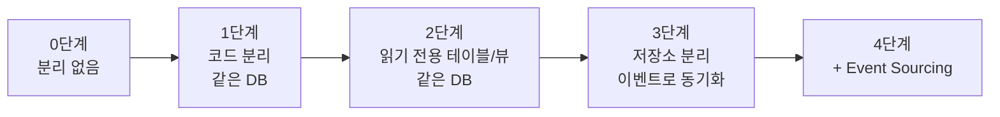
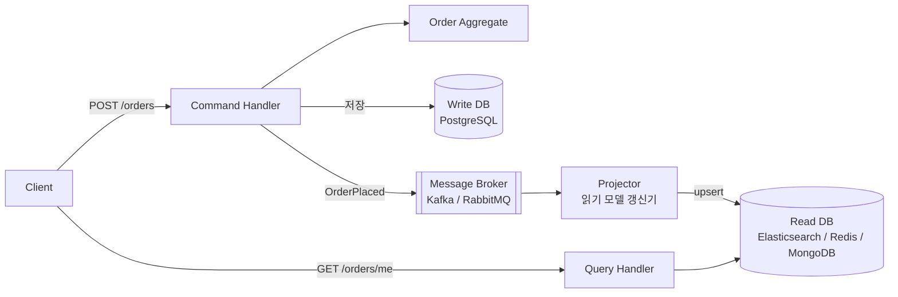
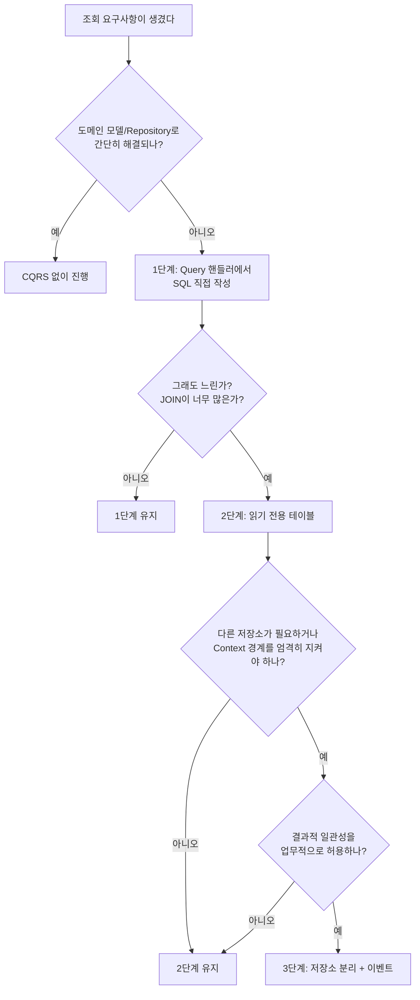

# CQRS (Command Query Responsibility Segregation)

## 1. CQRS란?

**CQRS(Command Query Responsibility Segregation)**는 **데이터를 바꾸는 일(Command)과 데이터를 읽는 일(Query)을 서로 다른 모델로 분리하는** 패턴입니다. 2010년 무렵 그렉 영(Greg Young)이 이름 붙이고 널리 알렸습니다.

```text
         ┌──────────────┐
요청 ──> │ 쓰기인가?    │
         └──┬────────┬──┘
     Command│        │Query
            ▼        ▼
   ┌──────────────┐ ┌──────────────┐
   │ Write Model  │ │ Read Model   │
   │ (규칙 검증)  │ │ (화면에 맞춤)│
   └──────┬───────┘ └──────┬───────┘
          ▼                ▼
       저장소            저장소
  (같을 수도, 다를 수도 있다)
```

식당에 비유하면 이렇습니다.

| 구분 | 식당 | 시스템 |
|---|---|---|
| Command | 주방: 주문을 받아 요리한다. 위생 규칙, 레시피를 엄격히 지킨다 | 주문 생성, 취소. 업무 규칙을 검증한다 |
| Query | 메뉴판: 손님이 보기 좋게 정리되어 있다. 주방 내부 구조와 상관없다 | 주문 목록, 통계. 화면에 맞는 모양으로 빠르게 보여준다 |

주방 동선을 메뉴판 모양에 맞출 필요가 없고, 메뉴판을 주방 구조대로 만들 필요도 없습니다. 각자 자기 목적에 최적화합니다.

## 2. 출발점: CQS

CQRS는 베르트랑 마이어(Bertrand Meyer)의 **CQS(Command Query Separation)** 원칙에서 나왔습니다.

> 메서드는 **상태를 바꾸는 명령(Command)**이거나 **값을 돌려주는 조회(Query)** 둘 중 하나여야 한다. 둘 다 하면 안 된다.

```typescript
// (X) 조회처럼 보이는데 상태를 바꾼다
getNextTicketNumber(): number {
  return ++this.counter;
}

// (O) 명령과 조회를 나눈다
issueTicket(): void { this.counter++; }       // Command: 반환 없음
currentTicketNumber(): number { return this.counter; } // Query: 부작용 없음
```

| 구분 | CQS | CQRS |
|---|---|---|
| 범위 | **메서드** 단위 | **모델/아키텍처** 단위 |
| 분리 대상 | 하나의 객체 안의 메서드 | 쓰기 모델과 읽기 모델 전체 |

CQRS는 CQS를 시스템 수준으로 키운 것입니다.

## 3. 왜 필요할까?

### 3-1. 쓰기와 읽기는 요구사항이 다르다

[[ddd-aggregate]]에서 본 `Order` Aggregate는 **규칙을 지키는 데** 최적화되어 있습니다. 그런데 화면에서 필요한 것은 전혀 다른 모양입니다.

```text
쓰기에 필요한 것 (Order Aggregate)       화면에 필요한 것 (내 주문 목록)
───────────────────────────────          ───────────────────────────────
- 주문 라인 전체                          - 주문번호
- 상태 전이 규칙                          - 대표 상품명 + "외 2건"
- 총액 한도 검증                          - 대표 상품 썸네일
- 동시성 버전                             - 총액 (포맷된 문자열)
                                          - 배송 상태 + 택배사 추적 링크
                                          - 리뷰 작성 가능 여부
```

목록 화면의 데이터는 **주문, 상품, 배송, 리뷰** 여러 곳에 흩어져 있습니다. 이걸 하나의 모델로 모두 해결하려고 하면 문제가 생깁니다.

| 문제 | 설명 |
|---|---|
| 도메인 모델 오염 | 화면 때문에 `Order`에 `thumbnailUrl`, `canWriteReview` 같은 필드가 들어간다 |
| 느린 조회 | 목록 하나에 Aggregate 수십 개를 불러오고, 연관 데이터를 N+1로 조회한다 |
| Repository 비대화 | `findByCustomerIdWithProductsAndShippingAndReviewsPaged...` 같은 메서드가 쌓인다 |
| 확장 불균형 | 대부분 서비스는 읽기가 쓰기보다 10~100배 많은데 같이 확장해야 한다 |

### 3-2. 분리하면

| | Write Model (Command) | Read Model (Query) |
|---|---|---|
| 목적 | 업무 규칙을 지킨다 | 화면에 맞게 빨리 보여준다 |
| 형태 | Aggregate, 도메인 객체 | 화면 모양 그대로의 DTO |
| 정규화 | 정규화된 테이블 | 비정규화 가능 (미리 JOIN 해 둠) |
| 저장소 | RDB 등 트랜잭션이 강한 곳 | 같은 RDB, 읽기 전용 복제본, Redis, Elasticsearch 등 |
| 확장 | 상대적으로 적게 | 읽기 트래픽에 맞춰 크게 |
| 복잡도 | 높음 (규칙) | 낮음 (단순 조회) |

## 4. CQRS의 단계

CQRS는 한 번에 전부 적용하지 않고 필요한 만큼만 분리할 수 있습니다.



| 단계 | 쓰기 저장소 | 읽기 저장소 | 동기화 | 일관성 | 복잡도 |
|---|---|---|---|---|---|
| 1. 코드 분리 | RDB | **같은 RDB, 같은 테이블** | 필요 없음 | 즉시 | 낮음 |
| 2. 읽기 전용 테이블 | RDB | 같은 RDB, 별도 테이블/뷰 | 같은 트랜잭션 또는 Materialized View | 즉시~약간 지연 | 중간 |
| 3. 저장소 분리 | RDB | Redis / Elasticsearch / 별도 DB | 이벤트 | 결과적 일관성 | 높음 |
| 4. Event Sourcing | 이벤트 저장소 | 프로젝션 | 이벤트 | 결과적 일관성 | 매우 높음 |

**대부분의 서비스는 1단계만으로 충분합니다.** 단계를 올릴 때마다 얻는 것과 잃는 것을 따져야 합니다.

## 5. 1단계: 코드만 분리하기 (같은 DB)

가장 가볍고, 효과 대비 비용이 가장 좋은 형태입니다.

### 5-1. 구조

```text
src/ordering/
├── domain/                        # 쓰기 모델
│   ├── order.ts
│   └── order.repository.ts
├── application/
│   ├── command/                   # 쓰기
│   │   ├── place-order.command.ts
│   │   ├── place-order.handler.ts
│   │   ├── cancel-order.command.ts
│   │   └── cancel-order.handler.ts
│   └── query/                     # 읽기
│       ├── get-my-orders.query.ts
│       ├── get-my-orders.handler.ts
│       └── my-order-summary.dto.ts
├── infrastructure/
└── presentation/
    └── order.controller.ts
```

### 5-2. Command 쪽: 도메인 모델로 규칙을 지킨다

Nest.js는 `@nestjs/cqrs` 패키지를 제공합니다. `CommandBus`, `QueryBus`, `EventBus`로 요청을 해당 핸들러에 전달합니다.

```typescript
// application/command/cancel-order.command.ts
export class CancelOrderCommand {
  constructor(
    readonly orderId: string,
    readonly requestedBy: string,
    readonly reason: string,
  ) {}
}

// application/command/cancel-order.handler.ts
@CommandHandler(CancelOrderCommand)
export class CancelOrderHandler implements ICommandHandler<CancelOrderCommand, void> {
  constructor(@Inject(ORDER_REPOSITORY) private readonly orders: OrderRepository) {}

  async execute(command: CancelOrderCommand): Promise<void> {
    const order = await this.orders.findById(OrderId.of(command.orderId));
    if (!order) throw new OrderNotFoundException(command.orderId);

    order.cancel(CustomerId.of(command.requestedBy), command.reason); // 규칙은 도메인이 지킨다
    await this.orders.save(order);
  }
}
```

Command 핸들러의 특징은 다음과 같습니다.

- **Aggregate를 불러와서, 행동을 시키고, 저장합니다.** ([[ddd-tactical-design]]의 Application Service와 같습니다.)
- 반환값은 **없거나 최소한**(생성된 ID 정도)입니다.
- 이름은 **명령형**입니다: `PlaceOrder`, `CancelOrder`, `ChangeShippingAddress`.

### 5-3. Query 쪽: 도메인 모델을 거치지 않는다

```typescript
// application/query/get-my-orders.query.ts
export class GetMyOrdersQuery {
  constructor(
    readonly customerId: string,
    readonly page: number,
    readonly size: number,
  ) {}
}

// application/query/my-order-summary.dto.ts
export interface MyOrderSummary {
  orderId: string;
  orderedAt: string;
  title: string;          // "무선 키보드 외 2건"
  thumbnailUrl: string;
  totalAmount: number;
  status: string;
  canWriteReview: boolean;
}

// application/query/get-my-orders.handler.ts
@QueryHandler(GetMyOrdersQuery)
export class GetMyOrdersHandler implements IQueryHandler<GetMyOrdersQuery, MyOrderSummary[]> {
  constructor(private readonly dataSource: DataSource) {}

  async execute(q: GetMyOrdersQuery): Promise<MyOrderSummary[]> {
    // 화면에 필요한 모양 그대로 SQL 한 번으로 가져온다
    const rows = await this.dataSource.query(
      `SELECT o.id                         AS "orderId",
              o.created_at                 AS "orderedAt",
              first_line.product_name      AS "firstName",
              first_line.thumbnail_url     AS "thumbnailUrl",
              line_count.cnt               AS "lineCount",
              o.total_amount               AS "totalAmount",
              o.status                     AS "status",
              (o.status = 'DELIVERED' AND r.id IS NULL) AS "canWriteReview"
         FROM orders o
         JOIN LATERAL (
              SELECT p.name AS product_name, p.thumbnail_url
                FROM order_lines l JOIN products p ON p.id = l.product_id
               WHERE l.order_id = o.id
               ORDER BY l.id LIMIT 1
         ) first_line ON true
         JOIN LATERAL (
              SELECT COUNT(*) AS cnt FROM order_lines WHERE order_id = o.id
         ) line_count ON true
         LEFT JOIN reviews r ON r.order_id = o.id
        WHERE o.customer_id = $1
        ORDER BY o.created_at DESC
        LIMIT $2 OFFSET $3`,
      [q.customerId, q.size, (q.page - 1) * q.size],
    );

    return rows.map((r) => ({
      orderId: r.orderId,
      orderedAt: r.orderedAt.toISOString(),
      title: r.lineCount > 1 ? `${r.firstName} 외 ${r.lineCount - 1}건` : r.firstName,
      thumbnailUrl: r.thumbnailUrl,
      totalAmount: Number(r.totalAmount),
      status: r.status,
      canWriteReview: r.canWriteReview,
    }));
  }
}
```

Query 핸들러의 특징은 다음과 같습니다.

- **Aggregate와 Repository를 쓰지 않습니다.** SQL, QueryBuilder, 뷰를 직접 써도 됩니다.
- 부작용이 없습니다. 아무리 많이 호출해도 데이터가 바뀌지 않습니다.
- 다른 Context의 테이블(products, reviews)을 JOIN 하는 것도 **읽기 쪽에서는** 실용적으로 허용하는 경우가 많습니다. (경계를 엄격히 지키려면 3단계로 갑니다.)

> 다른 Context의 테이블을 직접 JOIN 하면 그 Context의 스키마가 바뀔 때 이 쿼리가 깨집니다. 모놀리스 안에서는 감수할 만한 결합이지만, 서비스를 분리할 계획이 있다면 읽기 모델을 따로 만드는 3단계가 필요합니다.

### 5-4. Controller

```typescript
// presentation/order.controller.ts
@Controller('orders')
export class OrderController {
  constructor(
    private readonly commandBus: CommandBus,
    private readonly queryBus: QueryBus,
  ) {}

  @Post(':id/cancel')
  @HttpCode(204)
  async cancel(@Param('id') id: string, @Body() body: CancelOrderRequest, @CurrentUser() user: User) {
    await this.commandBus.execute(new CancelOrderCommand(id, user.id, body.reason));
  }

  @Get('me')
  async myOrders(@CurrentUser() user: User, @Query() q: PageRequest) {
    return this.queryBus.execute(new GetMyOrdersQuery(user.id, q.page, q.size));
  }
}

// ordering.module.ts
@Module({
  imports: [CqrsModule],
  controllers: [OrderController],
  providers: [
    CancelOrderHandler,
    PlaceOrderHandler,
    GetMyOrdersHandler,
    { provide: ORDER_REPOSITORY, useClass: TypeOrmOrderRepository },
  ],
})
export class OrderingModule {}
```

> `@nestjs/cqrs`는 필수가 아닙니다. Command 서비스와 Query 서비스를 그냥 클래스 두 개로 나눠도 CQRS 1단계입니다. 버스는 핸들러가 많아졌을 때 디스패치를 깔끔하게 해 주는 도구일 뿐입니다.

## 6. 2단계: 읽기 전용 테이블 (같은 DB)

5-3의 쿼리처럼 JOIN이 많고 느리다면, **화면 모양 그대로의 테이블**을 따로 만들어 둡니다.

```sql
-- 내 주문 목록 전용 읽기 테이블 (비정규화)
CREATE TABLE my_order_summaries (
  order_id         UUID PRIMARY KEY,
  customer_id      UUID NOT NULL,
  ordered_at       TIMESTAMPTZ NOT NULL,
  title            TEXT NOT NULL,       -- "무선 키보드 외 2건" 이 미리 계산되어 있다
  thumbnail_url    TEXT,
  total_amount     BIGINT NOT NULL,
  status           TEXT NOT NULL,
  can_write_review BOOLEAN NOT NULL DEFAULT false
);
CREATE INDEX ON my_order_summaries (customer_id, ordered_at DESC);
```

조회는 단순해집니다.

```typescript
@QueryHandler(GetMyOrdersQuery)
export class GetMyOrdersHandler implements IQueryHandler<GetMyOrdersQuery> {
  constructor(private readonly dataSource: DataSource) {}

  execute(q: GetMyOrdersQuery) {
    return this.dataSource.query(
      `SELECT * FROM my_order_summaries
        WHERE customer_id = $1 ORDER BY ordered_at DESC LIMIT $2 OFFSET $3`,
      [q.customerId, q.size, (q.page - 1) * q.size],
    );
  }
}
```

이 테이블을 채우는 방법은 두 가지입니다.

| 방법 | 설명 | 일관성 |
|---|---|---|
| 같은 트랜잭션에서 갱신 | Command 핸들러가 `orders`와 `my_order_summaries`를 함께 쓴다 | 즉시 |
| 도메인 이벤트 핸들러에서 갱신 | `OrderPlaced`, `OrderCancelled` 이벤트를 받아 갱신한다 | 결과적 (밀리초~초) |
| DB Materialized View | `REFRESH MATERIALIZED VIEW`로 주기적 갱신 | 갱신 주기만큼 지연 |

이벤트 핸들러로 갱신하는 코드는 7장에서 봅니다.

## 7. 3단계: 저장소 분리 + 이벤트 동기화

### 7-1. 구조



| 구성 요소 | 역할 |
|---|---|
| Command Handler | 규칙을 지키며 쓰기 DB에 저장하고 이벤트를 발행한다 |
| Message Broker | 이벤트를 전달한다 |
| **Projector** (Projection Handler) | 이벤트를 받아 읽기 DB를 화면 모양으로 갱신한다 |
| Query Handler | 읽기 DB만 조회한다 |

### 7-2. Projector 구현

```typescript
// ordering/read-model/my-order-summary.projector.ts
@Injectable()
export class MyOrderSummaryProjector {
  constructor(
    @InjectModel(MyOrderSummaryDoc.name) private readonly summaries: Model<MyOrderSummaryDoc>,
    private readonly catalog: CatalogReadClient, // 상품명, 썸네일 조회용
  ) {}

  @EventPattern('ordering.order-placed.v1')
  async onOrderPlaced(@Payload() e: OrderPlacedV1) {
    const first = await this.catalog.getProduct(e.lines[0].productId);
    await this.summaries.updateOne(
      { _id: e.orderId },
      {
        $setOnInsert: {
          customerId: e.customerId,
          orderedAt: e.occurredAt,
          title: e.lines.length > 1 ? `${first.name} 외 ${e.lines.length - 1}건` : first.name,
          thumbnailUrl: first.thumbnailUrl,
          totalAmount: e.totalAmount,
          status: 'PENDING',
          canWriteReview: false,
        },
      },
      { upsert: true }, // 같은 이벤트가 두 번 와도 결과가 같다 (멱등)
    );
  }

  @EventPattern('ordering.order-cancelled.v1')
  async onOrderCancelled(@Payload() e: OrderCancelledV1) {
    await this.summaries.updateOne({ _id: e.orderId }, { $set: { status: 'CANCELLED' } });
  }

  @EventPattern('shipping.delivered.v1')
  async onDelivered(@Payload() e: DeliveredV1) {
    await this.summaries.updateOne(
      { _id: e.orderId },
      { $set: { status: 'DELIVERED', canWriteReview: true } },
    );
  }

  @EventPattern('review.written.v1')
  async onReviewWritten(@Payload() e: ReviewWrittenV1) {
    await this.summaries.updateOne({ _id: e.orderId }, { $set: { canWriteReview: false } });
  }
}
```

**여러 Context의 이벤트**(주문, 배송, 리뷰)를 모아 하나의 화면용 모델을 만듭니다. 다른 Context의 테이블을 JOIN 하지 않아도 되므로 경계가 지켜집니다.

### 7-3. Projector를 만들 때 지킬 것

| 원칙 | 이유 | 방법 |
|---|---|---|
| **멱등성** | 메시지 브로커는 같은 이벤트를 두 번 보낼 수 있다 | upsert, 처리한 이벤트 ID 기록 |
| **순서 처리** | `OrderCancelled`가 `OrderPlaced`보다 먼저 도착할 수 있다 | 같은 주문 ID는 같은 파티션으로 보낸다, 버전 비교 |
| **재구축 가능** | 읽기 모델이 망가지거나 화면이 바뀌면 다시 만들어야 한다 | 이벤트를 처음부터 다시 재생할 수 있게 한다 |
| **실패 격리** | Projector 실패가 쓰기를 막으면 안 된다 | 재시도, Dead Letter Queue |

```typescript
// 순서 역전 방어: 버전이 더 높을 때만 갱신
await this.summaries.updateOne(
  { _id: e.orderId, version: { $lt: e.version } },
  { $set: { status: 'CANCELLED', version: e.version } },
);
```

> 쓰기 DB 저장과 이벤트 발행을 확실하게 함께 처리하려면 [[transactional-outbox]]가 필요합니다. 메시지 브로커와 이벤트 기반 구조 전반은 [[event-driven-architecture]]에서 다룹니다.

## 8. 결과적 일관성 다루기

3단계부터는 **쓰기 직후 읽으면 반영이 안 되어 있을 수 있습니다.**

```text
t=0ms    POST /orders        → 주문 저장 완료, 201 응답
t=5ms    GET /orders/me      → 읽기 DB에 아직 없음
t=80ms   Projector가 반영    → 이제 보임
```

사용자 입장에서는 "방금 주문했는데 목록에 없다"가 됩니다. 대처 방법은 다음과 같습니다.

| 방법 | 설명 |
|---|---|
| **응답에 결과를 담아 보낸다** | Command 응답에 생성된 주문 요약을 포함해, 클라이언트가 목록에 바로 끼워 넣는다 (낙관적 UI) |
| **자기 쓰기는 쓰기 DB에서 읽는다** | 방금 만든 주문 상세는 쓰기 DB에서 조회한다 (Read-your-writes) |
| **버전을 기다린다** | Command 응답에 버전을 주고, Query 시 그 버전 이상이 될 때까지 짧게 기다린다 |
| **UX로 알린다** | "주문이 접수되었습니다. 목록 반영까지 몇 초 걸릴 수 있어요" |
| **업무적으로 허용 가능한지 확인한다** | 통계, 추천, 검색은 몇 초 늦어도 대부분 괜찮다 |

**결과적 일관성을 받아들일 수 없는 화면이라면 3단계를 쓰면 안 됩니다.** 1~2단계에 머무르세요.

## 9. CQRS와 다른 패턴의 관계

| 패턴 | 관계 |
|---|---|
| [[ddd\|DDD]] | Aggregate는 쓰기(규칙)에 집중하고, 복잡한 조회를 Read Model로 빼면 Aggregate가 작고 깔끔해진다 |
| [[hexagonal-architecture\|Hexagonal]] / [[clean-architecture\|Clean]] | Command와 Query가 각각 Inbound Port(유스케이스)가 된다. Query는 도메인을 거치지 않는 얇은 경로를 가질 수 있다 |
| [[event-driven-architecture\|EDA]] | 3단계에서 읽기 모델을 이벤트로 동기화한다 |
| [[event-sourcing\|Event Sourcing]] | 쓰기 저장소를 이벤트로 바꾸면, 상태를 조회하려면 Read Model이 사실상 필수가 된다. 그래서 둘은 자주 함께 쓰인다. 하지만 **CQRS는 Event Sourcing 없이도 쓸 수 있다** |

## 10. 언제 쓰면 좋을까?

### 10-1. 쓰면 좋은 경우

- 조회 화면이 **여러 Aggregate/Context의 데이터를 조합**해야 한다.
- **읽기 트래픽이 쓰기보다 훨씬 많아서** 따로 확장하고 싶다.
- 도메인 규칙이 복잡해서 **도메인 모델을 조회 요구사항으로부터 보호**하고 싶다.
- 검색(Elasticsearch), 캐시(Redis)처럼 **조회에 특화된 저장소**가 필요하다.

### 10-2. 쓰지 않는 게 나은 경우

- **단순 CRUD**: 화면 모양과 테이블 모양이 거의 같다면 분리할 이유가 없다.
- 쓰기 직후 **즉시 일관성이 반드시 필요**한 화면이 대부분이다. (3단계 기준)
- 팀이 이벤트, 메시지 브로커 운영 경험이 없다. (3단계 기준)



## 11. 장점과 단점

| 장점 | 설명 |
|---|---|
| 도메인 모델이 깔끔해진다 | 화면용 필드와 조회 메서드가 Aggregate에서 빠진다 |
| 조회가 빨라진다 | 화면 모양 그대로 저장하거나, 필요한 SQL을 자유롭게 쓴다 |
| 독립적으로 확장한다 | 읽기 DB만 복제본을 늘리거나 캐시를 붙인다 |
| 저장소를 목적에 맞게 고른다 | 쓰기는 RDB, 검색은 Elasticsearch, 목록은 Redis |
| 코드 탐색이 쉽다 | 쓰기 로직과 읽기 로직이 섞이지 않는다 |

| 단점 | 설명 |
|---|---|
| 코드가 늘어난다 | Command, Query, Handler, DTO가 각각 생긴다 |
| 결과적 일관성 (3단계) | 쓰기 직후 읽기에 반영이 안 될 수 있다 |
| 운영 복잡도 (3단계) | 메시지 브로커, Projector, 재처리, 모니터링이 필요하다 |
| 데이터 중복 (2~3단계) | 같은 데이터가 여러 곳에 있고, 어긋나면 재구축해야 한다 |

## 12. 핵심 정리

> CQRS는 데이터를 바꾸는 Command와 데이터를 읽는 Query를 서로 다른 모델로 분리하는 패턴이다. Command 쪽은 Aggregate로 업무 규칙을 지키고, Query 쪽은 도메인 모델을 거치지 않고 화면에 맞는 모양으로 빠르게 읽는다. 코드만 분리하는 1단계부터 읽기 전용 테이블(2단계), 저장소를 분리하고 이벤트로 동기화하는 3단계까지 필요한 만큼만 적용할 수 있다. 3단계부터는 결과적 일관성과 운영 복잡도를 감수해야 하므로, 대부분의 서비스는 1~2단계로 충분하다.
