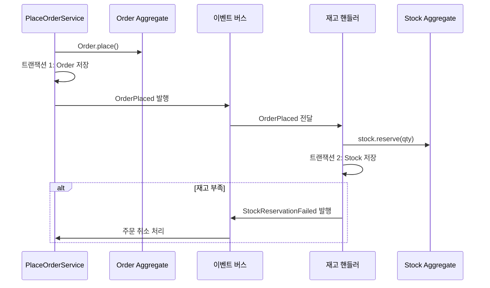
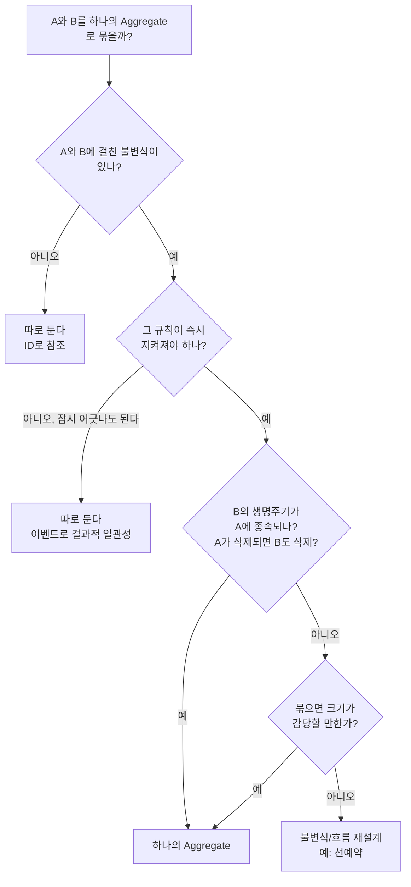

# Aggregate (애그리거트)

## 1. Aggregate란?

**Aggregate**는 **데이터 변경의 단위로 함께 다뤄야 하는 객체들의 묶음**입니다. 묶음 바깥에서는 대표 객체 하나, 즉 **Aggregate Root**를 통해서만 안쪽 객체에 접근할 수 있습니다.

[[ddd-tactical-design]]에서 본 Entity, Value Object가 벽돌이라면, Aggregate는 그 벽돌로 쌓은 **방 하나**입니다. 방에 들어가려면 정해진 문(Aggregate Root)으로만 들어가야 하고, 창문으로 넘어 들어가 가구를 옮기면 안 됩니다.

```text
┌─────────────── Order Aggregate ───────────────┐
│                                               │
│   ┌──────────────────┐                        │
│   │ Order (Root)     │◄──── 외부는 여기로만    │
│   │  - id            │                        │
│   │  - status        │                        │
│   │  - shippingAddr ─┼──> Address (VO)        │
│   └───────┬──────────┘                        │
│           │ 1:N                               │
│   ┌───────▼──────────┐                        │
│   │ OrderLine        │                        │
│   │  - productId     │                        │
│   │  - unitPrice ────┼──> Money (VO)          │
│   │  - quantity  ────┼──> Quantity (VO)       │
│   └──────────────────┘                        │
└───────────────────────────────────────────────┘
```

## 2. 왜 Aggregate가 필요할까?

### 2-1. 지켜야 하는 규칙(불변식)이 깨진다

주문에는 이런 규칙이 있다고 해 봅시다.

> 주문 총액은 50만 원을 넘을 수 없다. (1회 결제 한도)

`OrderLine`을 아무 데서나 직접 수정할 수 있다면 이 규칙을 지킬 방법이 없습니다.

```typescript
// (X) OrderLine을 직접 꺼내서 수정한다
const line = await orderLineRepository.findById(lineId);
line.quantity = 100;               // 총액 한도 검사를 아무도 안 한다
await orderLineRepository.save(line);
```

`OrderLine` 입장에서는 자기 수량만 알 뿐, 같은 주문의 다른 라인 금액을 모릅니다. **총액 규칙은 주문 전체를 볼 수 있는 `Order`만 지킬 수 있습니다.**

```typescript
// (O) Root를 통해서만 수정한다
const order = await orderRepository.findById(orderId);
order.changeLineQuantity(lineId, Quantity.of(100)); // 여기서 총액 한도 검사
await orderRepository.save(order);
```

### 2-2. 불변식(Invariant)

**불변식**은 **언제 어느 시점에 봐도 항상 참이어야 하는 업무 규칙**입니다.

| 불변식 예 | 지키는 Aggregate |
|---|---|
| 주문 총액은 50만 원 이하 | Order |
| 주문 라인은 1개 이상 | Order |
| 배송이 시작된 주문은 라인을 바꿀 수 없다 | Order |
| 좌석 하나에 예약은 하나만 | Seat (또는 Screening) |
| 계좌 잔액은 0 이상 | Account |

Aggregate 경계는 **이 불변식을 즉시(하나의 트랜잭션 안에서) 지켜야 하는 범위**로 정합니다. 이것이 Aggregate 설계의 가장 중요한 기준입니다.

## 3. Aggregate의 규칙

Vaughn Vernon의 *Implementing Domain-Driven Design*에서 정리한 네 가지 규칙이 가장 널리 쓰입니다.

| 규칙 | 내용 |
|---|---|
| 1. 경계 안에서 불변식을 지킨다 | 트랜잭션 안에서 즉시 지켜야 하는 규칙만 하나의 Aggregate로 묶는다 |
| 2. 작게 설계한다 | 필요한 것만 묶는다. 크면 동시성 충돌과 성능 문제가 생긴다 |
| 3. 다른 Aggregate는 ID로 참조한다 | 객체를 직접 들고 있지 않는다 |
| 4. 경계 밖은 결과적 일관성으로 맞춘다 | 한 트랜잭션에서 하나의 Aggregate만 수정한다 |

### 3-1. 규칙 1: Root를 통해서만 접근한다

```typescript
// ordering/domain/order.ts
export class Order extends AggregateRoot {
  private static readonly MAX_TOTAL = Money.of(500_000);

  private constructor(
    readonly id: OrderId,
    readonly customerId: CustomerId,
    private status: OrderStatus,
    private lines: OrderLine[],
  ) {
    super();
  }

  // 내부 컬렉션을 그대로 내주지 않는다 (복사본 + 읽기 전용)
  get orderLines(): ReadonlyArray<OrderLine> {
    return [...this.lines];
  }

  addLine(productId: ProductId, unitPrice: Money, quantity: Quantity): void {
    this.assertModifiable();
    const newLine = OrderLine.create(productId, unitPrice, quantity);
    this.assertWithinLimit([...this.lines, newLine]);
    this.lines.push(newLine);
  }

  changeLineQuantity(lineId: OrderLineId, quantity: Quantity): void {
    this.assertModifiable();
    const changed = this.lines.map((l) =>
      l.id.equals(lineId) ? l.withQuantity(quantity) : l,
    );
    this.assertWithinLimit(changed);
    this.lines = changed;
  }

  removeLine(lineId: OrderLineId): void {
    this.assertModifiable();
    const remaining = this.lines.filter((l) => !l.id.equals(lineId));
    if (remaining.length === 0) {
      throw new EmptyOrderException(); // 라인은 1개 이상
    }
    this.lines = remaining;
  }

  totalAmount(): Money {
    return this.lines.reduce((sum, l) => sum.add(l.amount()), Money.zero());
  }

  private assertModifiable(): void {
    if (this.status !== OrderStatus.PENDING) {
      throw new OrderNotModifiableException(this.id, this.status);
    }
  }

  private assertWithinLimit(lines: OrderLine[]): void {
    const total = lines.reduce((sum, l) => sum.add(l.amount()), Money.zero());
    if (!Order.MAX_TOTAL.isGreaterThanOrEqual(total)) {
      throw new OrderLimitExceededException(total, Order.MAX_TOTAL);
    }
  }
}
```

모든 변경이 `Order`의 메서드를 거치기 때문에 "총액 50만 원 이하", "라인 1개 이상", "결제 전에만 수정 가능"이라는 불변식이 항상 지켜집니다.

> `orderLines`로 꺼낸 배열에 `push`를 해도 원본은 바뀌지 않습니다. 내부 컬렉션을 그대로 반환하면 바깥에서 `order.lines.push(...)`로 규칙을 우회할 수 있습니다.

### 3-2. 규칙 2: 작게 설계한다

처음 Aggregate를 설계할 때 가장 흔한 실수는 **관련 있어 보이는 것을 전부 묶는 것**입니다.

```text
(X) 거대한 Aggregate

┌──────────── Customer Aggregate ─────────────┐
│ Customer                                    │
│  ├── Address[]                              │
│  ├── Order[]          ← 수천 개             │
│  │    └── OrderLine[]                       │
│  ├── Review[]         ← 수백 개             │
│  ├── Coupon[]                               │
│  └── PointHistory[]   ← 수만 개             │
└─────────────────────────────────────────────┘
```

이렇게 만들면 생기는 문제는 다음과 같습니다.

| 문제 | 설명 |
|---|---|
| 성능 | 고객 이름 하나 바꾸려고 주문 수천 개를 불러온다 |
| 동시성 충돌 | 고객이 리뷰를 쓰는 동안 주문이 들어오면 같은 Aggregate를 동시에 수정해 충돌한다 |
| 트랜잭션 범위 | 락이 넓게 걸려 처리량이 떨어진다 |

```text
(O) 작은 Aggregate 여러 개

┌ Customer ┐   ┌ Order ──────┐   ┌ Review ┐   ┌ PointAccount ┐
│ id       │   │ id          │   │ id     │   │ id           │
│ name     │   │ customerId ─┼─> │ ...    │   │ customerId   │
│ Address[]│   │ OrderLine[] │   │        │   │ balance      │
└──────────┘   └─────────────┘   └────────┘   └──────────────┘
       ▲              │ ID로만 참조
       └──────────────┘
```

**"이것들이 한 트랜잭션 안에서 함께 바뀌어야만 규칙이 지켜지는가?"** 라는 질문에 "아니오"라면 따로 둡니다. 고객 이름과 주문 라인은 함께 바뀔 이유가 없습니다.

### 3-3. 규칙 3: 다른 Aggregate는 ID로 참조한다

```typescript
// (X) 다른 Aggregate를 객체로 들고 있다
class Order {
  customer: Customer;     // Order를 불러올 때 Customer도 불러와야 하나?
  products: Product[];    // Order에서 product.changePrice()를 호출할 수 있다?
}

// (O) ID만 들고 있다
class Order {
  readonly customerId: CustomerId;
  private lines: OrderLine[]; // OrderLine 안에는 productId만
}
```

ID로 참조하면 얻는 것이 있습니다.

- **경계가 분명해집니다.** `Order`에서 `Customer`를 수정하는 코드를 쓰는 것 자체가 불가능합니다.
- **저장소를 나누기 쉽습니다.** 나중에 회원 서비스를 따로 떼어내도 `Order`는 ID만 들고 있으니 영향이 적습니다.
- **필요할 때만 불러옵니다.** ORM의 지연 로딩과 N+1 문제를 신경 쓸 필요가 줄어듭니다.

같은 Aggregate 안의 객체(Order → OrderLine)는 객체로 직접 참조합니다. **경계를 넘을 때만** ID를 씁니다.

### 3-4. 규칙 4: 한 트랜잭션에서 하나의 Aggregate만 수정한다

"주문하면 재고를 차감한다"를 하나의 트랜잭션으로 처리하고 싶어집니다.

```typescript
// (X) 한 트랜잭션에서 두 Aggregate를 수정
@Transactional()
async placeOrder(command) {
  const order = Order.place(...);
  await this.orders.save(order);

  for (const line of command.lines) {
    const stock = await this.stocks.findByProductId(line.productId);
    stock.decrease(line.quantity);     // 다른 Aggregate 수정
    await this.stocks.save(stock);
  }
}
```

인기 상품이면 수많은 주문이 같은 `Stock`을 동시에 수정하려고 해서 락 경합이 생깁니다. 재고가 다른 서비스로 분리되면 이 트랜잭션 자체가 불가능해집니다.

대신 **도메인 이벤트로 연결**하고, 두 Aggregate 사이는 **결과적 일관성(Eventual Consistency)**으로 맞춥니다.



> **결과적 일관성**: 지금 이 순간에는 주문과 재고가 맞지 않을 수 있지만, 잠시 뒤에는 반드시 맞춰지는 것. 몇 밀리초~몇 초의 차이를 업무적으로 허용할 수 있는지가 판단 기준입니다.

재고 부족 시 주문을 취소하는 식의 **보상 처리**가 필요해지는데, 이 흐름을 체계적으로 다루는 방법이 [[saga-pattern]]입니다.

### 3-5. 예외: 즉시 일관성이 꼭 필요하다면

"절대 초과 판매가 있으면 안 된다"(한정판 판매, 좌석 예약)처럼 즉시 일관성이 업무적으로 필수라면 다음을 검토합니다.

- **경계를 다시 봅니다.** 재고 차감이 주문의 불변식이라면 둘을 하나의 Aggregate로 볼 수도 있습니다. (예: `Screening` 하나에 좌석 예약을 모두 넣음)
- **주문 전에 재고를 먼저 예약**하는 흐름으로 바꿉니다. (재고 Aggregate 하나만 수정 → 성공 시 주문 생성)
- 그래도 안 되면 그때 한 트랜잭션에 두 Aggregate를 수정하는 것을 **의식적으로** 허용합니다. 네 규칙은 상황에 따라 벗어날 수 있는 지침입니다.

## 4. Aggregate 경계 찾기

### 4-1. 질문 목록



### 4-2. 예제로 연습하기

| 후보 | 판단 | 이유 |
|---|---|---|
| Order + OrderLine | 묶는다 | 총액 한도, 최소 1라인 규칙이 걸쳐 있다. 라인은 주문 없이 존재할 수 없다 |
| Order + Customer | 나눈다 | 둘 사이에 즉시 지켜야 할 규칙이 없다 |
| Order + Payment | 나눈다 | 결제는 외부 PG와 비동기로 진행된다. 이벤트로 연결한다 |
| Order + Stock | 대개 나눈다 | 재고는 여러 주문이 동시에 건드린다. 묶으면 경합이 심하다 |
| Product + ProductImage | 묶는다 | 이미지는 상품 없이 의미가 없고, "대표 이미지 1개" 규칙이 있다 |
| Post + Comment | 대개 나눈다 | 댓글은 수천 개가 될 수 있고 각자 독립적으로 수정된다 |

> Post + Comment는 직관적으로는 묶고 싶어지는 대표적인 예입니다. "댓글 수 100개 제한" 같은 불변식이 없다면 `Comment`가 `postId`를 들고 있는 별도 Aggregate가 낫습니다.

## 5. 동시성 제어: 낙관적 락

Aggregate는 **한 번에 하나의 변경만** 반영되어야 합니다. 두 요청이 같은 주문을 동시에 읽고 각각 수정하면 하나의 변경이 사라질 수 있습니다(Lost Update).

```text
시간 →
요청 A: 주문 #1 읽기 (version 3) ──> 라인 추가 ──> 저장 (version 4) ✓
요청 B: 주문 #1 읽기 (version 3) ──────> 라인 삭제 ──> 저장 시도 (version 3 기대) ✗ 충돌
```

Aggregate Root에 **버전 필드**를 두고, 저장할 때 버전이 그대로인지 확인합니다.

```typescript
// ordering/infrastructure/order.orm-entity.ts
@Entity('orders')
export class OrderOrmEntity {
  @PrimaryColumn('uuid') id: string;
  @VersionColumn() version: number; // TypeORM이 저장할 때마다 1씩 올린다
  // ...
}
```

```typescript
// TypeORM의 save()는 버전 충돌을 자동으로 막지 않는다.
// 조건부 UPDATE로 직접 확인한다.
async save(order: Order): Promise<void> {
  const row = OrderMapper.toOrm(order);
  const result = await this.repo
    .createQueryBuilder()
    .update(OrderOrmEntity)
    .set({ status: row.status, version: () => 'version + 1' })
    .where('id = :id AND version = :version', { id: row.id, version: row.version })
    .execute();

  if (result.affected === 0) {
    throw new ConcurrencyConflictException(order.id);
  }
  // 라인 저장 생략
}
```

> TypeORM에서는 `findOne`에 `lock: { mode: 'optimistic', version }` 옵션을 줘서 조회 시점에 버전을 확인할 수도 있지만, 저장 시점의 충돌은 위처럼 조건부 UPDATE로 확인하는 것이 확실합니다.

충돌이 나면 클라이언트에 409를 돌려주거나, 다시 읽어서 재시도합니다. **Aggregate를 작게 만들수록 충돌이 줄어듭니다.** 이것이 규칙 2(작게 설계)의 또 다른 이유입니다.

## 6. Aggregate와 Repository, 조회

### 6-1. Repository는 Aggregate 단위

```typescript
// (O) Aggregate Root당 하나
interface OrderRepository {
  findById(id: OrderId): Promise<Order | null>;
  save(order: Order): Promise<void>;
}

// (X) 내부 Entity용 Repository
interface OrderLineRepository { ... }
```

Repository는 **Aggregate 전체를 한 번에** 불러오고 한 번에 저장합니다. 절반만 불러온 `Order`로는 불변식을 지킬 수 없습니다.

### 6-2. 화면 조회는 Aggregate를 쓰지 않아도 된다

"내 주문 목록: 주문번호, 대표 상품명, 총액, 배송 상태"를 보여주려고 `Order` Aggregate 수십 개를 전부 불러오면 낭비입니다. 이 화면에는 불변식을 지킬 일이 없기 때문입니다.

```typescript
// 조회 전용: Aggregate를 거치지 않고 필요한 컬럼만 바로 읽는다
@Injectable()
export class OrderListQuery {
  constructor(private readonly dataSource: DataSource) {}

  async execute(customerId: string): Promise<OrderSummaryDto[]> {
    return this.dataSource.query(
      `SELECT o.id, o.status, o.total_amount, MIN(p.name) AS first_product_name
         FROM orders o
         JOIN order_lines l ON l.order_id = o.id
         JOIN product_snapshots p ON p.id = l.product_id
        WHERE o.customer_id = $1
        GROUP BY o.id
        ORDER BY o.created_at DESC`,
      [customerId],
    );
  }
}
```

**쓰기는 Aggregate로 규칙을 지키고, 읽기는 화면에 맞게 따로 한다.** 이 생각을 구조로 만든 것이 [[cqrs|CQRS]]입니다.

## 7. 자주 하는 실수

| 실수 | 증상 | 해결 |
|---|---|---|
| DB 테이블 관계대로 Aggregate를 만든다 | FK가 있으면 다 묶여서 거대해진다 | 불변식 기준으로 경계를 정한다 |
| 내부 Entity를 밖으로 노출한다 | `order.lines[0].quantity = 5`가 가능하다 | 복사본/읽기 전용으로 반환한다 |
| 다른 Aggregate를 객체로 참조한다 | 한 Aggregate에서 다른 Aggregate를 수정한다 | ID로 참조한다 |
| 한 트랜잭션에서 여러 Aggregate를 수정한다 | 락 경합, 서비스 분리 불가 | 도메인 이벤트 + 결과적 일관성 |
| 조회 화면까지 Aggregate로 만든다 | 불필요한 로딩, 느린 목록 | 조회 전용 쿼리를 따로 둔다 |
| 버전 관리를 하지 않는다 | 동시 수정 시 변경이 사라진다 | 낙관적 락 |

## 8. 핵심 정리

> Aggregate는 불변식을 함께 지켜야 하는 객체 묶음이고, 바깥에서는 Aggregate Root를 통해서만 접근한다. 경계는 "한 트랜잭션 안에서 즉시 지켜야 하는 규칙"의 범위로 정하며, 가능한 한 작게 만든다. 다른 Aggregate는 ID로만 참조하고, 한 트랜잭션에서는 하나의 Aggregate만 수정하며, 경계 밖은 도메인 이벤트로 결과적 일관성을 맞춘다. 동시 수정은 버전 필드를 이용한 낙관적 락으로 막는다.
