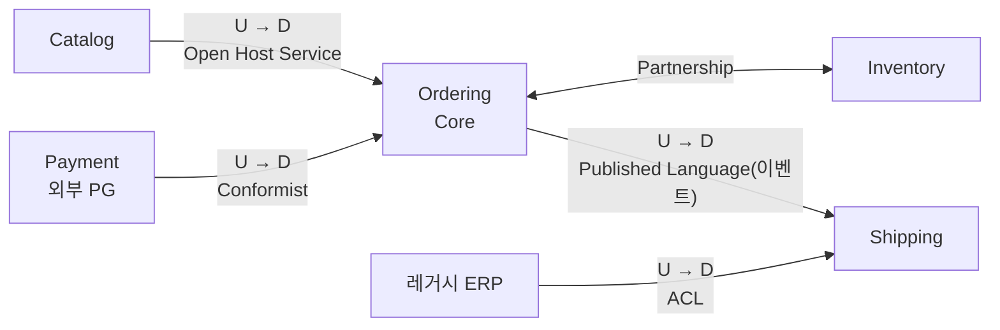
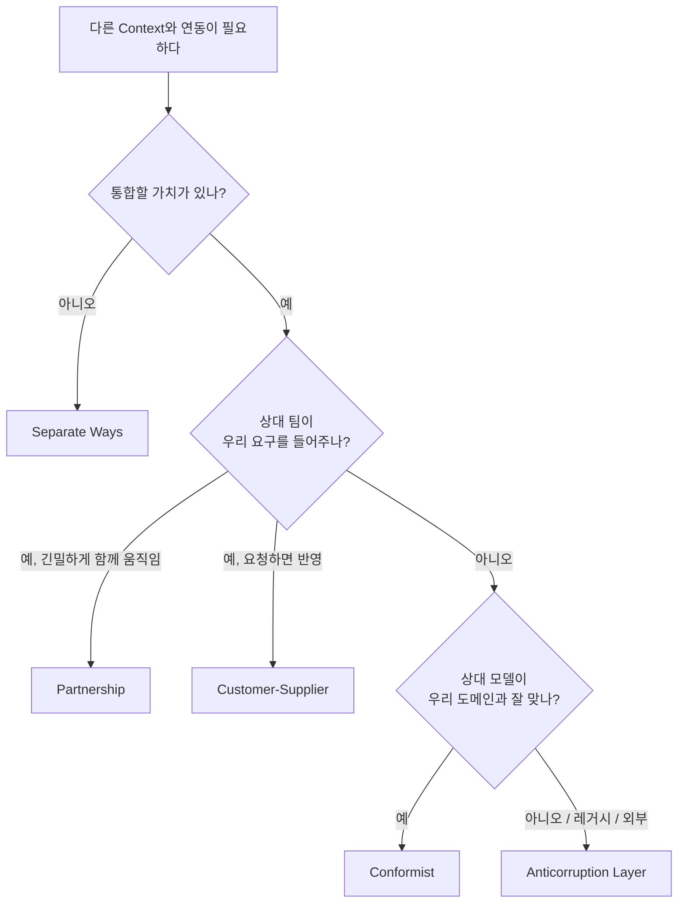

# DDD 전략 설계 (Strategic Design)

## 1. 전략 설계란?

**전략 설계**는 [[ddd|DDD]]에서 **시스템을 어떤 기준으로 나누고, 나눈 조각들이 서로 어떻게 관계를 맺을지** 정하는 단계입니다. 클래스 하나하나를 어떻게 만들지는 다루지 않습니다. 그건 [[ddd-tactical-design|전술 설계]]의 몫입니다.

전략 설계는 다음 세 가지 질문에 답합니다.

| 질문 | 도구 |
|---|---|
| 우리 업무는 어떤 영역들로 이루어져 있고, 어디에 힘을 쏟아야 할까? | **서브도메인** (Core / Supporting / Generic) |
| 하나의 모델과 언어가 통하는 경계는 어디까지일까? | **Bounded Context** |
| 경계끼리는 어떻게 대화할까? | **Context Map** |

```text
문제 공간 (Problem Space)          해결 공간 (Solution Space)
"업무가 실제로 어떻게 생겼나"       "그걸 소프트웨어로 어떻게 나누나"

    서브도메인          ──────>      Bounded Context
                                         │
                                    Context Map
                              (Context 사이의 관계)
```

서브도메인은 **업무를 분석한 결과**이고, Bounded Context는 **소프트웨어를 나눈 결과**입니다. 둘이 1:1로 맞으면 이상적이지만 항상 그렇지는 않습니다.

## 2. 서브도메인 (Subdomain)

쇼핑몰이라는 큰 도메인은 여러 하위 업무 영역으로 나뉩니다. 이것을 **서브도메인**이라고 합니다.

```text
쇼핑몰 도메인
├── 상품 카탈로그
├── 주문
├── 결제
├── 배송
├── 추천
├── 회원/인증
└── 알림
```

모든 서브도메인이 똑같이 중요하지는 않습니다. DDD는 서브도메인을 세 종류로 나눠서 **어디에 시간과 실력을 쓸지** 정하라고 합니다.

### 2-1. Core Domain (핵심 도메인)

**회사가 돈을 버는 이유이자, 경쟁사와 차별화되는 영역**입니다.

- 예: 배송 회사의 물류 경로 최적화, 동영상 서비스의 추천, 핀테크의 송금 경험
- 전략: 가장 실력 있는 사람이 직접 만듭니다. DDD 전술 설계를 적극적으로 적용합니다.
- 사서 쓰거나 외주를 맡기면 차별점이 사라집니다.

### 2-2. Supporting Subdomain (지원 서브도메인)

**Core를 돕기 위해 필요하지만, 그 자체로 차별화되지는 않는** 영역입니다. 우리 업무에 맞춰야 해서 기성품으로는 해결이 안 됩니다.

- 예: 쇼핑몰의 상품 등록 관리 도구, 판매자 정산 리포트
- 전략: 직접 만들되 단순하게 만듭니다. [[layered-architecture|Layered Architecture]] 정도로 충분한 경우가 많습니다.

### 2-3. Generic Subdomain (범용 서브도메인)

**어느 회사에나 있고 이미 잘 만들어진 해결책이 있는** 영역입니다.

- 예: 회원 인증, 결제 대행, 이메일 발송, 파일 저장
- 전략: 사서 씁니다. (Auth0, Cognito, PG사 SDK, SES, S3)

### 2-4. 한눈에 비교

| 구분 | 차별화 | 복잡도 | 전략 | 설계 수준 |
|---|---|---|---|---|
| Core | 높음 | 높음 | 직접, 최고 인력 | DDD 전술 설계, Hexagonal |
| Supporting | 낮음 | 낮음~중간 | 직접, 단순하게 | Layered, CRUD |
| Generic | 없음 | 다양함 | 구매, 오픈소스 | 연동 코드만 |

> 같은 "결제"라도 쇼핑몰에게는 Generic이지만, 결제 대행사(PG)에게는 Core입니다. 분류는 **회사의 사업 모델**에 따라 달라집니다.

## 3. Bounded Context (바운디드 컨텍스트)

### 3-1. 정의

**Bounded Context**는 **하나의 도메인 모델과 하나의 유비쿼터스 언어가 일관되게 통하는 경계**입니다.

[[ddd]]에서 본 것처럼 "상품"이라는 단어는 팀마다 뜻이 다릅니다.

```text
┌─────────────────────┐  ┌─────────────────────┐  ┌─────────────────────┐
│ Catalog Context     │  │ Inventory Context   │  │ Shipping Context    │
│                     │  │                     │  │                     │
│ Product             │  │ StockItem           │  │ Parcel              │
│  - name             │  │  - sku              │  │  - weight           │
│  - description      │  │  - quantity         │  │  - dimensions       │
│  - images           │  │  - warehouseId      │  │  - trackingNumber   │
│  - price            │  │  - reserve()        │  │  - dispatch()       │
└─────────────────────┘  └─────────────────────┘  └─────────────────────┘
   "상품"=보여줄 것        "상품"=셀 수 있는 것      "상품"=보낼 짐
```

모든 정보를 하나의 `Product`에 몰아넣지 않고, **각 Context가 자기에게 필요한 모양으로** 모델을 가집니다. Context끼리는 **상품 ID 같은 식별자**로 연결됩니다.

### 3-2. 하나의 거대한 모델이 망가지는 과정

```typescript
// 모든 팀이 같이 쓰는 Product
class Product {
  id: string;
  name: string;            // 전시팀
  description: string;     // 전시팀
  images: string[];        // 전시팀
  price: number;           // 전시팀
  supplyPrice: number;     // 정산팀
  commissionRate: number;  // 정산팀
  stockQuantity: number;   // 재고팀
  warehouseId: string;     // 재고팀
  weight: number;          // 배송팀
  width: number;           // 배송팀
  height: number;          // 배송팀
  // ... 40개 더
}
```

- 배송팀이 `weight` 단위를 g에서 kg로 바꾸면 전시팀 화면이 깨집니다.
- 한 테이블을 여러 팀이 수정해서 마이그레이션 때마다 회의가 필요합니다.
- "상품 가격"이 판매가인지 공급가인지 매번 확인해야 합니다.

### 3-3. Bounded Context를 나누는 기준

정답은 없지만 다음 신호들을 참고합니다.

| 신호 | 예 |
|---|---|
| **같은 단어가 다른 뜻**으로 쓰인다 | 전시팀의 "상품" ≠ 물류팀의 "상품" |
| **다른 사람(부서)**이 그 규칙을 결정한다 | 가격 정책은 MD팀, 배송비 정책은 물류팀 |
| **변경 주기**가 다르다 | 프로모션 규칙은 매주, 정산 규칙은 분기마다 |
| **업무 흐름의 단계**가 바뀐다 | 주문 → 결제 → 배송 → 정산 |
| **일관성이 필요한 범위**가 다르다 | 재고는 즉시 정확해야 하고, 추천은 조금 늦어도 된다 |

### 3-4. Bounded Context와 팀, 코드, 서비스

Bounded Context는 보통 다음 단위와 맞춰집니다.

- **팀**: 하나의 Context는 하나의 팀이 소유합니다. 여러 팀이 한 Context를 같이 고치면 언어가 흐려집니다.
- **코드**: 모노레포라면 패키지, Nest.js라면 Module 하나 또는 여러 개
- **배포 단위**: 마이크로서비스로 나눈다면 대개 Context 단위가 기준이 됩니다.
- **데이터**: Context마다 자기 테이블(스키마)을 가지고, 다른 Context의 테이블을 직접 조회하지 않습니다.

> Bounded Context가 곧 마이크로서비스는 아닙니다. 모놀리스 안에서도 모듈 경계로 Bounded Context를 지킬 수 있습니다(모듈러 모놀리스). 처음부터 서비스를 쪼개기보다는, 모놀리스 안에서 경계를 먼저 지키다가 필요할 때 떼어내는 편이 안전합니다.

### 3-5. Nest.js 모듈로 Context 경계 지키기

```text
src/
├── catalog/        # Catalog Context
├── ordering/       # Ordering Context
├── inventory/      # Inventory Context
└── shipping/       # Shipping Context
```

```typescript
// ordering/ordering.module.ts
@Module({
  imports: [TypeOrmModule.forFeature([OrderOrmEntity])],
  providers: [
    PlaceOrderService,
    { provide: ORDER_REPOSITORY, useClass: TypeOrmOrderRepository },
  ],
  controllers: [OrderController],
  exports: [], // 다른 Context에 내부 구현을 노출하지 않는다
})
export class OrderingModule {}
```

경계를 지키는 규칙은 다음과 같습니다.

- 다른 Context의 엔티티 클래스를 `import` 하지 않습니다.
- 다른 Context의 테이블을 `JOIN` 하지 않습니다.
- 필요한 정보는 **공개된 인터페이스**(파사드 서비스, API, 이벤트)로만 주고받습니다.

ESLint의 `no-restricted-imports`나 `eslint-plugin-boundaries` 같은 도구로 이 규칙을 자동 검사할 수 있습니다.

## 4. Context Map (컨텍스트 맵)

### 4-1. 정의

**Context Map**은 **Bounded Context들 사이의 관계를 그린 지도**입니다. 어떤 Context가 어떤 Context에 의존하는지, 그 관계가 어떤 성격인지(협력적인지, 일방적인지)를 표시합니다.



### 4-2. Upstream과 Downstream

관계를 이해하려면 먼저 **상류(Upstream)**와 **하류(Downstream)**를 알아야 합니다.

```text
Upstream (U)  ────────>  Downstream (D)
 영향을 주는 쪽            영향을 받는 쪽
 모델/API를 제공          그것을 사용
```

강물에 비유하면 상류에서 물을 흐리면 하류가 영향을 받습니다. Upstream이 API를 바꾸면 Downstream이 고쳐야 합니다. 반대 방향은 성립하지 않습니다.

### 4-3. 관계 패턴

#### Partnership (파트너십)

두 팀이 **같이 성공하고 같이 실패하는** 관계입니다. 변경을 함께 계획하고 함께 배포합니다.

- 예: 주문팀과 재고팀이 "주문 시 재고 예약" 기능을 같이 설계
- 주의: 팀 간 소통 비용이 커서, 정말 긴밀한 경우에만 씁니다.

#### Shared Kernel (공유 커널)

두 Context가 **모델의 일부를 공유 코드로** 같이 씁니다.

```text
┌──────────┐      ┌──────────┐
│ Ordering │      │ Shipping │
│     ┌────┴──────┴────┐     │
│     │ Shared Kernel  │     │
│     │ Money, Address │     │
│     └────┬──────┬────┘     │
└──────────┘      └──────────┘
```

- 예: `Money`, `Address` 같은 값 객체를 공용 패키지로 공유
- 주의: 공유 부분을 바꾸려면 양쪽 동의가 필요합니다. **최소한으로** 유지합니다.

#### Customer-Supplier (고객-공급자)

Upstream(공급자)이 Downstream(고객)의 요구를 **들어주는** 관계입니다. Downstream이 요구사항을 내고, Upstream이 일정에 반영합니다.

- 예: 주문팀(고객)이 카탈로그팀(공급자)에 "품절 여부도 API에 넣어 주세요"라고 요청

#### Conformist (순응자)

Upstream이 Downstream의 요구를 **들어줄 이유가 없는** 관계입니다. Downstream은 Upstream 모델을 그대로 따릅니다.

- 예: 외부 PG사 API. 우리가 바꿔 달라고 해도 바꿔주지 않습니다.
- 위험: 외부 모델이 우리 도메인 안으로 그대로 들어옵니다. 이게 싫으면 ACL을 씁니다.

#### Anticorruption Layer (ACL, 부패 방지 계층)

Downstream이 **번역 계층**을 두어 Upstream 모델이 자기 도메인을 오염시키지 않게 막습니다. 레거시 시스템이나 외부 API와 연동할 때 가장 많이 쓰는 패턴입니다.

```text
┌────────────────────┐        ┌───────────────────────────────┐
│ 레거시 ERP         │        │ Shipping Context              │
│                    │        │  ┌─────┐      ┌────────────┐  │
│ { DLV_CD: "03",    │ ─────> │  │ ACL │ ───> │ Parcel     │  │
│   WGT_G: 1200 }    │        │  └─────┘      │ (깨끗한    │  │
│                    │        │   번역기      │  도메인)   │  │
└────────────────────┘        │               └────────────┘  │
                              └───────────────────────────────┘
```

```typescript
// shipping/infrastructure/legacy-erp.translator.ts
// 레거시 ERP의 코드값과 단위를 우리 도메인 언어로 번역한다
interface ErpDeliveryRecord {
  DLV_CD: string;   // '01' 일반, '02' 퀵, '03' 새벽
  WGT_G: number;    // 그램 단위
  RCV_ADDR1: string;
  RCV_ADDR2: string;
}

@Injectable()
export class LegacyErpTranslator {
  toParcel(record: ErpDeliveryRecord): Parcel {
    return Parcel.create({
      method: this.toDeliveryMethod(record.DLV_CD),
      weight: Weight.ofGrams(record.WGT_G),
      address: Address.of(record.RCV_ADDR1, record.RCV_ADDR2),
    });
  }

  private toDeliveryMethod(code: string): DeliveryMethod {
    switch (code) {
      case '01': return DeliveryMethod.STANDARD;
      case '02': return DeliveryMethod.QUICK;
      case '03': return DeliveryMethod.DAWN;
      default: throw new UnknownDeliveryCodeException(code);
    }
  }
}
```

ERP가 바뀌어도 고칠 곳은 `LegacyErpTranslator` 하나뿐이고, `Parcel` 도메인은 `DLV_CD` 같은 이름을 전혀 모릅니다.

#### Open Host Service (OHS, 공개 호스트 서비스)

Upstream이 여러 Downstream을 위해 **잘 정의된 공개 API**를 제공합니다. Downstream마다 맞춤 API를 따로 만들지 않습니다.

- 예: 카탈로그 Context가 `GET /catalog/products/:id`라는 안정적인 REST API를 공개

#### Published Language (공표된 언어)

Context 사이에서 주고받는 **데이터 형식을 문서화된 공통 규격**으로 정합니다. OHS와 함께 쓰이는 경우가 많습니다.

- 예: JSON Schema, Protobuf, AsyncAPI로 정의한 이벤트 형식

```typescript
// 공표된 이벤트 형식: 버전을 붙여 관리한다
export interface OrderPlacedV1 {
  type: 'ordering.order-placed.v1';
  orderId: string;
  customerId: string;
  lines: { productId: string; quantity: number }[];
  occurredAt: string; // ISO 8601
}
```

#### Separate Ways (각자의 길)

통합 비용이 이득보다 크면 **연결하지 않습니다**. 필요한 기능은 각자 따로 만듭니다.

- 예: 마케팅팀의 간단한 쿠폰 발송 기능을 주문 시스템과 연동하지 않고 별도 도구로 처리

### 4-4. 관계 패턴 정리

| 패턴 | 관계 성격 | 한 줄 설명 |
|---|---|---|
| Partnership | 대등, 협력 | 같이 계획하고 같이 배포한다 |
| Shared Kernel | 대등, 공유 | 작은 모델 조각을 함께 소유한다 |
| Customer-Supplier | U → D, 협력 | 공급자가 고객 요구를 반영한다 |
| Conformist | U → D, 일방 | 하류가 상류 모델을 그대로 따른다 |
| Anticorruption Layer | U → D, 방어 | 하류가 번역 계층으로 자기 모델을 지킨다 |
| Open Host Service | U → 여러 D | 상류가 공개 API를 제공한다 |
| Published Language | 공통 규격 | 주고받는 형식을 문서화한다 |
| Separate Ways | 연결 없음 | 통합하지 않는다 |

### 4-5. 어떤 관계를 고를까?



## 5. Context 간 통신 방식

Context끼리 정보를 주고받는 방식은 크게 두 가지입니다.

| 방식 | 예 | 장점 | 단점 |
|---|---|---|---|
| 동기 호출 | REST, gRPC | 단순하고 결과를 바로 안다 | 상대가 죽으면 같이 실패한다, 결합도가 높다 |
| 비동기 이벤트 | 메시지 큐, 이벤트 버스 | 느슨하게 결합된다, 장애가 퍼지지 않는다 | 결과적 일관성, 디버깅이 어렵다 |

```text
동기:   Ordering ──(HTTP: 재고 있어?)──> Inventory
                 <──(응답: 3개 있음)───

비동기: Ordering ──(OrderPlaced 이벤트)──> [메시지 브로커] ──> Shipping
                                                         ──> Notification
        Ordering은 누가 받는지 모른다
```

Bounded Context 사이에서는 **비동기 이벤트**가 경계를 지키기에 더 유리합니다. 이벤트 기반 통신은 [[event-driven-architecture]]에서 자세히 다룹니다.

## 6. 전략 설계 진행 방법

실제로 전략 설계를 할 때는 대략 이런 순서를 밟습니다.

1. **이벤트 스토밍(Event Storming)**: 도메인 전문가와 개발자가 한자리에 모여 업무에서 일어나는 사건(`주문됨`, `결제 완료됨`, `배송 시작됨`)을 포스트잇에 적어 시간 순서대로 붙입니다.
2. **경계 찾기**: 포스트잇 묶음에서 언어가 바뀌는 지점, 담당 부서가 바뀌는 지점을 찾아 선을 긋습니다. 이것이 Bounded Context 후보가 됩니다.
3. **서브도메인 분류**: 각 영역이 Core / Supporting / Generic 중 무엇인지 정합니다.
4. **Context Map 작성**: Context 사이의 관계와 통합 방식을 정합니다.
5. **유비쿼터스 언어 정리**: Context별 용어 사전을 만듭니다.

```text
이벤트 스토밍 결과 예시 (시간 순)

[상품 등록됨] [가격 변경됨] │ [장바구니 담김] [주문됨] [결제 요청됨] │ [결제 완료됨] │ [출고 지시됨] [배송 시작됨] [배송 완료됨]
─────── Catalog ────────────┼──────────── Ordering ───────────────┼── Payment ───┼────────────── Shipping ──────────────
```

## 7. 흔한 실수

| 실수 | 결과 | 대안 |
|---|---|---|
| DB 테이블 기준으로 Context를 나눈다 | 업무 경계와 코드 경계가 어긋난다 | 업무 흐름과 언어 기준으로 나눈다 |
| 처음부터 마이크로서비스로 쪼갠다 | 경계가 틀렸을 때 되돌리기 어렵다 | 모듈러 모놀리스로 시작한다 |
| 너무 잘게 쪼갠다 | Context 간 호출이 폭발한다 | 한 트랜잭션이 여러 Context를 넘나들면 경계를 의심한다 |
| 모든 영역에 전술 설계를 적용한다 | Supporting/Generic에 과한 비용이 든다 | Core에만 집중한다 |
| 외부 API 모델을 그대로 쓴다 | 외부 변경이 도메인 전체로 번진다 | ACL로 번역한다 |

## 8. 핵심 정리

> 전략 설계는 시스템을 어떻게 나누고 나눈 조각이 어떻게 관계 맺을지 정하는 일이다. 서브도메인을 Core, Supporting, Generic으로 분류해 Core에 힘을 집중한다. Bounded Context는 하나의 모델과 언어가 통하는 경계로, 같은 단어라도 Context마다 다른 모델을 가진다. Context Map은 Context 사이의 관계(Partnership, Customer-Supplier, Conformist, ACL 등)를 그린 지도이며, 외부나 레거시와 연동할 때는 ACL로 자기 도메인을 보호한다.
