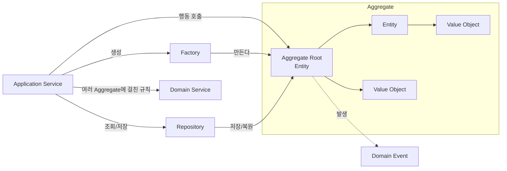
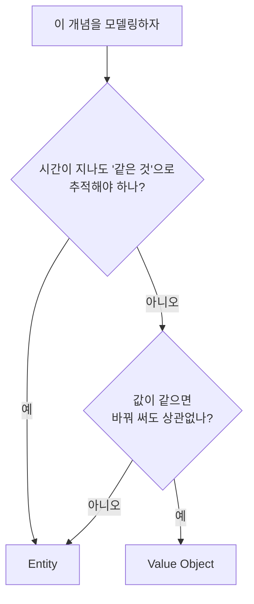

# DDD 전술 설계 (Tactical Design)

## 1. 전술 설계란?

**전술 설계**는 [[ddd-strategic-design|전략 설계]]로 나눈 하나의 Bounded Context 안에서, **도메인 규칙을 코드로 어떻게 표현할지** 정하는 패턴 모음입니다.

전략 설계가 "도시를 구역으로 나누기"라면, 전술 설계는 "그 구역 안에 건물을 짓는 표준 공법"입니다.

| 빌딩 블록 | 한 줄 설명 |
|---|---|
| **Entity** | 고유 ID로 구별되고, 시간이 지나며 상태가 바뀌는 객체 |
| **Value Object** | 값 자체로 구별되고, 바뀌지 않는 객체 |
| **Aggregate** | 함께 일관성을 지켜야 하는 객체 묶음 (→ [[ddd-aggregate]]) |
| **Repository** | Aggregate를 저장하고 꺼내 오는 창구 |
| **Domain Service** | 특정 객체에 넣기 어색한 도메인 규칙 |
| **Factory** | 복잡한 객체 생성 과정을 감추는 장치 |
| **Domain Event** | 도메인에서 일어난 의미 있는 사건 |



이 문서는 Entity, Value Object, Domain Service, Repository, Factory, Domain Event를 다룹니다. Aggregate는 내용이 많아서 [[ddd-aggregate]]에서 따로 다룹니다.

예제는 계속 **쇼핑몰의 주문(Ordering) Context**를 사용합니다.

## 2. Entity (엔티티)

### 2-1. 정의

**Entity**는 **고유한 식별자(ID)로 구별되는 객체**입니다. 속성이 바뀌어도 ID가 같으면 같은 객체입니다.

사람으로 비유하면, 이름을 바꾸고 이사를 가도 주민등록번호가 같으면 같은 사람입니다.

```text
주문 #1001 (상태: 결제 대기, 금액: 30,000원)
        │  결제 완료
        ▼
주문 #1001 (상태: 결제 완료, 금액: 30,000원)
        │  상품 하나 부분 취소
        ▼
주문 #1001 (상태: 부분 취소, 금액: 20,000원)

→ 속성은 계속 바뀌었지만 같은 "주문 #1001"이다
```

### 2-2. Entity의 특징

| 특징 | 설명 |
|---|---|
| 식별자 | 생성 시점에 ID를 갖고, 평생 바뀌지 않는다 |
| 생명주기 | 생성 → 상태 변경 → 종료(삭제, 보관)를 거친다 |
| 동등성 | ID가 같으면 같은 객체다 |
| 행동 | 상태를 바꾸는 메서드가 규칙을 함께 지킨다 |

### 2-3. 구현

```typescript
// ordering/domain/order-id.ts
export class OrderId {
  private constructor(readonly value: string) {}

  static generate(): OrderId {
    return new OrderId(randomUUID());
  }

  static of(value: string): OrderId {
    return new OrderId(value);
  }

  equals(other: OrderId): boolean {
    return this.value === other.value;
  }
}
```

```typescript
// ordering/domain/order.ts
export class Order {
  private constructor(
    readonly id: OrderId,
    readonly customerId: CustomerId,
    private status: OrderStatus,
    private readonly lines: OrderLine[],
  ) {}

  // 상태 변경은 업무 용어로 된 메서드로만 한다
  pay(): void {
    if (this.status !== OrderStatus.PENDING) {
      throw new InvalidOrderStateException(this.id, this.status, 'pay');
    }
    this.status = OrderStatus.PAID;
  }

  cancel(): void {
    if (this.status === OrderStatus.SHIPPED || this.status === OrderStatus.DELIVERED) {
      throw new CannotCancelShippedOrderException(this.id);
    }
    this.status = OrderStatus.CANCELLED;
  }

  equals(other: Order): boolean {
    return this.id.equals(other.id);
  }
}
```

### 2-4. Entity를 만들 때 주의할 점

**setter를 열지 않습니다.** `order.status = 'PAID'`가 가능하면 `pay()`에 넣어 둔 규칙을 누구나 건너뛸 수 있습니다.

```typescript
// (X) 상태를 밖에서 마음대로 바꿀 수 있다
order.setStatus(OrderStatus.PAID);

// (O) 업무 행동을 통해서만 바뀐다
order.pay();
```

**ID를 원시 타입 대신 전용 타입으로 감쌉니다.** `string`끼리는 실수로 바꿔 넣어도 컴파일러가 막지 못합니다.

```typescript
// (X) 순서를 바꿔 넣어도 에러가 안 난다
function assign(orderId: string, customerId: string) {}
assign(customerId, orderId);

// (O) 타입이 달라 컴파일 에러
function assign(orderId: OrderId, customerId: CustomerId) {}
```

> TypeScript는 구조적 타입 시스템이라 필드 모양이 같은 두 클래스를 같은 타입으로 봅니다. `OrderId`와 `CustomerId`가 둘 다 `{ value: string }`뿐이면 서로 대입이 됩니다. 확실히 구분하려면 `private readonly _brand = 'OrderId'` 같은 브랜드 필드를 넣거나 `string & { __brand: 'OrderId' }` 형태의 브랜드 타입을 씁니다.

## 3. Value Object (값 객체)

### 3-1. 정의

**Value Object**는 **속성 값 자체로 구별되는 객체**입니다. ID가 없고, 값이 같으면 같은 것으로 봅니다. 한번 만들면 **바꾸지 않습니다**(불변).

지폐로 비유하면, 내 만 원짜리와 친구의 만 원짜리를 바꿔도 아무도 신경 쓰지 않습니다. 금액(값)이 같기 때문입니다. 반면 집(Entity)은 같은 평수라도 주소(ID)가 다르면 다른 집입니다.

| 구분 | Entity | Value Object |
|---|---|---|
| 구별 기준 | ID | 모든 속성 값 |
| 변경 | 상태가 바뀐다 | 바뀌지 않는다. 바꾸려면 새로 만든다 |
| 생명주기 | 있다 | 없다. 소유한 Entity에 딸려 있다 |
| 예 | 주문, 회원, 상품 | 금액, 주소, 이메일, 기간, 수량 |

### 3-2. 왜 원시 타입 대신 Value Object를 쓸까?

```typescript
// 원시 타입만 쓴 코드
class Order {
  totalAmount: number;   // 원? 달러? 음수도 되나?
  currency: string;      // 'KRW', 'krw', '원' 다 들어갈 수 있다
  shippingZip: string;   // 형식 검증은 어디서?
}

// 금액 계산이 곳곳에 흩어진다
const total = order.totalAmount + shippingFee;   // 통화가 다르면?
```

이런 상태를 **Primitive Obsession(원시 타입 집착)**이라고 합니다. 값에 딸린 규칙(음수 불가, 통화 일치, 형식 검증)이 사방에 흩어집니다.

Value Object로 감싸면 규칙이 한 곳에 모입니다.

```typescript
// ordering/domain/money.ts
export class Money {
  private constructor(
    readonly amount: number,
    readonly currency: Currency,
  ) {}

  static of(amount: number, currency: Currency = 'KRW'): Money {
    if (!Number.isInteger(amount)) {
      throw new InvalidMoneyException('금액은 정수여야 합니다');
    }
    if (amount < 0) {
      throw new InvalidMoneyException('금액은 음수일 수 없습니다');
    }
    return new Money(amount, currency);
  }

  static zero(currency: Currency = 'KRW'): Money {
    return new Money(0, currency);
  }

  add(other: Money): Money {
    this.assertSameCurrency(other);
    return new Money(this.amount + other.amount, this.currency); // 새 객체를 반환
  }

  multiply(times: number): Money {
    return Money.of(this.amount * times, this.currency);
  }

  // 비율 계산: 원 단위 미만은 버린다
  percent(rate: number): Money {
    return Money.of(Math.floor((this.amount * rate) / 100), this.currency);
  }

  isGreaterThanOrEqual(other: Money): boolean {
    this.assertSameCurrency(other);
    return this.amount >= other.amount;
  }

  equals(other: Money): boolean {
    return this.amount === other.amount && this.currency === other.currency;
  }

  private assertSameCurrency(other: Money): void {
    if (this.currency !== other.currency) {
      throw new CurrencyMismatchException(this.currency, other.currency);
    }
  }
}
```

```typescript
const price = Money.of(10_000);
const total = price.multiply(3).add(Money.of(3_000)); // 33,000원
price.amount; // 여전히 10,000. 원본은 바뀌지 않는다
```

### 3-3. 불변이어야 하는 이유

Value Object가 바뀔 수 있다면 이런 일이 생깁니다.

```typescript
const address = new Address('서울시 강남구', '101호');
customer.address = address;
order.shippingAddress = address; // 같은 객체를 공유

address.detail = '202호';         // 고객 주소를 바꾸려 했는데
// → 이미 접수된 주문의 배송지도 같이 바뀐다
```

불변이면 공유해도 안전하고, 바꾸려면 새 객체를 만들어 교체하므로 의도가 분명해집니다.

```typescript
customer.changeAddress(Address.of('서울시 강남구', '202호'));
// order.shippingAddress는 그대로 101호
```

### 3-4. 자주 쓰는 Value Object 예

```typescript
// 이메일: 생성 시점에 형식 검증
export class Email {
  private constructor(readonly value: string) {}

  static of(value: string): Email {
    const normalized = value.trim().toLowerCase();
    if (!/^[^\s@]+@[^\s@]+\.[^\s@]+$/.test(normalized)) {
      throw new InvalidEmailException(value);
    }
    return new Email(normalized);
  }

  equals(other: Email): boolean {
    return this.value === other.value;
  }
}

// 수량: 1 이상
export class Quantity {
  private constructor(readonly value: number) {}

  static of(value: number): Quantity {
    if (!Number.isInteger(value) || value < 1) {
      throw new InvalidQuantityException(value);
    }
    return new Quantity(value);
  }
}

// 기간: 시작이 끝보다 늦을 수 없다
export class DateRange {
  private constructor(readonly start: Date, readonly end: Date) {}

  static of(start: Date, end: Date): DateRange {
    if (start > end) throw new InvalidDateRangeException(start, end);
    return new DateRange(start, end);
  }

  contains(date: Date): boolean {
    return this.start <= date && date <= this.end;
  }
}
```

`Email` 타입의 값을 받았다면 이미 형식 검증이 끝난 이메일이라는 뜻입니다. 이 값을 쓰는 곳에서는 다시 검증할 필요가 없습니다.

### 3-5. Entity로 할까, Value Object로 할까?



같은 개념도 Context에 따라 다르게 모델링될 수 있습니다.

| 개념 | Context | 모델링 | 이유 |
|---|---|---|---|
| 주소 | 주문 | Value Object | 배송지 값만 중요하다 |
| 주소 | 우편 시스템 | Entity | 주소 하나하나를 관리하고 추적한다 |
| 좌석 | 영화관 자유석 | Value Object | 아무 자리나 같다 |
| 좌석 | 공연 지정석 | Entity | A열 3번은 특정한 자리다 |

> 실무에서는 **기본을 Value Object로 하고, 추적이 필요할 때만 Entity로** 만드는 편이 좋습니다. Value Object는 불변이라 다루기 쉽고 버그가 적습니다.

## 4. Domain Service (도메인 서비스)

### 4-1. 정의

**Domain Service**는 **특정 Entity나 Value Object에 넣기 어색한 도메인 규칙**을 담는 객체입니다. 보통 여러 Aggregate를 함께 봐야 하는 규칙이 여기에 해당합니다.

예를 들어 "VIP 회원은 주문 금액의 10%를 할인하되, 쿠폰과 중복 적용하지 않고 더 큰 할인 하나만 적용한다"는 규칙은 `Order`, `Customer`, `Coupon`을 모두 봐야 합니다. 이걸 `Order` 안에 넣으면 `Order`가 회원 등급과 쿠폰 정책까지 알아야 해서 어색합니다.

```typescript
// ordering/domain/discount-policy.service.ts
// 순수 도메인 로직: 프레임워크 의존 없음, 상태 없음
export class DiscountPolicy {
  calculate(order: Order, customer: Customer, coupon: Coupon | null): Money {
    const total = order.totalAmount();

    const gradeDiscount = customer.isVip() ? total.percent(10) : Money.zero();

    const couponDiscount = coupon?.isApplicableTo(order)
      ? coupon.discountFor(total)
      : Money.zero();

    // 중복 적용 불가: 더 큰 할인 하나만
    return gradeDiscount.isGreaterThanOrEqual(couponDiscount)
      ? gradeDiscount
      : couponDiscount;
  }
}
```

### 4-2. Domain Service와 Application Service 구분

이름이 비슷해서 가장 많이 헷갈리는 부분입니다.

| 구분 | Domain Service | Application Service |
|---|---|---|
| 위치 | `domain/` | `application/` |
| 담는 것 | **업무 규칙** ("할인은 이렇게 계산한다") | **작업 순서** ("조회하고, 규칙 실행하고, 저장한다") |
| 의존 | 도메인 객체만 | Repository, Domain Service, 외부 시스템 |
| 인프라 접근 | 하지 않는다 | 트랜잭션, 저장, 메시지 발행을 조율한다 |
| 테스트 | 순수 단위 테스트 | 목(mock)을 쓴 테스트 |
| 비유 | 레시피 | 레시피를 들고 재료를 꺼내 요리하고 접시에 담는 요리사 |

```typescript
// ordering/application/place-order.service.ts
@Injectable()
export class PlaceOrderService {
  constructor(
    @Inject(ORDER_REPOSITORY) private readonly orders: OrderRepository,
    @Inject(CUSTOMER_REPOSITORY) private readonly customers: CustomerRepository,
    @Inject(COUPON_REPOSITORY) private readonly coupons: CouponRepository,
    private readonly discountPolicy: DiscountPolicy,
  ) {}

  @Transactional()
  async execute(command: PlaceOrderCommand): Promise<OrderId> {
    // 1. 필요한 것을 조회한다
    const customer = await this.customers.findById(command.customerId);
    const coupon = command.couponId ? await this.coupons.findById(command.couponId) : null;

    // 2. 도메인 객체를 만들고, 도메인 규칙을 실행한다
    const order = Order.place(customer.id, command.lines);
    const discount = this.discountPolicy.calculate(order, customer, coupon);
    order.applyDiscount(discount);

    // 3. 저장한다
    await this.orders.save(order);
    return order.id;
  }
}
```

Application Service에 `if`문으로 업무 규칙이 쌓이기 시작하면, 그 규칙을 Entity나 Domain Service로 옮겨야 한다는 신호입니다.

> `@Transactional()`은 Nest.js 기본 기능이 아닙니다. `typeorm-transactional`이나 `@nestjs-cls/transactional` 같은 라이브러리를 쓰거나, `DataSource.transaction()`으로 직접 감쌉니다.

### 4-3. Domain Service를 남용하지 않기

모든 로직을 Domain Service에 넣으면 [[layered-architecture|Layered Architecture]]에서 본 **빈약한 도메인 모델**로 돌아갑니다. 먼저 "이 규칙을 가장 잘 아는 객체가 누구인가?"를 묻고, 정말 어느 한 객체의 책임이 아닐 때만 Domain Service를 만듭니다.

## 5. Repository (리포지토리)

### 5-1. 정의

**Repository**는 **Aggregate를 마치 메모리 컬렉션처럼 저장하고 꺼내 오게 해 주는** 추상화입니다. 도메인 입장에서는 DB가 MySQL인지, MongoDB인지, 메모리인지 모릅니다.

```text
도메인이 보는 것:   orders.save(order) / orders.findById(id)
실제로 일어나는 일:  INSERT INTO orders ... / SELECT ... JOIN order_lines ...
```

### 5-2. 인터페이스는 도메인에, 구현은 인프라에

```typescript
// ordering/domain/order.repository.ts
export const ORDER_REPOSITORY = Symbol('ORDER_REPOSITORY');

export interface OrderRepository {
  findById(id: OrderId): Promise<Order | null>;
  save(order: Order): Promise<void>;
}
```

```typescript
// ordering/infrastructure/typeorm-order.repository.ts
@Injectable()
export class TypeOrmOrderRepository implements OrderRepository {
  constructor(
    @InjectRepository(OrderOrmEntity)
    private readonly repo: Repository<OrderOrmEntity>,
  ) {}

  async findById(id: OrderId): Promise<Order | null> {
    const row = await this.repo.findOne({
      where: { id: id.value },
      relations: { lines: true },
    });
    return row ? OrderMapper.toDomain(row) : null;
  }

  async save(order: Order): Promise<void> {
    await this.repo.save(OrderMapper.toOrm(order));
  }
}
```

```typescript
// ordering/ordering.module.ts
@Module({
  providers: [
    { provide: ORDER_REPOSITORY, useClass: TypeOrmOrderRepository },
  ],
})
export class OrderingModule {}
```

TypeScript 인터페이스는 런타임에 사라지기 때문에, Nest.js에서는 `Symbol`이나 문자열 토큰으로 주입합니다.

인터페이스가 `domain/` 안에 있으므로 **의존 방향이 뒤집힙니다**. 인프라가 도메인을 따르고, 도메인은 인프라를 모릅니다. 이것이 [[hexagonal-architecture|Hexagonal Architecture]]의 핵심 아이디어이기도 합니다.

### 5-3. 도메인 객체와 ORM 엔티티 분리

```typescript
// ordering/infrastructure/order.orm-entity.ts
@Entity('orders')
export class OrderOrmEntity {
  @PrimaryColumn('uuid') id: string;
  @Column() customerId: string;
  @Column() status: string;
  @OneToMany(() => OrderLineOrmEntity, (l) => l.order, { cascade: true })
  lines: OrderLineOrmEntity[];
}

// ordering/infrastructure/order.mapper.ts
export class OrderMapper {
  static toDomain(row: OrderOrmEntity): Order {
    return Order.reconstitute({
      id: OrderId.of(row.id),
      customerId: CustomerId.of(row.customerId),
      status: row.status as OrderStatus,
      lines: row.lines.map((l) =>
        OrderLine.reconstitute(l.productId, Money.of(l.unitPrice), Quantity.of(l.quantity)),
      ),
    });
  }

  static toOrm(order: Order): OrderOrmEntity {
    const snapshot = order.toSnapshot();
    const row = new OrderOrmEntity();
    row.id = snapshot.id;
    row.customerId = snapshot.customerId;
    row.status = snapshot.status;
    row.lines = snapshot.lines.map((l) => Object.assign(new OrderLineOrmEntity(), l));
    return row;
  }
}
```

| 방식 | 장점 | 단점 |
|---|---|---|
| 분리 (도메인 객체 + ORM 엔티티 + Mapper) | 도메인이 ORM에서 완전히 자유롭다 | 매핑 코드가 늘어난다 |
| 통합 (도메인 클래스에 `@Entity` 데코레이터) | 코드가 적다 | ORM 제약(public 필드, 인자 없는 생성자)이 도메인에 스며든다 |

규칙이 복잡한 Core 도메인은 분리하고, 단순한 영역은 통합해도 괜찮습니다.

### 5-4. Repository 설계 규칙

- **Aggregate 단위로 하나**만 만듭니다. `OrderLineRepository`는 만들지 않습니다. `OrderLine`은 `Order`를 통해서만 저장됩니다 ([[ddd-aggregate]] 참고).
- 메서드 이름은 **도메인 언어**로 짓습니다. `findByStatusAndCreatedAtBefore` 대신 `findUnpaidOrdersOlderThan(duration)`.
- 화면용 복잡한 조회(목록, 통계, 검색)는 Repository에 넣지 않고 별도 조회 모델로 뺍니다. 이것이 [[cqrs|CQRS]]의 출발점입니다.

## 6. Factory (팩토리)

### 6-1. 정의

**Factory**는 **복잡한 객체 생성 과정과 생성 시점의 규칙을 감추는** 장치입니다. 생성자에 검증과 조립이 많아지면 Factory로 분리합니다.

### 6-2. 정적 팩토리 메서드

가장 흔한 형태는 Aggregate Root의 정적 메서드입니다.

```typescript
export class Order extends AggregateRoot {
  private constructor(/* ... */) {
    super();
  }

  // 새 주문을 만들 때: 생성 규칙을 검사하고 이벤트를 기록한다
  static place(customerId: CustomerId, lines: OrderLineInput[]): Order {
    if (lines.length === 0) {
      throw new EmptyOrderException();
    }
    if (lines.length > 50) {
      throw new TooManyOrderLinesException(lines.length);
    }

    const order = new Order(
      OrderId.generate(),
      customerId,
      OrderStatus.PENDING,
      lines.map((l) => OrderLine.create(l.productId, l.unitPrice, l.quantity)),
    );
    order.record(new OrderPlaced(order.id, customerId, order.totalAmount()));
    return order;
  }

  // DB에서 복원할 때: 생성 규칙과 이벤트 없이 그대로 조립한다
  static reconstitute(props: OrderProps): Order {
    return new Order(props.id, props.customerId, props.status, props.lines);
  }
}
```

`place`와 `reconstitute`를 나누는 이유는 **새로 만드는 것**과 **저장된 것을 다시 불러오는 것**이 다른 일이기 때문입니다. 불러올 때마다 "주문됨" 이벤트가 발생하면 안 됩니다.

### 6-3. 별도 Factory 클래스

생성에 외부 정보(다른 Aggregate, 정책)가 필요하면 별도 클래스로 만듭니다.

```typescript
// 장바구니로부터 주문을 만든다: Cart와 상품 가격 정보가 필요하다
export class OrderFactory {
  createFromCart(cart: Cart, prices: PriceList): Order {
    const lines = cart.items.map((item) => ({
      productId: item.productId,
      unitPrice: prices.priceOf(item.productId), // 주문 시점 가격을 고정
      quantity: item.quantity,
    }));
    return Order.place(cart.customerId, lines);
  }
}
```

## 7. Domain Event (도메인 이벤트)

### 7-1. 정의

**Domain Event**는 **도메인에서 일어난, 업무적으로 의미 있는 사건**입니다. 이름은 항상 **과거형**으로 짓습니다. 이미 일어난 일이기 때문입니다.

| 좋은 이름 | 나쁜 이름 | 이유 |
|---|---|---|
| `OrderPlaced` | `CreateOrder` | 명령이 아니라 사실이다 |
| `PaymentCompleted` | `PaymentEvent` | 무슨 일이 일어났는지 드러나야 한다 |
| `OrderCancelled` | `OrderStatusChanged` | 업무적 의미가 있어야 한다 |

### 7-2. 왜 필요할까?

"주문이 완료되면 재고를 차감하고, 포인트를 적립하고, 알림을 보낸다"를 한 메서드에 쓰면 주문 코드가 재고, 포인트, 알림을 모두 알아야 합니다.

```typescript
// (X) 주문 유스케이스가 모든 후속 작업을 직접 호출한다
async placeOrder(command) {
  const order = Order.place(...);
  await this.orders.save(order);
  await this.inventoryService.decrease(order.lines);   // 재고
  await this.pointService.accrue(order.customerId);    // 포인트
  await this.notificationService.send(order);          // 알림
}
```

이벤트를 쓰면 주문은 "주문됨"이라는 사실만 알리고, 관심 있는 쪽이 각자 반응합니다. 6-2의 `Order.place()`가 `order.record(new OrderPlaced(...))`로 사실을 기록하는 부분이 이것입니다.

### 7-3. 구현: 이벤트를 모았다가 저장 후 발행

```typescript
// shared/domain/aggregate-root.ts
export abstract class AggregateRoot {
  private readonly events: DomainEvent[] = [];

  protected record(event: DomainEvent): void {
    this.events.push(event);
  }

  pullEvents(): DomainEvent[] {
    return this.events.splice(0); // 꺼내면서 비운다
  }
}

// ordering/domain/events/order-placed.event.ts
export class OrderPlaced implements DomainEvent {
  readonly occurredAt = new Date();
  constructor(
    readonly orderId: OrderId,
    readonly customerId: CustomerId,
    readonly totalAmount: Money,
  ) {}
}
```

```typescript
// ordering/application/place-order.service.ts
@Injectable()
export class PlaceOrderService {
  constructor(
    @Inject(ORDER_REPOSITORY) private readonly orders: OrderRepository,
    private readonly eventEmitter: EventEmitter2, // @nestjs/event-emitter
  ) {}

  async execute(command: PlaceOrderCommand): Promise<OrderId> {
    const order = Order.place(command.customerId, command.lines);
    await this.orders.save(order);

    for (const event of order.pullEvents()) {
      await this.eventEmitter.emitAsync(event.constructor.name, event);
    }
    return order.id;
  }
}

// point/application/accrue-point-on-order-placed.handler.ts
@Injectable()
export class AccruePointOnOrderPlaced {
  @OnEvent('OrderPlaced')
  async handle(event: OrderPlaced) {
    // 포인트 적립
  }
}
```

> 이 방식에는 "DB 저장은 성공했는데 이벤트 발행 전에 서버가 죽으면?" 같은 문제가 남아 있습니다. 저장과 발행을 함께 보장하는 방법은 [[transactional-outbox]]에서, 이벤트 기반 구조 전체는 [[event-driven-architecture]]에서 다룹니다.

## 8. 빌딩 블록 정리

```text
ordering/
├── domain/
│   ├── order.ts                     # Aggregate Root (Entity)
│   ├── order-line.ts                # Entity (Aggregate 내부)
│   ├── order-id.ts                  # Value Object (ID)
│   ├── money.ts                     # Value Object
│   ├── quantity.ts                  # Value Object
│   ├── order.repository.ts          # Repository 인터페이스
│   ├── order.factory.ts             # Factory
│   ├── discount-policy.service.ts   # Domain Service
│   └── events/order-placed.event.ts # Domain Event
├── application/
│   └── place-order.service.ts       # Application Service
└── infrastructure/
    ├── typeorm-order.repository.ts  # Repository 구현
    ├── order.orm-entity.ts          # ORM 엔티티
    └── order.mapper.ts              # 도메인 ↔ ORM 변환
```

| 빌딩 블록 | 핵심 질문 | 체크 포인트 |
|---|---|---|
| Entity | 시간이 지나도 같은 것으로 추적해야 하나? | ID가 있다, setter가 없다 |
| Value Object | 값이 같으면 같은 것인가? | 불변이다, 생성 시 검증한다 |
| Domain Service | 어느 한 객체의 책임이 아닌 규칙인가? | 상태가 없다, 인프라를 모른다 |
| Repository | Aggregate를 어떻게 저장/복원하나? | Aggregate당 하나, 인터페이스는 도메인에 |
| Factory | 생성 과정이 복잡한가? | 생성과 복원을 구분한다 |
| Domain Event | 다른 곳이 알아야 할 사건인가? | 과거형 이름, 불변 |

## 9. 핵심 정리

> 전술 설계는 Bounded Context 안의 도메인 규칙을 코드로 표현하는 패턴 모음이다. Entity는 ID로 구별되고 상태가 바뀌며, Value Object는 값으로 구별되고 불변이다. 특정 객체에 넣기 어색한 규칙은 Domain Service에, 작업 순서와 트랜잭션은 Application Service에 둔다. Repository는 인터페이스를 도메인에 두어 의존을 뒤집고, Factory는 생성과 복원을 구분하며, Domain Event는 일어난 사실을 과거형으로 알려 다른 영역과 느슨하게 연결한다.
