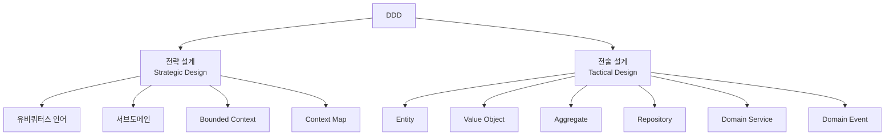

# DDD (Domain-Driven Design, 도메인 주도 설계)

## 1. DDD란?

**DDD(Domain-Driven Design)**는 **소프트웨어의 구조와 언어를 실제 비즈니스(도메인)에 맞추는** 설계 방법입니다. 2003년 에릭 에반스(Eric Evans)의 책 *Domain-Driven Design*에서 정리되었습니다.

여기서 **도메인(Domain)**은 소프트웨어가 해결하려는 업무 영역을 말합니다. 쇼핑몰이라면 주문, 결제, 배송, 정산 같은 것들이 도메인입니다.

DDD를 한 문장으로 줄이면 다음과 같습니다.

> 코드를 보면 업무가 보이고, 업무 이야기를 들으면 코드가 떠오르게 만든다.

DDD는 **특정 폴더 구조나 프레임워크가 아닙니다**. `Entity`, `Repository` 같은 클래스를 만든다고 DDD가 되지는 않습니다. DDD는 "복잡한 업무를 어떻게 이해하고 나눌지"에 대한 사고방식이고, 코드 패턴은 그 결과물 중 하나입니다.

## 2. 왜 DDD가 필요할까?

### 2-1. 개발자와 업무 담당자의 말이 다르다

```text
기획자: "주문이 확정되면 정산 대상이 돼요."
개발자: (orders 테이블 status를 'CONFIRMED'로 바꾸고,
         settlement 테이블에 row를 insert 하면 되겠군)

3개월 뒤
기획자: "부분 취소된 주문도 확정은 확정이죠. 근데 정산은 남은 금액만 해야 해요."
개발자: (확정이 그런 뜻이었어?)
```

같은 "확정"이라는 단어를 서로 다르게 이해하고 있었습니다. 이런 차이는 코드에 그대로 버그로 남습니다.

### 2-2. 복잡도가 데이터베이스에 숨는다

DB 테이블부터 설계하고 서비스에서 테이블을 조작하는 방식은 처음에는 빠릅니다. 하지만 규칙이 늘어날수록 이런 코드가 곳곳에 생깁니다.

```typescript
// 이 조건이 무슨 업무 규칙인지 코드만 봐서는 알 수 없다
if (order.status === 'PAID' && order.shippedAt == null && !order.isGift && dayjs().diff(order.paidAt, 'day') < 7) {
  // ...
}
```

DDD는 이 조건에 업무 용어로 이름을 붙이고, 그 규칙을 가장 잘 아는 객체 안에 넣으라고 말합니다.

```typescript
if (order.isCancellable()) {
  // ...
}
```

### 2-3. 하나의 거대한 모델이 모든 걸 표현하려고 한다

`Product`라는 클래스 하나가 상품 전시, 재고, 배송, 정산을 모두 책임지면 필드가 수십 개가 되고, 한 팀의 수정이 다른 팀 기능을 깨뜨립니다. DDD는 "모든 곳에서 통하는 하나의 모델"을 포기하고 **경계를 나누라고** 말합니다 (4-4 참고).

## 3. DDD의 두 축: 전략 설계와 전술 설계

DDD는 크게 두 부분으로 나뉩니다.



| 구분 | 질문 | 범위 | 문서 |
|---|---|---|---|
| 전략 설계 | 시스템을 **어떻게 나눌까?** | 큰 그림, 팀/서비스 경계 | [[ddd-strategic-design]] |
| 전술 설계 | 나눈 영역 안을 **어떻게 코드로 만들까?** | 클래스, 객체 설계 | [[ddd-tactical-design]], [[ddd-aggregate]] |

비유하자면 전략 설계는 **도시 계획**(주거 지역, 상업 지역, 공업 지역을 어디에 둘지)이고, 전술 설계는 **건물 설계**(그 구역 안에 건물을 어떻게 지을지)입니다.

많은 사람이 전술 설계(Entity, Repository 패턴)부터 배우지만, 에반스는 **전략 설계가 더 중요하다**고 강조합니다. 경계를 잘못 나누면 그 안의 코드를 아무리 잘 짜도 소용이 없기 때문입니다.

## 4. 유비쿼터스 언어 (Ubiquitous Language)

**유비쿼터스 언어**는 개발자와 도메인 전문가(기획자, 운영자, 현업 담당자)가 **함께 쓰는 하나의 언어**입니다. 회의, 문서, 코드, DB 컬럼명까지 같은 단어를 씁니다.

### 4-1. 유비쿼터스 언어가 없을 때

| 현업이 쓰는 말 | 코드에 쓰인 이름 |
|---|---|
| 주문 확정 | `updateStatus(2)` |
| 구매 확정 | `setFinalFlag(true)` |
| 반품 | `refund`, `return`, `cancel` 이 섞여 있음 |

현업 요구사항을 코드로 옮길 때마다 머릿속에서 번역이 필요하고, 번역할 때마다 오해가 생깁니다.

### 4-2. 유비쿼터스 언어가 있을 때

```typescript
class Order {
  confirm(): void { /* 주문 확정 */ }
  confirmPurchase(): void { /* 구매 확정: 반품 기간이 끝나 정산 가능한 상태 */ }
  requestReturn(reason: ReturnReason): void { /* 반품 요청 */ }
}
```

기획 문서에 "구매 확정 후에는 반품 요청을 할 수 없다"라고 적혀 있으면, 코드에도 거의 같은 문장이 보입니다.

```typescript
requestReturn(reason: ReturnReason): void {
  if (this.isPurchaseConfirmed()) {
    throw new CannotReturnAfterPurchaseConfirmedException();
  }
  // ...
}
```

### 4-3. 유비쿼터스 언어를 만드는 방법

- **용어 사전**을 만들어 팀이 함께 관리합니다. 단어, 뜻, 예시, 헷갈리기 쉬운 단어를 적습니다.
- 회의에서 애매한 단어가 나오면 그 자리에서 정의를 확인합니다. ("여기서 '취소'는 결제 취소인가요, 주문 취소인가요?")
- 코드 리뷰에서 용어 사전과 다른 이름을 쓰면 지적합니다.
- 용어가 바뀌면 **코드 이름도 같이 바꿉니다**. 언어와 코드가 어긋나기 시작하면 다시 번역 비용이 생깁니다.

### 4-4. 같은 단어, 다른 뜻

유비쿼터스 언어를 만들다 보면 같은 단어가 부서마다 다른 뜻으로 쓰인다는 사실을 알게 됩니다.

| 단어 | 상품 전시팀 | 물류팀 | 정산팀 |
|---|---|---|---|
| 상품 | 이름, 이미지, 설명, 판매가 | 무게, 부피, 보관 위치 | 공급가, 수수료율 |

이걸 억지로 하나의 `Product`로 합치지 말고, 각자의 경계 안에서 각자의 뜻으로 쓰자는 것이 **Bounded Context**입니다. 유비쿼터스 언어는 시스템 전체가 아니라 **하나의 Bounded Context 안에서** 하나로 통일됩니다. 자세한 내용은 [[ddd-strategic-design]]에서 다룹니다.

## 5. 도메인 모델 (Domain Model)

**도메인 모델**은 업무 지식을 코드로 표현한 것입니다. 데이터만 담은 구조가 아니라 **규칙과 행동을 함께** 가집니다.

| 구분 | 데이터 모델 | 도메인 모델 |
|---|---|---|
| 관심사 | 무엇을 저장할까? | 무엇을 할 수 있고, 무엇은 안 되는가? |
| 형태 | 필드 + getter/setter | 필드 + 업무 행동 메서드 |
| 규칙 위치 | 서비스 곳곳 | 모델 내부 |
| 예 | `order.status = 'CANCELLED'` | `order.cancel()` |

```typescript
// 도메인 모델: 규칙이 객체 안에 있다
export class Order {
  private constructor(
    readonly id: OrderId,
    private status: OrderStatus,
    private readonly lines: OrderLine[],
  ) {}

  cancel(): void {
    if (this.status === OrderStatus.SHIPPED) {
      throw new CannotCancelShippedOrderException(this.id);
    }
    this.status = OrderStatus.CANCELLED;
  }

  totalAmount(): Money {
    return this.lines.reduce((sum, line) => sum.add(line.amount()), Money.zero());
  }
}
```

`Order`를 쓰는 쪽은 "배송된 주문은 취소할 수 없다"는 규칙을 몰라도 됩니다. `cancel()`을 부르면 객체가 알아서 지킵니다.

## 6. DDD와 아키텍처의 관계

DDD는 아키텍처 패턴이 아니지만, 도메인 모델을 **기술로부터 보호하는** 구조가 필요합니다. 도메인 모델이 TypeORM 데코레이터, HTTP 요청 객체, 메시지 큐 라이브러리에 의존하면 업무 규칙이 기술 변경에 흔들리기 때문입니다.

```text
┌──────────────────────────────────────────┐
│ Infrastructure (DB, MQ, 외부 API)        │
│  ┌────────────────────────────────────┐  │
│  │ Application (유스케이스 조율)      │  │
│  │  ┌──────────────────────────────┐  │  │
│  │  │ Domain (도메인 모델)         │  │  │
│  │  │ 순수 TypeScript, 의존 없음   │  │  │
│  │  └──────────────────────────────┘  │  │
│  └────────────────────────────────────┘  │
└──────────────────────────────────────────┘
         의존은 바깥에서 안쪽으로만
```

그래서 DDD는 다음 패턴들과 자주 함께 쓰입니다.

| 함께 쓰는 패턴 | 이유 | 문서 |
|---|---|---|
| Hexagonal Architecture | 도메인을 중심에 두고 기술을 바깥으로 밀어낸다 | [[hexagonal-architecture]] |
| CQRS | 복잡한 도메인 모델은 쓰기에 집중하고, 조회는 따로 최적화한다 | [[cqrs]] |
| Event-Driven Architecture | Bounded Context 사이를 도메인 이벤트로 느슨하게 연결한다 | [[event-driven-architecture]] |

[[layered-architecture|Layered Architecture]]에서도 DDD를 할 수 있습니다. 다만 Domain 계층이 Persistence 계층에 의존하지 않도록 Repository를 인터페이스로 뒤집는 작업이 필요합니다.

## 7. Nest.js 프로젝트에서 DDD 구조 예시

Bounded Context별로 모듈을 나누고, 각 모듈 안을 계층으로 나누는 구조가 흔합니다.

```text
src/
├── order/                      # 주문 Bounded Context
│   ├── domain/                 # 순수 도메인: 프레임워크 import 없음
│   │   ├── order.ts            # Aggregate Root
│   │   ├── order-line.ts       # Entity
│   │   ├── money.ts            # Value Object
│   │   ├── order.repository.ts # Repository 인터페이스
│   │   └── events/order-placed.event.ts
│   ├── application/            # 유스케이스
│   │   └── place-order.service.ts
│   ├── infrastructure/         # 기술 구현
│   │   ├── typeorm-order.repository.ts
│   │   └── order.orm-entity.ts
│   ├── presentation/
│   │   └── order.controller.ts
│   └── order.module.ts
├── payment/                    # 결제 Bounded Context
└── shipping/                   # 배송 Bounded Context
```

| 폴더 | 들어가는 것 | 의존해도 되는 것 |
|---|---|---|
| `domain/` | 엔티티, 값 객체, 도메인 규칙, 리포지토리 인터페이스 | 없음 (순수 TS) |
| `application/` | 유스케이스 서비스, 트랜잭션 처리 | `domain/` |
| `infrastructure/` | ORM 엔티티, 리포지토리 구현, 외부 API 클라이언트 | `domain/`, `application/` |
| `presentation/` | 컨트롤러, DTO | `application/` |

## 8. DDD를 쓰지 않는 게 나은 경우

DDD는 비용이 큰 방법입니다. 다음 경우에는 오히려 과합니다.

- **CRUD가 대부분**인 서비스 (게시판, 관리자 도구). 규칙이 거의 없으면 도메인 모델이 데이터 모델과 다를 게 없습니다.
- **도메인 전문가와 대화할 수 없는** 상황. 유비쿼터스 언어를 함께 만들 상대가 없습니다.
- **곧 버릴 프로토타입**.
- 팀이 DDD에 익숙하지 않은데 일정이 촉박한 경우. 어설프게 적용하면 클래스 수만 늘어납니다.

전략 설계(경계 나누기, 용어 통일)는 대부분의 프로젝트에 도움이 됩니다. 전술 설계(Aggregate, Value Object 등)는 **Core 도메인처럼 규칙이 복잡한 곳에만** 골라서 적용하는 것이 현실적입니다. 어떤 영역이 Core인지 구분하는 방법은 [[ddd-strategic-design]]에서 다룹니다.

## 9. 장점과 단점

| 장점 | 설명 |
|---|---|
| 코드가 업무를 설명한다 | 새로 온 개발자도 코드로 업무 규칙을 파악할 수 있다 |
| 소통 비용이 줄어든다 | 현업과 개발자가 같은 단어를 쓴다 |
| 변경에 강하다 | 규칙이 한곳에 모여 있어 수정 범위가 좁다 |
| 경계가 명확하다 | 팀, 모듈, 마이크로서비스를 나누는 기준이 된다 |

| 단점 | 설명 |
|---|---|
| 학습 비용이 크다 | 개념이 많고 추상적이다 |
| 초기 개발이 느리다 | 모델링과 대화에 시간이 든다 |
| 코드 양이 늘어난다 | 도메인 객체와 ORM 엔티티 사이의 매핑 코드가 생긴다 |
| 잘못 쓰면 형식만 남는다 | 패턴 이름만 붙인 빈약한 모델이 되기 쉽다 |

## 10. 핵심 정리

> DDD는 소프트웨어의 구조와 언어를 비즈니스 도메인에 맞추는 설계 방법이다. 전략 설계로 시스템의 경계(Bounded Context)를 나누고 그 안에서 하나의 유비쿼터스 언어를 쓴다. 전술 설계로 그 경계 안의 규칙을 Entity, Value Object, Aggregate 같은 도메인 모델로 표현한다. 복잡한 Core 도메인에 쓸 때 효과가 크고, 단순 CRUD에는 과하다.
