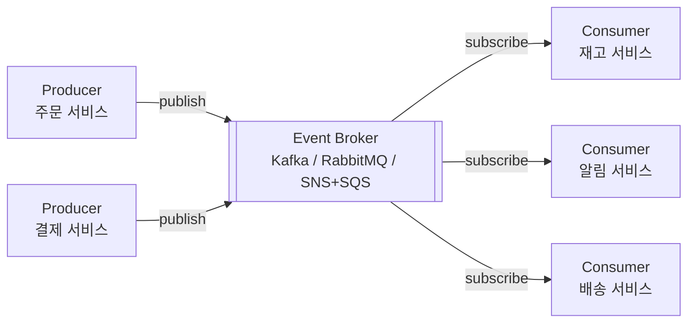
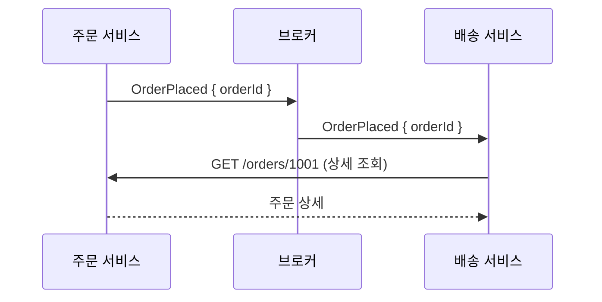
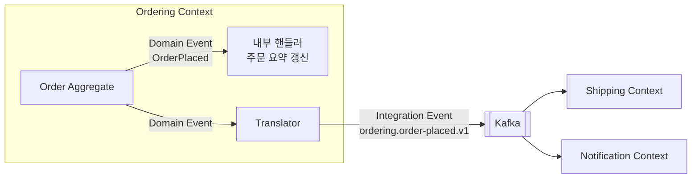
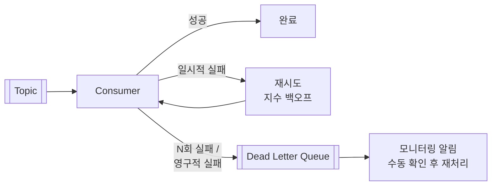
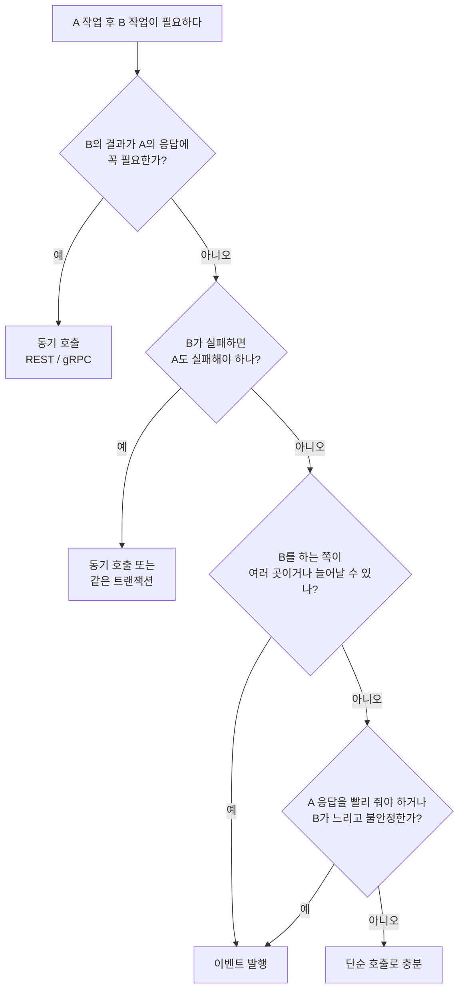

# Event-Driven Architecture (이벤트 기반 아키텍처)

## 1. Event-Driven Architecture란?

**Event-Driven Architecture(EDA)**는 **컴포넌트들이 서로를 직접 호출하지 않고, "무슨 일이 일어났다"는 이벤트를 발행하고 구독하는 방식으로 협력하는** 구조입니다.

```text
직접 호출 (요청 기반)                    이벤트 기반
────────────────────                     ────────────────────
주문 서비스                               주문 서비스
  ├─> 재고 서비스.차감()                   └─> "주문됨" 발행 ──> [이벤트 브로커]
  ├─> 포인트 서비스.적립()                                          ├─> 재고 서비스
  ├─> 알림 서비스.발송()                                            ├─> 포인트 서비스
  └─> 배송 서비스.접수()                                            ├─> 알림 서비스
                                                                    └─> 배송 서비스
주문 서비스가 4곳을 다 알아야 한다       주문 서비스는 아무도 모른다
```

학교 방송에 비유하면 이해하기 쉽습니다.

| 방식 | 비유 |
|---|---|
| 직접 호출 | 교무실 선생님이 반마다 직접 찾아가서 "3시에 강당으로 모이세요"라고 전한다. 반이 늘면 할 일도 는다 |
| 이벤트 기반 | 교내 방송으로 한 번 알린다. 들어야 하는 반이 알아서 듣는다. 반이 늘어도 방송은 한 번이다 |

## 2. 왜 필요할까?

### 2-1. 직접 호출 방식의 문제

```typescript
// 주문 서비스가 모든 후속 작업을 직접 호출한다
async placeOrder(cmd: PlaceOrderCommand) {
  const order = await this.orderRepo.save(Order.place(cmd));
  await this.inventoryClient.decrease(order.lines);  // 재고 서비스 HTTP 호출
  await this.pointClient.accrue(order.customerId);   // 포인트 서비스 HTTP 호출
  await this.notificationClient.send(order);         // 알림 서비스 HTTP 호출
  await this.shippingClient.register(order);         // 배송 서비스 HTTP 호출
  return order.id;
}
```

| 문제 | 설명 |
|---|---|
| **강한 결합** | 새 기능(쿠폰 사용 처리)이 생기면 주문 코드를 고쳐야 한다 |
| **장애 전파** | 알림 서비스가 죽으면 주문까지 실패한다 |
| **느린 응답** | 4개 호출을 다 기다려야 응답한다 |
| **확장 어려움** | 주문 폭주 시 4개 서비스가 동시에 같은 부하를 받는다 |
| **책임 혼란** | "주문"이 "알림"과 "포인트" 정책까지 알고 있다 |

### 2-2. 이벤트 기반으로 바꾸면

```typescript
async placeOrder(cmd: PlaceOrderCommand) {
  const order = Order.place(cmd);
  await this.orderRepo.save(order);
  await this.eventPublisher.publish(new OrderPlaced(order)); // 사실만 알린다
  return order.id;
}
```

| 개선 | 설명 |
|---|---|
| 느슨한 결합 | 쿠폰 서비스가 `OrderPlaced`를 구독하기만 하면 된다. 주문 코드는 그대로 |
| 장애 격리 | 알림 서비스가 죽어도 주문은 성공한다. 알림은 복구 후 밀린 이벤트를 처리한다 |
| 빠른 응답 | 저장과 발행만 하고 바로 응답한다 |
| 부하 완충 | 브로커가 이벤트를 쌓아 두고, 각 서비스는 자기 속도로 처리한다 |

## 3. 핵심 구성 요소



| 구성 요소 | 역할 |
|---|---|
| **Event** | 일어난 사실을 담은 메시지. 과거형 이름 (`OrderPlaced`) |
| **Producer** (Publisher) | 이벤트를 만들어 발행한다. 누가 받는지 모른다 |
| **Event Broker** (Channel) | 이벤트를 받아 보관하고 구독자에게 전달한다 |
| **Consumer** (Subscriber) | 관심 있는 이벤트를 구독해 처리한다. 누가 보냈는지 몰라도 된다 |

### 3-1. 이벤트 vs 명령 vs 메시지

| 구분 | Event | Command |
|---|---|---|
| 의미 | 일어난 **사실** | 해 달라는 **요청** |
| 이름 | 과거형: `OrderPlaced` | 명령형: `ShipOrder` |
| 받는 쪽 | 0개 이상, 발행자는 모른다 | 정확히 1개, 발행자가 안다 |
| 거절 | 할 수 없다 (이미 일어났다) | 할 수 있다 |
| 결합 | 느슨함 | 상대적으로 강함 |

"메시지"는 둘을 모두 아우르는 말입니다. 브로커로 Command를 보낼 수도 있지만, **EDA의 중심은 Event**입니다.

## 4. 이벤트의 세 가지 스타일

마틴 파울러는 이벤트를 쓰는 방식을 몇 가지로 나눴습니다. 같은 "주문됨" 이벤트라도 **얼마나 많은 정보를 담느냐**에 따라 성격이 완전히 달라집니다.

### 4-1. Event Notification (이벤트 알림)

**"무슨 일이 있었다"만 알리고, 자세한 정보는 담지 않습니다.** 필요한 쪽이 다시 물어봅니다.

```json
{ "type": "OrderPlaced", "orderId": "1001" }
```



| 장점 | 단점 |
|---|---|
| 이벤트가 작고 단순하다 | 구독자가 다시 호출하므로 결합과 부하가 생긴다 |
| 이벤트 스키마가 거의 안 바뀐다 | 주문 서비스가 죽으면 구독자도 처리하지 못한다 |
| | 다시 조회할 때는 이미 상태가 바뀌었을 수 있다 |

### 4-2. Event-Carried State Transfer (이벤트로 상태 전달)

**구독자가 필요한 데이터를 이벤트에 모두 담아 보냅니다.** 구독자는 다시 물어보지 않고, 필요하면 자기 쪽에 복사본을 저장합니다.

```json
{
  "type": "OrderPlaced",
  "orderId": "1001",
  "customerId": "c-1",
  "shippingAddress": { "zip": "06236", "line1": "서울시 강남구 ...", "line2": "101호" },
  "lines": [{ "productId": "p-1", "quantity": 2 }],
  "totalAmount": 30000
}
```

| 장점 | 단점 |
|---|---|
| 구독자가 독립적으로 동작한다 (발행자 장애와 무관) | 이벤트가 크다 |
| 추가 호출이 없어 빠르다 | 데이터가 여러 곳에 복제된다 |
| | 이벤트 스키마가 곧 계약이 되어 바꾸기 어렵다 |

### 4-3. Event Sourcing

이벤트를 **상태의 원본으로 저장**하는 방식입니다. 통신 패턴이라기보다 저장 패턴이며, 자세한 내용은 [[event-sourcing]]에서 다룹니다.

### 4-4. 어떤 스타일을 고를까?

| 상황 | 추천 |
|---|---|
| 구독자가 많고 각자 필요한 정보가 다르다 | Notification (각자 필요한 것만 조회) |
| 발행자 장애와 무관하게 구독자가 동작해야 한다 | State Transfer |
| 구독자가 발행자 데이터를 로컬에 캐시해야 한다 | State Transfer |
| 이벤트 스키마를 자주 바꾸게 될 것 같다 | Notification |

실무에서는 **"구독자가 일반적으로 필요한 핵심 정보는 담되, 모든 것을 담지는 않는"** 중간 지점을 많이 택합니다.

## 5. Domain Event와 Integration Event

같은 "이벤트"라도 **어디까지 퍼지느냐**에 따라 두 종류로 나눕니다.

| 구분 | Domain Event | Integration Event |
|---|---|---|
| 범위 | 하나의 Bounded Context **안** | Bounded Context **사이** (서비스 간) |
| 전달 | 메모리 (같은 프로세스) | 메시지 브로커 (네트워크) |
| 형식 | 도메인 객체 (`OrderId`, `Money`) | 직렬화 가능한 단순 데이터 (JSON, Protobuf) |
| 변경 | 자유롭다 (내부 구현) | 신중해야 한다 (외부 계약) |
| 버전 관리 | 필요 없음 | 필수 (`order-placed.v1`) |
| 예 | `OrderLineRemoved` (세밀함) | `ordering.order-placed.v1` (바깥이 알아야 할 것만) |



```typescript
// Domain Event: 내부용, 도메인 타입 사용
export class OrderPlaced {
  constructor(
    readonly orderId: OrderId,
    readonly customerId: CustomerId,
    readonly lines: OrderLine[],
    readonly total: Money,
  ) {}
}

// Integration Event: 외부 계약, 단순 데이터 + 버전
export interface OrderPlacedV1 {
  eventId: string;          // 중복 처리 방지용 고유 ID
  type: 'ordering.order-placed.v1';
  occurredAt: string;       // ISO 8601
  data: {
    orderId: string;
    customerId: string;
    lines: { productId: string; quantity: number }[];
    totalAmount: number;
    currency: 'KRW';
  };
}

// 내부 이벤트를 외부 계약으로 번역한다
@Injectable()
export class OrderIntegrationEventTranslator {
  constructor(private readonly publisher: IntegrationEventPublisher) {}

  @OnEvent(OrderPlaced.name)
  async handle(e: OrderPlaced) {
    await this.publisher.publish<OrderPlacedV1>({
      eventId: randomUUID(),
      type: 'ordering.order-placed.v1',
      occurredAt: new Date().toISOString(),
      data: {
        orderId: e.orderId.value,
        customerId: e.customerId.value,
        lines: e.lines.map((l) => ({ productId: l.productId.value, quantity: l.quantity.value })),
        totalAmount: e.total.amount,
        currency: 'KRW',
      },
    });
  }
}
```

**내부 Domain Event를 그대로 외부에 내보내지 않는 것**이 중요합니다. 내부 리팩터링이 다른 팀 서비스를 깨뜨리게 되기 때문입니다. [[ddd-strategic-design]]의 Published Language가 바로 이 Integration Event 형식입니다.

## 6. 이벤트 브로커

### 6-1. 두 가지 모델

| 모델 | 대표 | 특징 |
|---|---|---|
| **메시지 큐** (Message Queue) | RabbitMQ, AWS SQS | 메시지를 소비하면 사라진다. 작업 분배에 적합 |
| **이벤트 로그** (Log-based) | Apache Kafka, AWS Kinesis, Redpanda | 메시지를 일정 기간 보관한다. 여러 소비자가 각자 위치(offset)에서 읽는다. 다시 읽기(replay) 가능 |

```text
메시지 큐                          이벤트 로그
┌────────────┐                     ┌─────────────────────────────────┐
│ [m3][m2][m1]──> 소비자 A         │ [e1][e2][e3][e4][e5][e6] ...    │
└────────────┘     (꺼내면 사라짐) └──▲──────────▲──────────▲────────┘
                                      소비자 A    소비자 B    소비자 C
                                      (offset 1)  (offset 3)  (offset 6)
```

### 6-2. Pub/Sub 팬아웃

하나의 이벤트를 여러 서비스가 각자 받아야 한다면, **구독자마다 독립된 큐(또는 Consumer Group)**가 필요합니다.

```text
Kafka:            topic: ordering.events
                    ├── consumer group "shipping"      (배송 서비스 인스턴스들이 나눠 처리)
                    ├── consumer group "notification"
                    └── consumer group "point"

RabbitMQ:         exchange (fanout/topic)
                    ├── queue "shipping.order-placed"
                    ├── queue "notification.order-placed"
                    └── queue "point.order-placed"

AWS:              SNS topic ──> SQS queue (구독자마다 하나씩)
```

같은 그룹 안의 인스턴스끼리는 **나눠서** 처리하고(부하 분산), 그룹끼리는 **각자 전부** 받습니다(팬아웃).

### 6-3. Nest.js에서 Kafka 사용하기

```typescript
// main.ts: 마이크로서비스 리스너 연결
const app = await NestFactory.create(AppModule);
app.connectMicroservice<MicroserviceOptions>({
  transport: Transport.KAFKA,
  options: {
    client: { brokers: ['localhost:9092'] },
    consumer: { groupId: 'shipping' }, // 이 서비스의 Consumer Group
  },
});
await app.startAllMicroservices();
await app.listen(3000);
```

```typescript
// 발행 쪽 (주문 서비스)
@Injectable()
export class KafkaIntegrationEventPublisher implements IntegrationEventPublisher {
  constructor(@Inject('KAFKA') private readonly kafka: ClientKafka) {}

  async publish<T extends { type: string; data: { orderId: string } }>(event: T) {
    await lastValueFrom(
      this.kafka.emit('ordering.events', {
        key: event.data.orderId, // 같은 주문 이벤트는 같은 파티션 → 순서 보장
        value: JSON.stringify(event),
      }),
    );
  }
}

// 구독 쪽 (배송 서비스)
@Controller()
export class OrderEventsConsumer {
  constructor(private readonly registerShipment: RegisterShipmentService) {}

  @EventPattern('ordering.events')
  async handle(@Payload() event: OrderPlacedV1 | OrderCancelledV1) {
    switch (event.type) {
      case 'ordering.order-placed.v1':
        return this.registerShipment.execute(event);
      case 'ordering.order-cancelled.v1':
        return this.registerShipment.cancel(event.data.orderId);
      default:
        return; // 모르는 이벤트는 무시한다 (발행자가 새 이벤트를 추가해도 안전)
    }
  }
}
```

## 7. 반드시 알아야 할 문제들

이벤트 기반 시스템은 네트워크와 브로커를 거치므로, 직접 호출에서는 없던 문제들이 생깁니다.

### 7-1. 전달 보장 수준

| 보장 수준 | 의미 | 현실 |
|---|---|---|
| At-most-once | 최대 한 번. 잃어버릴 수 있다 | 손실 허용 시만 (로그, 지표) |
| **At-least-once** | 최소 한 번. **중복될 수 있다** | **대부분 브로커의 기본** |
| Exactly-once | 정확히 한 번 | 브로커 내부에서만 제한적으로 가능. 외부 DB까지 포함하면 사실상 어렵다 |

현실적인 목표는 **"At-least-once 전달 + 소비자의 멱등 처리 = 결과적으로 한 번 처리한 것과 같은 효과"**입니다.

### 7-2. 멱등성 (Idempotency)

**같은 이벤트를 여러 번 처리해도 결과가 한 번 처리한 것과 같아야 합니다.**

```typescript
// 처리한 이벤트 ID를 기록해서 중복을 막는다
@Injectable()
export class RegisterShipmentService {
  constructor(private readonly dataSource: DataSource) {}

  async execute(event: OrderPlacedV1) {
    await this.dataSource.transaction(async (tx) => {
      // 1) 이미 처리한 이벤트인지 확인 (PK 충돌로 판단)
      const inserted = await tx.query(
        `INSERT INTO processed_events (event_id, processed_at)
         VALUES ($1, now()) ON CONFLICT DO NOTHING RETURNING event_id`,
        [event.eventId],
      );
      if (inserted.length === 0) return; // 이미 처리함 → 무시

      // 2) 실제 처리 (같은 트랜잭션)
      await tx.query(
        `INSERT INTO shipments (order_id, status) VALUES ($1, 'READY')`,
        [event.data.orderId],
      );
    });
  }
}
```

| 멱등 처리 방법 | 예 |
|---|---|
| 처리한 이벤트 ID 기록 | 위 `processed_events` 테이블 |
| 자연스럽게 멱등한 연산 | `status = 'SHIPPED'`로 SET (몇 번 해도 같음) |
| upsert | `INSERT ... ON CONFLICT DO UPDATE` |
| 버전/조건부 갱신 | `WHERE version < $eventVersion` |

`stock = stock - 1` 같은 **누적 연산은 멱등하지 않으므로** 반드시 이벤트 ID 기록과 함께 써야 합니다.

### 7-3. 순서 보장

```text
발행 순서:  OrderPlaced → OrderPaid → OrderCancelled
도착 순서:  OrderPlaced → OrderCancelled → OrderPaid   ← 취소된 주문이 결제 완료로 바뀐다
```

| 방법 | 설명 |
|---|---|
| **파티션 키** | Kafka에서 같은 키(주문 ID)는 같은 파티션 → 그 안에서 순서 보장 |
| 버전 번호 | 이벤트에 Aggregate 버전을 넣고, 낮은 버전은 무시하거나 대기 |
| 상태 기반 검증 | 소비자가 "취소된 주문은 결제 완료로 바꾸지 않는다" 규칙을 가진다 |

**전체 순서는 보장하지 않고, 같은 Aggregate 안에서의 순서만 보장**하는 것이 일반적입니다.

### 7-4. 저장과 발행의 원자성 (Dual Write 문제)

```typescript
await this.orderRepo.save(order);           // ① DB 저장 성공
// ← 여기서 서버가 죽으면?
await this.eventPublisher.publish(event);   // ② 발행 안 됨 → 배송이 영원히 안 됨
```

반대로 발행을 먼저 하면 "DB 저장은 실패했는데 이벤트는 나간" 상황이 생깁니다. DB와 브로커는 하나의 트랜잭션으로 묶을 수 없습니다. 이 문제를 푸는 표준 해법이 **Transactional Outbox**이며, [[transactional-outbox]]에서 자세히 다룹니다.

### 7-5. 실패 처리와 Dead Letter Queue

소비자가 이벤트 처리에 계속 실패하면 어떻게 할까요?



| 실패 종류 | 예 | 처리 |
|---|---|---|
| 일시적 | DB 타임아웃, 외부 API 503 | 지수 백오프로 재시도 |
| 영구적 | 잘못된 형식, 존재하지 않는 주문 | 재시도해도 소용없음 → 바로 DLQ |

DLQ를 두지 않으면 실패하는 이벤트 하나가 **뒤의 모든 이벤트를 막는(poison message)** 상황이 생길 수 있습니다.

### 7-6. 결과적 일관성

이벤트 처리는 비동기이므로, **잠시 동안 서비스 간 데이터가 어긋납니다.**

```text
t=0     주문 생성 완료 (주문 서비스: 주문 있음)
t=0~1s  배송 서비스: 아직 배송 정보 없음   ← 이 시간 동안 "배송 조회"하면 없다고 나온다
t=1s    배송 서비스가 이벤트 처리 → 일치
```

이걸 업무적으로 허용할 수 있는지 반드시 확인해야 합니다. 허용할 수 없다면 그 부분은 동기 호출로 남겨 둡니다. ([[cqrs]] 8장 참고)

## 8. 여러 서비스에 걸친 흐름: Choreography와 Orchestration

"주문 → 결제 → 재고 예약 → 배송" 같은 흐름을 이벤트로 연결하는 방식은 두 가지입니다.

| 방식 | 설명 | 비유 |
|---|---|---|
| **Choreography** (안무) | 각 서비스가 이벤트를 듣고 스스로 다음 일을 한다. 중앙 지휘자가 없다 | 서로 신호를 보며 맞추는 군무 |
| **Orchestration** (지휘) | 중앙 오케스트레이터가 각 서비스에 명령을 보내고 결과를 받아 다음 단계를 결정한다 | 지휘자가 있는 오케스트라 |

```text
Choreography
주문 ──OrderPlaced──> 결제 ──PaymentCompleted──> 재고 ──StockReserved──> 배송

Orchestration
           ┌──── 결제해 ────> 결제
오케스트레이터 ── 재고 잡아 ──> 재고
           └──── 배송해 ────> 배송
```

중간 단계가 실패했을 때 앞 단계를 되돌리는 **보상 트랜잭션**까지 포함한 자세한 내용은 [[saga-pattern]]에서 다룹니다.

## 9. 관찰 가능성 (Observability)

직접 호출은 스택 트레이스로 흐름을 따라갈 수 있지만, 이벤트 기반 시스템은 **흐름이 여러 서비스에 흩어져** 추적이 어렵습니다.

| 도구 | 설명 |
|---|---|
| **Correlation ID** | 최초 요청에서 만든 ID를 모든 이벤트 메타데이터에 전파한다 |
| **Causation ID** | 이 이벤트를 일으킨 직전 이벤트의 ID |
| 분산 추적 | OpenTelemetry로 이벤트 발행·소비를 하나의 트레이스로 연결한다 |
| 소비 지연 모니터링 | Kafka consumer lag: 소비자가 얼마나 밀렸는지 |
| 이벤트 카탈로그 | 어떤 이벤트를 누가 발행하고 누가 구독하는지 문서화 (AsyncAPI) |

```typescript
interface EventEnvelope<T> {
  eventId: string;
  type: string;
  occurredAt: string;
  correlationId: string; // 최초 HTTP 요청부터 이어지는 ID
  causationId?: string;  // 이 이벤트를 일으킨 이벤트 ID
  data: T;
}
```

## 10. 장점과 단점

| 장점 | 설명 |
|---|---|
| 느슨한 결합 | 발행자는 구독자를 모른다. 구독자 추가가 발행자에 영향을 주지 않는다 |
| 확장성 | 서비스별로 독립 확장한다. 브로커가 부하를 완충한다 |
| 장애 격리 | 한 소비자의 장애가 발행자와 다른 소비자에 퍼지지 않는다 |
| 응답 속도 | 후속 작업을 기다리지 않는다 |
| 기능 확장 | 기존 이벤트를 구독하는 새 서비스를 쉽게 붙인다 |

| 단점 | 설명 |
|---|---|
| 흐름 파악이 어렵다 | 코드만 봐서는 이벤트 이후 무슨 일이 일어나는지 모른다 |
| 결과적 일관성 | 즉시 일관성이 필요한 곳에는 부적합하다 |
| 운영 복잡도 | 브로커 운영, 모니터링, DLQ, 재처리 도구가 필요하다 |
| 중복·순서 문제 | 멱등성과 순서 처리를 모든 소비자가 신경 써야 한다 |
| 디버깅 | 분산 추적 없이는 문제 원인을 찾기 어렵다 |
| 이벤트 스키마 관리 | 이벤트가 계약이 되어 함부로 바꿀 수 없다 |

## 11. 언제 쓰면 좋을까?



**잘 맞는 경우**
- 한 사건에 여러 서비스가 반응해야 한다 (주문 → 재고, 포인트, 알림, 배송, 정산)
- 후속 작업이 느리거나 불안정하다 (메일, 푸시, 외부 API)
- 트래픽이 몰렸다가 빠지는 패턴이라 완충이 필요하다
- [[ddd-strategic-design|Bounded Context]] 사이를 느슨하게 연결하고 싶다
- [[cqrs|CQRS]] 읽기 모델을 비동기로 갱신해야 한다

**맞지 않는 경우**
- 결과를 즉시 응답에 담아야 한다 (로그인, 결제 승인 결과, 재고 확인)
- 단일 서비스, 단순 CRUD
- 팀에 브로커 운영과 분산 시스템 디버깅 역량이 없다

> 시스템 전체를 이벤트로만 연결할 필요는 없습니다. **조회와 즉시 결과가 필요한 곳은 동기 호출, 후속 처리와 전파는 이벤트**로 섞어 쓰는 것이 가장 흔한 형태입니다.

## 12. 핵심 정리

> Event-Driven Architecture는 컴포넌트가 서로를 직접 호출하지 않고, 일어난 사실을 이벤트로 발행하고 관심 있는 쪽이 구독해 반응하는 구조다. 발행자와 구독자가 서로를 모르기 때문에 결합이 느슨해지고, 장애가 격리되며, 기능을 쉽게 붙일 수 있다. 이벤트는 정보량에 따라 Notification과 State Transfer로, 범위에 따라 Domain Event와 Integration Event로 나뉜다. 대신 중복 전달에 대비한 멱등 처리, 순서 보장, 저장과 발행의 원자성(Outbox), 실패 처리(DLQ), 결과적 일관성, 분산 추적을 반드시 함께 설계해야 한다.
