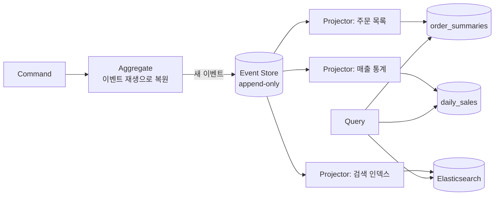
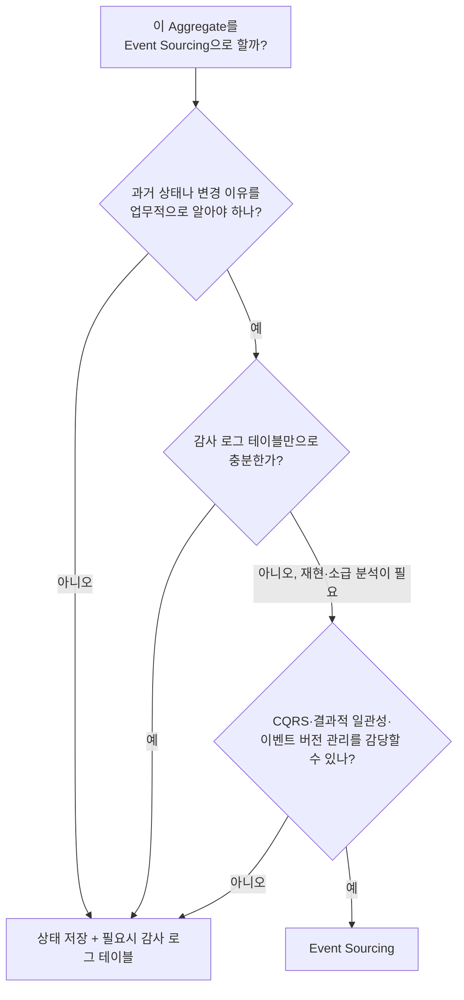

# Event Sourcing (이벤트 소싱)

## 1. Event Sourcing이란?

**Event Sourcing**은 **현재 상태를 저장하는 대신, 상태를 바꾼 사건(이벤트)을 순서대로 모두 저장하고, 현재 상태는 이벤트를 처음부터 다시 재생해서 만들어 내는** 방식입니다.

은행 통장에 비유하면 가장 쉽습니다.

```text
상태 저장 방식 (일반적인 DB)          이벤트 저장 방식 (Event Sourcing)
──────────────────────────           ──────────────────────────────────
계좌 #123                             계좌 #123의 거래 내역
  잔액: 70,000원                       1. 계좌 개설됨           0원
                                       2. 입금됨           +100,000원
  (어떻게 70,000원이 됐는지?          3. 출금됨            -50,000원
   알 수 없다)                         4. 입금됨            +20,000원
                                       ─────────────────────────────
                                       재생 결과 잔액:       70,000원
```

통장은 잔액만 적어 두지 않습니다. **거래 내역을 한 줄씩 쌓고**, 잔액은 그 내역을 더해서 나온 결과입니다. Event Sourcing은 이 방식을 소프트웨어 데이터 저장에 그대로 적용합니다.

## 2. 일반 방식(상태 저장)과 비교

주문을 예로 들어 보겠습니다.

### 2-1. 상태 저장 (CRUD)

```text
orders 테이블
┌──────┬───────────┬──────────┬────────┐
│ id   │ status    │ total    │ addr   │
├──────┼───────────┼──────────┼────────┤
│ 1001 │ CANCELLED │ 20,000   │ 부산   │   ← UPDATE로 덮어쓴 최종 결과만 남는다
└──────┴───────────┴──────────┴────────┘
```

질문: "이 주문은 원래 얼마였나요? 배송지를 언제 바꿨나요? 누가 취소했나요?"
답: **알 수 없습니다.** UPDATE가 이전 값을 지웠기 때문입니다. (별도 히스토리 테이블을 만들지 않았다면)

### 2-2. 이벤트 저장 (Event Sourcing)

```text
events 테이블 (주문 1001의 스트림)
┌─────────┬────────────────────────┬──────────────────────────────────┬─────────────────────┐
│ version │ type                   │ payload                          │ occurred_at         │
├─────────┼────────────────────────┼──────────────────────────────────┼─────────────────────┤
│ 1       │ OrderPlaced            │ {lines: [...], total: 30000}     │ 2026-10-01 10:00:00 │
│ 2       │ ShippingAddressChanged │ {from: "서울", to: "부산"}       │ 2026-10-01 10:05:00 │
│ 3       │ OrderLineRemoved       │ {productId: "p-2", amount: 10000}│ 2026-10-01 10:07:00 │
│ 4       │ OrderPaid              │ {transactionId: "tx-9"}          │ 2026-10-01 10:08:00 │
│ 5       │ OrderCancelled         │ {by: "customer", reason: "변심"} │ 2026-10-02 09:00:00 │
└─────────┴────────────────────────┴──────────────────────────────────┴─────────────────────┘
```

모든 질문에 답할 수 있습니다. 원래 30,000원이었고, 10:05에 서울에서 부산으로 바꿨고, 고객이 변심으로 취소했습니다.

| 구분 | 상태 저장 | Event Sourcing |
|---|---|---|
| 저장하는 것 | 현재 상태 | 상태를 바꾼 모든 사건 |
| 쓰기 연산 | INSERT, UPDATE, DELETE | **INSERT만** (추가 전용, Append-only) |
| 과거 상태 | 알 수 없음 | 언제든 재현 가능 |
| 현재 상태 조회 | 바로 읽음 | 이벤트를 재생해야 함 |
| 변경 이력/감사 | 별도로 만들어야 함 | 기본으로 갖춤 |

## 3. 핵심 개념

### 3-1. Event (이벤트)

**이미 일어난 사실**입니다. [[ddd-tactical-design]]의 Domain Event와 같은 개념이지만, Event Sourcing에서는 이벤트가 **알림이 아니라 저장 데이터 그 자체**입니다.

- 이름은 과거형입니다: `OrderPlaced`, `OrderPaid`
- **절대 수정하거나 삭제하지 않습니다.** 과거는 바뀌지 않습니다.
- 잘못된 이벤트를 되돌리려면 **보정 이벤트**를 새로 추가합니다. 회계에서 잘못된 전표를 지우지 않고 반대 전표를 끊는 것과 같습니다.

```text
(X) 잘못된 입금 이벤트를 DELETE
(O) "입금 정정됨 (-50,000)" 이벤트를 추가
```

### 3-2. Event Stream (이벤트 스트림)

**하나의 Aggregate에 속한 이벤트들의 순서 있는 목록**입니다. 보통 Aggregate ID가 스트림 ID가 됩니다.

```text
stream: order-1001   [OrderPlaced v1] → [AddressChanged v2] → [OrderPaid v3] → ...
stream: order-1002   [OrderPlaced v1] → [OrderCancelled v2]
stream: account-77   [AccountOpened v1] → [Deposited v2] → [Withdrawn v3] → ...
```

### 3-3. Event Store (이벤트 저장소)

이벤트를 저장하는 곳입니다. 필요한 기능은 다음과 같습니다.

| 기능 | 설명 |
|---|---|
| 추가(Append) | 스트림 끝에 이벤트를 붙인다 |
| 스트림 읽기 | 특정 스트림의 이벤트를 순서대로 읽는다 |
| 낙관적 동시성 제어 | "내가 읽었을 때 버전이 5였으니 6부터 쓰겠다"를 보장한다 |
| 전체 구독 | 모든 이벤트를 순서대로 읽어 Projection을 만든다 |

전용 제품(EventStoreDB, Axon Server)을 쓰기도 하지만, **PostgreSQL 테이블 하나로도** 충분히 시작할 수 있습니다 (5장).

### 3-4. Rehydration (재구성)

저장된 이벤트를 처음부터 순서대로 적용해 **현재 상태의 객체를 다시 만드는** 과정입니다.

```text
빈 Order
  + OrderPlaced          → status=PENDING, lines=[A,B], total=30000
  + AddressChanged       → address=부산
  + OrderLineRemoved     → lines=[A], total=20000
  + OrderPaid            → status=PAID
  = 현재 Order
```

### 3-5. Projection (프로젝션)

이벤트를 읽어 **조회용 모델(Read Model)**을 만드는 것입니다. Event Store는 "주문 1001번의 이벤트"는 잘 꺼내지만 "고객 A의 최근 주문 10개"는 못 꺼냅니다. 그래서 조회는 Projection으로 만든 별도 테이블에서 합니다. 이것이 Event Sourcing이 [[cqrs|CQRS]]와 거의 항상 함께 쓰이는 이유입니다.



### 3-6. Snapshot (스냅샷)

이벤트가 수천 개 쌓이면 매번 처음부터 재생하기 느립니다. 그래서 **중간 상태를 저장해 두고, 그 이후 이벤트만 재생**합니다.

```text
스냅샷 없이:  이벤트 1 ~ 5,000 전부 재생
스냅샷 사용:  [스냅샷 @ v4,900] + 이벤트 4,901 ~ 5,000 재생
```

스냅샷은 **성능 최적화일 뿐** 원본 데이터가 아닙니다. 지워도 이벤트에서 언제든 다시 만들 수 있습니다.

## 4. Aggregate를 Event Sourcing으로 구현하기

상태를 바꾸는 방식이 달라집니다. **명령 메서드는 상태를 직접 바꾸지 않고 이벤트를 만들고**, 상태 변경은 **이벤트 적용 메서드(`apply`)**에서만 합니다.

```text
명령 메서드 (cancel)              이벤트 적용 (apply)
─────────────────────             ──────────────────────
1. 규칙 검증                       상태만 바꾼다
2. 이벤트 생성                     검증하지 않는다 (이미 일어난 일이므로)
3. apply 호출                      재생할 때도 같은 메서드를 쓴다
```

### 4-1. 이벤트 정의

```typescript
// ordering/domain/events.ts
export type OrderEvent =
  | { type: 'OrderPlaced'; orderId: string; customerId: string; lines: LineData[] }
  | { type: 'ShippingAddressChanged'; orderId: string; address: string }
  | { type: 'OrderPaid'; orderId: string; transactionId: string }
  | { type: 'OrderCancelled'; orderId: string; reason: string };

export interface LineData {
  productId: string;
  unitPrice: number;
  quantity: number;
}
```

### 4-2. Event Sourced Aggregate

```typescript
// shared/domain/event-sourced-aggregate.ts
export abstract class EventSourcedAggregate<E extends { type: string }> {
  private uncommitted: E[] = [];
  private _version = 0; // 마지막으로 적용된 이벤트 버전

  get version() { return this._version; }

  // 명령 메서드에서 호출: 상태를 바꾸고, 저장할 목록에 쌓는다
  protected raise(event: E): void {
    this.apply(event);
    this.uncommitted.push(event);
  }

  // 저장소에서 복원할 때 호출: 상태만 바꾼다
  loadFromHistory(events: E[]): void {
    for (const e of events) {
      this.apply(e);
    }
  }

  pullUncommitted(): E[] {
    return this.uncommitted.splice(0);
  }

  private apply(event: E): void {
    this.when(event);
    this._version++;
  }

  protected abstract when(event: E): void;
}
```

```typescript
// ordering/domain/order.ts
export class Order extends EventSourcedAggregate<OrderEvent> {
  private id!: string;
  private status!: 'PENDING' | 'PAID' | 'CANCELLED' | 'SHIPPED';
  private lines: LineData[] = [];
  private address = '';

  // ── 명령 메서드: 규칙 검증 → 이벤트 발생 ──────────────
  static place(id: string, customerId: string, lines: LineData[]): Order {
    if (lines.length === 0) throw new EmptyOrderException();
    const order = new Order();
    order.raise({ type: 'OrderPlaced', orderId: id, customerId, lines });
    return order;
  }

  changeShippingAddress(address: string): void {
    if (this.status === 'SHIPPED') throw new AlreadyShippedException(this.id);
    if (this.address === address) return; // 변화 없으면 이벤트도 없다
    this.raise({ type: 'ShippingAddressChanged', orderId: this.id, address });
  }

  pay(transactionId: string): void {
    if (this.status !== 'PENDING') throw new InvalidOrderStateException(this.id, this.status);
    this.raise({ type: 'OrderPaid', orderId: this.id, transactionId });
  }

  cancel(reason: string): void {
    if (this.status === 'SHIPPED') throw new CannotCancelShippedOrderException(this.id);
    if (this.status === 'CANCELLED') return;
    this.raise({ type: 'OrderCancelled', orderId: this.id, reason });
  }

  totalAmount(): number {
    return this.lines.reduce((s, l) => s + l.unitPrice * l.quantity, 0);
  }

  // ── 이벤트 적용: 상태만 바꾼다, 검증하지 않는다 ──────
  protected when(e: OrderEvent): void {
    switch (e.type) {
      case 'OrderPlaced':
        this.id = e.orderId;
        this.status = 'PENDING';
        this.lines = e.lines;
        break;
      case 'ShippingAddressChanged':
        this.address = e.address;
        break;
      case 'OrderPaid':
        this.status = 'PAID';
        break;
      case 'OrderCancelled':
        this.status = 'CANCELLED';
        break;
    }
  }
}
```

> `when()`에서 예외를 던지면 안 됩니다. 이미 저장된 과거 이벤트를 재생하다가 실패하면 그 Aggregate는 영원히 불러올 수 없게 됩니다. 검증은 **명령 메서드에서, 이벤트를 만들기 전에** 끝내야 합니다.

## 5. Event Store를 PostgreSQL로 만들기

### 5-1. 테이블

```sql
CREATE TABLE events (
  global_position BIGSERIAL PRIMARY KEY,         -- 전체 순서 (Projection 구독용)
  stream_id       TEXT        NOT NULL,          -- 예: 'order-1001'
  version         INT         NOT NULL,          -- 스트림 안에서의 순서
  type            TEXT        NOT NULL,          -- 'OrderPlaced'
  payload         JSONB       NOT NULL,
  metadata        JSONB       NOT NULL DEFAULT '{}', -- userId, correlationId 등
  occurred_at     TIMESTAMPTZ NOT NULL DEFAULT now(),
  UNIQUE (stream_id, version)                    -- 동시성 제어의 핵심
);
```

`UNIQUE (stream_id, version)` 제약 하나로 **낙관적 동시성 제어**가 됩니다. 두 요청이 같은 버전으로 쓰려고 하면 하나는 유니크 제약 위반으로 실패합니다.

```text
요청 A: order-1001을 v4까지 읽음 → v5로 쓰기 ✓
요청 B: order-1001을 v4까지 읽음 → v5로 쓰기 ✗ (UNIQUE 위반 → 충돌)
```

### 5-2. Repository

```typescript
// ordering/infrastructure/event-sourced-order.repository.ts
@Injectable()
export class EventSourcedOrderRepository implements OrderRepository {
  constructor(private readonly dataSource: DataSource) {}

  async findById(id: string): Promise<Order | null> {
    const rows: { type: string; payload: object }[] = await this.dataSource.query(
      `SELECT type, payload FROM events WHERE stream_id = $1 ORDER BY version`,
      [`order-${id}`],
    );
    if (rows.length === 0) return null;

    const order = new Order(); // 빈 객체를 만든 뒤 이벤트로 채운다
    order.loadFromHistory(rows.map((r) => ({ type: r.type, ...r.payload }) as OrderEvent));
    return order;
  }

  async save(order: Order, metadata: Record<string, unknown> = {}): Promise<void> {
    const events = order.pullUncommitted();
    if (events.length === 0) return;

    // 새 이벤트 수만큼 버전이 올라간 상태이므로, 원래 버전을 역산한다
    const expectedVersion = order.version - events.length;
    const streamId = `order-${(events[0] as any).orderId}`;

    try {
      await this.dataSource.transaction(async (tx) => {
        for (const [i, e] of events.entries()) {
          const { type, ...payload } = e;
          await tx.query(
            `INSERT INTO events (stream_id, version, type, payload, metadata)
             VALUES ($1, $2, $3, $4, $5)`,
            [streamId, expectedVersion + i + 1, type, payload, metadata],
          );
        }
      });
    } catch (err) {
      if (isUniqueViolation(err)) throw new ConcurrencyConflictException(streamId);
      throw err;
    }
  }
}
```

### 5-3. 사용하는 쪽은 그대로

```typescript
@CommandHandler(CancelOrderCommand)
export class CancelOrderHandler implements ICommandHandler<CancelOrderCommand> {
  constructor(@Inject(ORDER_REPOSITORY) private readonly orders: OrderRepository) {}

  async execute(cmd: CancelOrderCommand) {
    const order = await this.orders.findById(cmd.orderId); // 이벤트 재생으로 복원
    if (!order) throw new OrderNotFoundException(cmd.orderId);
    order.cancel(cmd.reason);                              // OrderCancelled 이벤트 발생
    await this.orders.save(order);                         // 이벤트 INSERT
  }
}
```

Application Service 입장에서는 일반 Repository와 사용법이 같습니다. 저장 방식은 [[hexagonal-architecture|Driven Adapter]] 뒤에 숨어 있습니다.

## 6. Projection 만들기

### 6-1. 구독 방식

Projector는 `global_position` 순서대로 이벤트를 읽으면서 읽기 모델을 갱신하고, **어디까지 처리했는지(checkpoint)**를 기록합니다.

```sql
CREATE TABLE projection_checkpoints (
  projection_name TEXT PRIMARY KEY,
  last_position   BIGINT NOT NULL
);

CREATE TABLE order_summaries (
  order_id     TEXT PRIMARY KEY,
  customer_id  TEXT NOT NULL,
  status       TEXT NOT NULL,
  total_amount BIGINT NOT NULL,
  updated_at   TIMESTAMPTZ NOT NULL
);
```

```typescript
// ordering/read-model/order-summary.projector.ts
@Injectable()
export class OrderSummaryProjector {
  private static readonly NAME = 'order_summaries';

  constructor(private readonly dataSource: DataSource) {}

  @Interval(1000) // @nestjs/schedule: 1초마다 새 이벤트를 가져온다
  async poll() {
    await this.dataSource.transaction(async (tx) => {
      const [{ last_position }] = await tx.query(
        `SELECT last_position FROM projection_checkpoints
          WHERE projection_name = $1 FOR UPDATE`,
        [OrderSummaryProjector.NAME],
      );

      const events = await tx.query(
        `SELECT global_position, type, payload, occurred_at FROM events
          WHERE global_position > $1 AND stream_id LIKE 'order-%'
          ORDER BY global_position LIMIT 500`,
        [last_position],
      );

      for (const e of events) {
        await this.project(tx, e);
      }

      if (events.length > 0) {
        await tx.query(
          `UPDATE projection_checkpoints SET last_position = $2 WHERE projection_name = $1`,
          [OrderSummaryProjector.NAME, events.at(-1).global_position],
        );
      }
    });
  }

  private async project(tx: EntityManager, e: any) {
    const p = e.payload;
    switch (e.type) {
      case 'OrderPlaced': {
        const total = p.lines.reduce((s, l) => s + l.unitPrice * l.quantity, 0);
        await tx.query(
          `INSERT INTO order_summaries (order_id, customer_id, status, total_amount, updated_at)
           VALUES ($1, $2, 'PENDING', $3, $4) ON CONFLICT (order_id) DO NOTHING`,
          [p.orderId, p.customerId, total, e.occurred_at],
        );
        break;
      }
      case 'OrderPaid':
        await tx.query(
          `UPDATE order_summaries SET status = 'PAID', updated_at = $2 WHERE order_id = $1`,
          [p.orderId, e.occurred_at],
        );
        break;
      case 'OrderCancelled':
        await tx.query(
          `UPDATE order_summaries SET status = 'CANCELLED', updated_at = $2 WHERE order_id = $1`,
          [p.orderId, e.occurred_at],
        );
        break;
    }
  }
}
```

읽기 모델 갱신과 체크포인트 갱신이 **같은 트랜잭션**이라, 중간에 서버가 죽어도 이벤트를 빠뜨리거나 두 번 반영하지 않습니다.

> `BIGSERIAL`은 트랜잭션 커밋 순서와 번호 순서가 다를 수 있어서, 동시에 쓰는 트랜잭션이 많으면 작은 번호가 늦게 커밋되어 Projector가 건너뛸 위험이 있습니다. 운영 환경에서는 쓰기를 직렬화하거나, 일정 시간 이전 위치까지만 읽거나, 전용 Event Store를 쓰는 등의 대책이 필요합니다.

### 6-2. Projection의 가장 큰 장점: 다시 만들 수 있다

화면 요구사항이 바뀌어 새 컬럼이 필요해졌다면, Projection 테이블을 지우고 **체크포인트를 0으로 돌려 처음부터 재생**하면 됩니다.

```sql
TRUNCATE order_summaries;
UPDATE projection_checkpoints SET last_position = 0 WHERE projection_name = 'order_summaries';
-- Projector가 모든 이벤트를 다시 읽어 새 구조로 채운다
```

과거 데이터까지 새 구조로 **소급 적용**할 수 있습니다. 상태 저장 방식에서는 이미 사라진 정보로는 불가능한 일입니다.

## 7. Event Sourcing으로 얻는 것

| 이점 | 설명 | 예 |
|---|---|---|
| **완전한 감사 기록** | 누가, 언제, 무엇을, 왜 바꿨는지 모두 남는다 | 금융 거래, 의료 기록, 법적 증빙 |
| **시간 여행** | 특정 시점의 상태를 재현한다 | "지난달 말일 기준 재고는?" |
| **디버깅** | 버그가 난 상황을 이벤트 재생으로 그대로 재현한다 | "이 주문은 왜 이 상태가 됐지?" |
| **새로운 분석** | 과거 이벤트로 새 통계를 소급해서 만든다 | "장바구니에 넣었다가 뺀 상품 순위" |
| **이벤트 기반 통합** | 저장한 이벤트를 그대로 다른 서비스에 발행한다 | [[event-driven-architecture]] |
| **쓰기 성능** | INSERT만 하므로 락 경합이 적다 | 대량 쓰기 시스템 |

## 8. Event Sourcing의 어려움

| 어려움 | 설명 | 대처 |
|---|---|---|
| **이벤트 스키마 변경** | 이벤트는 수정할 수 없는데 구조를 바꿔야 할 때 | 이벤트 버전 관리, Upcaster (8-1) |
| **조회가 불편하다** | Event Store에서 직접 조건 검색을 할 수 없다 | CQRS + Projection 필수 |
| **결과적 일관성** | Projection이 늦게 반영된다 | [[cqrs]] 8장 참고 |
| **개인정보 삭제** | GDPR 등으로 데이터를 지워야 하는데 이벤트는 지울 수 없다 | 암호화 후 키 삭제(Crypto-shredding), 개인정보는 이벤트 밖에 저장 |
| **학습 비용** | 사고방식이 CRUD와 완전히 다르다 | 작은 Context부터 시작 |
| **이벤트 폭증** | 오래 사는 Aggregate는 이벤트가 매우 많다 | 스냅샷 |
| **잘못된 이벤트 설계** | `OrderUpdated` 같은 의미 없는 이벤트를 만들면 이점이 사라진다 | 업무 의미가 있는 이벤트 이름 |

### 8-1. 이벤트 버전 관리 (Upcasting)

`OrderPlaced`에 `currency` 필드를 추가해야 한다고 해 봅시다. 과거 이벤트에는 이 필드가 없습니다. 과거 이벤트를 수정하는 대신, **읽을 때 최신 형태로 변환(upcast)**합니다.

```typescript
// 저장된 이벤트를 읽을 때 최신 형태로 올려준다
function upcast(raw: { type: string; schemaVersion?: number; payload: any }) {
  if (raw.type === 'OrderPlaced' && (raw.schemaVersion ?? 1) === 1) {
    return {
      ...raw,
      schemaVersion: 2,
      payload: { ...raw.payload, currency: 'KRW' }, // v1에는 없던 필드에 기본값
    };
  }
  return raw;
}
```

| 변경 종류 | 방법 |
|---|---|
| 필드 추가 | 기본값을 넣는 Upcaster |
| 필드 이름 변경 | 옛 이름 → 새 이름으로 옮기는 Upcaster |
| 의미가 완전히 바뀜 | 새 이벤트 타입을 만든다 (`OrderPlacedV2`) |
| 이벤트 삭제 | 하지 않는다. 더 이상 발생시키지 않을 뿐, `when()`에서는 계속 처리한다 |

### 8-2. 개인정보 문제

이벤트에 이메일, 주소 같은 개인정보를 그대로 넣으면 "내 정보를 삭제해 주세요" 요청에 응할 수 없습니다.

```text
방법 1: 이벤트에는 ID만, 개인정보는 별도 테이블에 (삭제 가능)
  CustomerRegistered { customerId: "c-1" }      +  customer_pii 테이블 { c-1, 이메일, 주소 }

방법 2: Crypto-shredding
  이벤트의 개인정보 필드를 고객별 키로 암호화해 저장
  삭제 요청 시 그 고객의 키만 삭제 → 이벤트는 남지만 복호화 불가
```

## 9. Event Sourcing ≠ Event-Driven Architecture

이름이 비슷해서 자주 혼동합니다.

| 구분 | Event Sourcing | Event-Driven Architecture |
|---|---|---|
| 목적 | **상태를 저장하는 방식** | **컴포넌트끼리 통신하는 방식** |
| 이벤트의 역할 | 데이터의 원본 (Source of Truth) | 다른 곳에 알리는 메시지 |
| 범위 | 하나의 서비스/Aggregate 내부 | 여러 서비스 사이 |
| 이벤트 보관 | 영구 보관, 삭제 불가 | 처리 후 버려도 됨 (보관 기간 설정) |
| 함께 쓰나? | 함께 쓸 수 있지만, 서로 독립적이다 | |

```text
Event Sourcing만:   주문 서비스가 이벤트로 상태를 저장한다. 다른 서비스와는 REST로 통신한다.
EDA만:              주문 서비스는 일반 테이블에 상태를 저장한다. 변경 시 Kafka로 이벤트를 발행한다.
둘 다:              주문 서비스가 이벤트로 상태를 저장하고, 그 이벤트를 Kafka로도 발행한다.
```

> 내부 저장용 이벤트(세밀함, 자주 바뀜)를 그대로 외부에 발행하면 내부 구조가 외부 계약이 되어 버립니다. 외부에는 **별도로 설계한 통합 이벤트**를 발행하는 것이 안전합니다. 자세한 내용은 [[event-driven-architecture]]에서 다룹니다.

## 10. 언제 쓰면 좋을까?

### 10-1. 잘 맞는 경우

- **이력 자체가 업무 가치**인 도메인: 금융 원장, 회계, 보험 청구, 의료 기록
- **감사(audit)와 규제 준수**가 필수인 경우
- "그 시점에 어땠는지"를 자주 물어보는 도메인: 재고, 가격, 계약 상태
- 상태 전이가 복잡하고, 왜 그렇게 되었는지 추적해야 하는 워크플로

### 10-2. 맞지 않는 경우

- **단순 CRUD**: 게시판, 설정 관리, 회원 프로필
- 이력이 필요 없고 현재 상태만 중요한 데이터
- 강한 즉시 일관성 조회가 대부분인 화면
- 팀에 Event Sourcing 경험이 없고 일정이 촉박한 경우



> 시스템 전체에 적용하지 말고, **이력이 핵심인 Aggregate 하나(예: 계좌, 원장)**에만 적용하는 것이 현실적입니다. 그렉 영도 "Event Sourcing은 시스템 전체의 아키텍처가 아니라, 특정 Bounded Context에 쓰는 패턴"이라고 강조합니다.

## 11. 핵심 정리

> Event Sourcing은 현재 상태 대신 상태를 바꾼 이벤트를 추가 전용으로 모두 저장하고, 현재 상태는 이벤트를 재생해 만드는 방식이다. Aggregate는 명령 메서드에서 규칙을 검증해 이벤트를 만들고, 상태 변경은 이벤트 적용 메서드에서만 한다. 조회는 이벤트로 만든 Projection에서 하므로 CQRS와 사실상 함께 쓰인다. 완전한 이력, 시점 재현, 소급 분석이 가능하지만 이벤트 스키마 관리, 개인정보 삭제, 결과적 일관성, 높은 학습 비용을 감수해야 하므로 이력이 업무 가치인 영역에만 골라서 적용한다.
