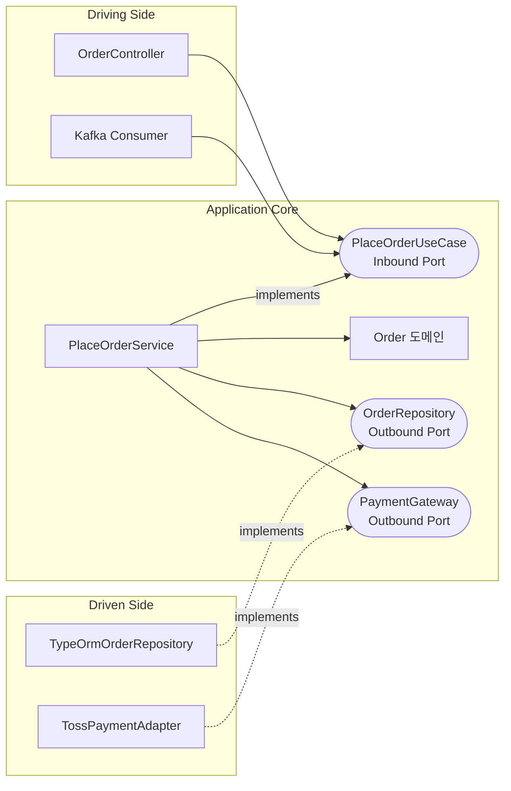

# Hexagonal Architecture (헥사고날 아키텍처)

## 1. Hexagonal Architecture란?

**Hexagonal Architecture**는 비즈니스 로직(애플리케이션 핵심)을 가운데 두고, DB·HTTP·메시지 큐 같은 외부 기술은 모두 바깥에 두어 "포트(Port)"와 "어댑터(Adapter)"로만 연결하는 구조입니다. 2005년 앨리스터 코오번(Alistair Cockburn)이 제안했고, 정식 이름은 **Ports and Adapters**입니다.

육각형 모양은 특별한 의미가 없습니다. "입구가 여러 개일 수 있다"는 걸 그림으로 보여주려고 다각형을 쓴 것뿐입니다.

```text
                 ┌────────────┐          ┌────────────┐
                 │ REST       │          │ CLI / 배치 │
                 │ Controller │          │            │
                 └─────┬──────┘          └─────┬──────┘
                       │  Driving Adapter       │
                ╱──────▼─────────────────────────▼──────╲
               ╱       ○ Inbound Port (유스케이스)        ╲
              ╱                                             ╲
             │         Application Core                     │
             │      (도메인 모델 + 유스케이스)               │
              ╲                                             ╱
               ╲       ○ Outbound Port (저장, 결제, 알림)   ╱
                ╲──────┬─────────────────────────┬──────╱
                       │  Driven Adapter          │
                 ┌─────▼──────┐          ┌───────▼──────┐
                 │ PostgreSQL │          │ 외부 PG API  │
                 │ Repository │          │ Client       │
                 └────────────┘          └──────────────┘
```

전자기기에 비유하면 이해하기 쉽습니다.

| 개념 | 비유 | 설명 |
|---|---|---|
| Application Core | 노트북 본체 | 실제 일을 하는 부분 |
| Port | USB-C 포트 | 규격(인터페이스)만 정해 둔 구멍 |
| Adapter | 충전기, 모니터 케이블 | 규격에 맞춰 바깥 장치를 연결하는 장치 |

노트북은 USB-C 규격만 알고, 꽂히는 게 삼성 충전기인지 애플 충전기인지는 모릅니다. 충전기를 바꿔도 노트북 내부를 고칠 필요가 없습니다.

## 2. 왜 필요할까? Layered Architecture의 한계

[[layered-architecture|Layered Architecture]]에서는 의존이 위에서 아래로 흐릅니다.

```text
Controller ──> Service ──> Repository(TypeORM) ──> DB
                  │
                  └── 비즈니스 로직이 TypeORM에 의존한다
```

가장 중요한 비즈니스 로직(Service)이 가장 자주 바뀌는 기술(ORM, DB)에 의존합니다. 그래서 이런 문제가 생깁니다.

- ORM을 Prisma로 바꾸면 Service를 고쳐야 합니다.
- Service를 테스트하려면 DB를 띄우거나 TypeORM `Repository`를 목(mock)으로 만들어야 합니다.
- 외부 결제 API 응답 형식이 Service 안으로 들어와 섞입니다.

Hexagonal Architecture는 이 화살표를 **뒤집습니다**.

```text
Controller ──> [ Core ] <── Repository 구현(TypeORM)
                  │
                  └── Core는 아무것도 의존하지 않는다
                      바깥이 Core가 정한 인터페이스를 따른다
```

이것을 **의존성 역전 원칙(DIP, Dependency Inversion Principle)**이라고 합니다.

> 상위 수준 정책(비즈니스 규칙)은 하위 수준 세부 사항(DB, 프레임워크)에 의존하면 안 된다. 둘 다 추상화(인터페이스)에 의존해야 한다.

## 3. 구성 요소

### 3-1. Application Core

비즈니스의 중심입니다. **외부 라이브러리나 프레임워크를 import 하지 않는 것**이 원칙입니다.

- **Domain**: Entity, Value Object, 도메인 규칙 ([[ddd-tactical-design]])
- **Application(유스케이스)**: "주문하기", "주문 취소하기" 같은 작업 흐름

### 3-2. Port (포트)

Core가 바깥과 대화하기 위해 **Core 쪽에서 정의한 인터페이스**입니다. 방향에 따라 두 종류가 있습니다.

| 종류 | 다른 이름 | 의미 | 예 |
|---|---|---|---|
| **Inbound Port** | Driving Port, Primary Port | 바깥이 Core에게 **시키는** 일 | `PlaceOrderUseCase` |
| **Outbound Port** | Driven Port, Secondary Port | Core가 바깥에 **부탁하는** 일 | `OrderRepository`, `PaymentGateway` |

### 3-3. Adapter (어댑터)

포트 규격에 맞춰 실제 기술을 연결하는 구현체입니다.

| 종류 | 역할 | 예 |
|---|---|---|
| **Driving Adapter** (Primary) | 외부 요청을 받아 Inbound Port를 호출 | REST Controller, GraphQL Resolver, 메시지 컨슈머, CLI, 스케줄러 |
| **Driven Adapter** (Secondary) | Outbound Port를 구현해 실제 기술을 사용 | TypeORM Repository, PG사 API 클라이언트, SMTP 메일 발송기, Kafka Producer |

### 3-4. 의존 방향 정리



화살표가 전부 **Core를 향합니다**. Driving Adapter는 Core를 호출하고, Driven Adapter는 Core가 정한 인터페이스를 구현합니다. Core에서 바깥을 향하는 화살표는 하나도 없습니다.

## 4. Nest.js로 구현하기

주문하고 결제를 요청하는 기능을 만들어 보겠습니다.

### 4-1. 폴더 구조

```text
src/ordering/
├── domain/                              # Core: 도메인
│   ├── order.ts
│   ├── order-id.ts
│   └── money.ts
├── application/                         # Core: 유스케이스
│   ├── port/
│   │   ├── in/
│   │   │   └── place-order.use-case.ts  # Inbound Port
│   │   └── out/
│   │       ├── order.repository.ts      # Outbound Port
│   │       └── payment.gateway.ts       # Outbound Port
│   └── service/
│       └── place-order.service.ts       # Inbound Port 구현
├── adapter/
│   ├── in/
│   │   └── web/
│   │       ├── order.controller.ts      # Driving Adapter
│   │       └── place-order.request.ts
│   └── out/
│       ├── persistence/
│       │   ├── typeorm-order.repository.ts  # Driven Adapter
│       │   └── order.orm-entity.ts
│       └── payment/
│           └── toss-payment.adapter.ts      # Driven Adapter
└── ordering.module.ts                   # 조립(Wiring)
```

### 4-2. Inbound Port

```typescript
// application/port/in/place-order.use-case.ts
export const PLACE_ORDER_USE_CASE = Symbol('PLACE_ORDER_USE_CASE');

export interface PlaceOrderUseCase {
  execute(command: PlaceOrderCommand): Promise<OrderId>;
}

export class PlaceOrderCommand {
  constructor(
    readonly customerId: string,
    readonly lines: { productId: string; unitPrice: number; quantity: number }[],
    readonly paymentMethodToken: string,
  ) {}
}
```

Command는 Core 소속이라 `class-validator` 데코레이터를 붙이지 않습니다. HTTP 입력 형식 검증은 Driving Adapter(Controller의 Request DTO)가 맡습니다.

### 4-3. Outbound Port

```typescript
// application/port/out/order.repository.ts
export const ORDER_REPOSITORY = Symbol('ORDER_REPOSITORY');

export interface OrderRepository {
  findById(id: OrderId): Promise<Order | null>;
  save(order: Order): Promise<void>;
}

// application/port/out/payment.gateway.ts
export const PAYMENT_GATEWAY = Symbol('PAYMENT_GATEWAY');

export interface PaymentGateway {
  requestPayment(request: {
    orderId: OrderId;
    amount: Money;
    paymentMethodToken: string;
  }): Promise<PaymentResult>;
}

export type PaymentResult =
  | { success: true; transactionId: string }
  | { success: false; reason: string };
```

포트는 **Core의 언어**로 정의합니다. `PaymentGateway`에는 토스, 카카오페이 같은 이름이 없고 `OrderId`, `Money` 같은 도메인 타입만 등장합니다.

### 4-4. 유스케이스 구현 (Application Service)

```typescript
// application/service/place-order.service.ts
@Injectable()
export class PlaceOrderService implements PlaceOrderUseCase {
  constructor(
    @Inject(ORDER_REPOSITORY) private readonly orders: OrderRepository,
    @Inject(PAYMENT_GATEWAY) private readonly payments: PaymentGateway,
  ) {}

  async execute(command: PlaceOrderCommand): Promise<OrderId> {
    const order = Order.place(
      CustomerId.of(command.customerId),
      command.lines.map((l) => ({
        productId: ProductId.of(l.productId),
        unitPrice: Money.of(l.unitPrice),
        quantity: Quantity.of(l.quantity),
      })),
    );

    const result = await this.payments.requestPayment({
      orderId: order.id,
      amount: order.totalAmount(),
      paymentMethodToken: command.paymentMethodToken,
    });

    if (!result.success) {
      throw new PaymentFailedException(order.id, result.reason);
    }

    order.markPaid(result.transactionId);
    await this.orders.save(order);
    return order.id;
  }
}
```

> `@Injectable()`과 `@Inject()`는 Nest.js 데코레이터입니다. Core를 완전히 순수하게 지키고 싶다면 서비스에서 데코레이터를 빼고 모듈의 `useFactory`로 조립하는 방법도 있습니다(4-7 참고). 실무에서는 DI 데코레이터 정도는 허용하는 경우가 많습니다.

> 실제로는 "결제 성공 후 주문 저장 실패" 같은 경우를 대비해야 합니다. 주문을 먼저 `PENDING`으로 저장하고, 결제 결과를 이벤트로 받아 상태를 바꾸는 방식이 더 안전합니다 ([[saga-pattern]] 참고). 여기서는 포트와 어댑터 구조를 보여주려고 단순하게 썼습니다.

### 4-5. Driving Adapter: Controller

```typescript
// adapter/in/web/place-order.request.ts
export class PlaceOrderRequest {
  @IsUUID() customerId: string;
  @ValidateNested({ each: true }) @Type(() => OrderLineRequest) @ArrayNotEmpty()
  lines: OrderLineRequest[];
  @IsString() paymentMethodToken: string;
}

// adapter/in/web/order.controller.ts
@Controller('orders')
export class OrderController {
  constructor(
    @Inject(PLACE_ORDER_USE_CASE) private readonly placeOrder: PlaceOrderUseCase,
  ) {}

  @Post()
  async create(@Body() req: PlaceOrderRequest) {
    const orderId = await this.placeOrder.execute(
      new PlaceOrderCommand(req.customerId, req.lines, req.paymentMethodToken),
    );
    return { id: orderId.value };
  }
}
```

Controller는 구현 클래스(`PlaceOrderService`)가 아니라 **포트(`PlaceOrderUseCase`)**에 의존합니다.

같은 유스케이스를 메시지 컨슈머에서도 호출할 수 있습니다. Driving Adapter만 하나 더 추가하면 됩니다.

```typescript
// adapter/in/messaging/order-request.consumer.ts
@Controller()
export class OrderRequestConsumer {
  constructor(
    @Inject(PLACE_ORDER_USE_CASE) private readonly placeOrder: PlaceOrderUseCase,
  ) {}

  @EventPattern('order.requested')
  async handle(@Payload() message: OrderRequestedMessage) {
    await this.placeOrder.execute(
      new PlaceOrderCommand(message.customerId, message.lines, message.token),
    );
  }
}
```

### 4-6. Driven Adapter: 외부 결제 API

```typescript
// adapter/out/payment/toss-payment.adapter.ts
@Injectable()
export class TossPaymentAdapter implements PaymentGateway {
  constructor(private readonly http: HttpService) {}

  async requestPayment(req: {
    orderId: OrderId;
    amount: Money;
    paymentMethodToken: string;
  }): Promise<PaymentResult> {
    try {
      // 외부 API의 요청/응답 형식은 이 파일 안에서만 다룬다
      const { data } = await firstValueFrom(
        this.http.post('https://api.tosspayments.com/v1/payments/confirm', {
          orderId: req.orderId.value,
          amount: req.amount.amount,
          paymentKey: req.paymentMethodToken,
        }),
      );
      return { success: true, transactionId: data.paymentKey };
    } catch (e) {
      return { success: false, reason: this.toReason(e) };
    }
  }

  private toReason(e: unknown): string {
    // 외부 에러 코드를 도메인이 이해할 수 있는 이유로 번역한다
    return isAxiosError(e) ? e.response?.data?.code ?? 'UNKNOWN' : 'NETWORK_ERROR';
  }
}
```

외부 API의 필드 이름(`paymentKey`)과 에러 형식은 어댑터 밖으로 나가지 않습니다. [[ddd-strategic-design]]에서 본 **ACL(부패 방지 계층)**이 바로 이 Driven Adapter 자리에 들어갑니다.

### 4-7. 조립: Module

```typescript
// ordering.module.ts
@Module({
  imports: [HttpModule, TypeOrmModule.forFeature([OrderOrmEntity])],
  controllers: [OrderController],
  providers: [
    { provide: PLACE_ORDER_USE_CASE, useClass: PlaceOrderService },
    { provide: ORDER_REPOSITORY, useClass: TypeOrmOrderRepository },
    { provide: PAYMENT_GATEWAY, useClass: TossPaymentAdapter },
  ],
})
export class OrderingModule {}
```

어떤 어댑터를 꽂을지는 **모듈에서 한 줄로** 정합니다. 결제사를 바꾸려면 `TossPaymentAdapter`를 `KakaoPayAdapter`로 바꾸기만 하면 됩니다. Core 코드는 한 줄도 바뀌지 않습니다.

```typescript
// 환경에 따라 다른 어댑터를 꽂을 수도 있다
{
  provide: PAYMENT_GATEWAY,
  useClass: process.env.NODE_ENV === 'production' ? TossPaymentAdapter : FakePaymentAdapter,
}
```

## 5. 가장 큰 장점: 테스트

Core가 포트(인터페이스)에만 의존하므로, 테스트에서는 **가짜 어댑터**를 꽂으면 됩니다. DB도, 외부 API도, Nest.js 테스트 모듈도 필요 없습니다.

```typescript
// 메모리 기반 가짜 어댑터
class InMemoryOrderRepository implements OrderRepository {
  readonly store = new Map<string, Order>();
  async findById(id: OrderId) { return this.store.get(id.value) ?? null; }
  async save(order: Order) { this.store.set(order.id.value, order); }
}

class FakePaymentGateway implements PaymentGateway {
  constructor(private readonly shouldSucceed = true) {}
  async requestPayment(): Promise<PaymentResult> {
    return this.shouldSucceed
      ? { success: true, transactionId: 'tx-1' }
      : { success: false, reason: 'CARD_DECLINED' };
  }
}
```

```typescript
// place-order.service.spec.ts
describe('PlaceOrderService', () => {
  const command = new PlaceOrderCommand(
    'c0a8012e-0000-4000-8000-000000000001',
    [{ productId: 'p-1', unitPrice: 10_000, quantity: 2 }],
    'token',
  );

  it('결제에 성공하면 결제 완료 상태로 저장한다', async () => {
    const orders = new InMemoryOrderRepository();
    const service = new PlaceOrderService(orders, new FakePaymentGateway(true));

    const id = await service.execute(command);

    expect(orders.store.get(id.value)?.isPaid()).toBe(true);
  });

  it('결제에 실패하면 주문을 저장하지 않는다', async () => {
    const orders = new InMemoryOrderRepository();
    const service = new PlaceOrderService(orders, new FakePaymentGateway(false));

    await expect(service.execute(command)).rejects.toThrow(PaymentFailedException);
    expect(orders.store.size).toBe(0);
  });
});
```

| 테스트 대상 | 방법 | 속도 |
|---|---|---|
| Domain | 순수 단위 테스트 | 매우 빠름 |
| Application Service | 가짜 어댑터로 단위 테스트 | 빠름 |
| Driven Adapter | 실제 DB/테스트 컨테이너로 통합 테스트 | 느림 |
| Driving Adapter | `supertest`로 HTTP 테스트 | 느림 |

비즈니스 규칙 대부분을 빠른 테스트로 검증하고, 느린 통합 테스트는 어댑터에만 집중할 수 있습니다.

## 6. Clean Architecture, Onion Architecture와의 관계

비슷한 이름의 아키텍처가 여럿 있는데, 핵심 아이디어는 모두 같습니다. **"비즈니스를 가운데 두고, 의존은 안쪽으로만 향한다."**

| 이름 | 제안자, 연도 | 강조점 |
|---|---|---|
| Hexagonal (Ports and Adapters) | Alistair Cockburn, 2005 | 안과 밖, 포트와 어댑터 |
| Onion Architecture | Jeffrey Palermo, 2008 | 동심원 계층 (Domain Model → Domain Services → Application Services → 바깥) |
| Clean Architecture | Robert C. Martin, 2012 | 의존성 규칙, Entities → Use Cases → Interface Adapters → Frameworks |

```text
Clean Architecture의 동심원

┌──────────────────────────────────────────────┐
│ Frameworks & Drivers (DB, Web, UI)           │
│  ┌────────────────────────────────────────┐  │
│  │ Interface Adapters (Controller, Repo)  │  │  ← Hexagonal의 Adapter
│  │  ┌──────────────────────────────────┐  │  │
│  │  │ Use Cases                        │  │  │  ← Hexagonal의 Application + Port
│  │  │  ┌────────────────────────────┐  │  │  │
│  │  │  │ Entities                   │  │  │  │  ← Hexagonal의 Domain
│  │  │  └────────────────────────────┘  │  │  │
│  │  └──────────────────────────────────┘  │  │
│  └────────────────────────────────────────┘  │
└──────────────────────────────────────────────┘
```

실무에서는 세 가지를 엄격히 구분하지 않고 섞어 쓰는 경우가 많습니다. Clean Architecture는 [[clean-architecture]]에서 자세히 다루고, Layered와의 자세한 비교는 [[layered-vs-hexagonal-vs-onion-vs-clean]]에서 다룹니다.

## 7. 흔한 실수

| 실수 | 증상 | 해결 |
|---|---|---|
| 모든 것에 포트를 만든다 | 구현이 하나뿐인 인터페이스가 수십 개 | 바뀔 가능성이 있거나 테스트에서 바꿔 끼울 외부 의존에만 포트를 만든다 |
| Core에서 ORM 엔티티를 쓴다 | `domain/`에서 `typeorm`을 import | ORM 엔티티는 어댑터 안에 두고 Mapper로 변환한다 |
| 포트를 기술 용어로 정의한다 | `S3Uploader`, `RedisCache` 포트 | `FileStorage`, `SessionStore`처럼 Core가 필요한 역할로 이름 짓는다 |
| 어댑터에 비즈니스 로직을 넣는다 | Controller나 Repository 구현에 `if` 규칙 | 규칙은 Core로 옮긴다 |
| 단순 CRUD에 적용한다 | 파일 수만 3배 | Layered로 충분하다 |

> 특히 **Inbound Port 인터페이스**는 구현이 거의 항상 하나라서 생략하는 팀도 많습니다. Controller가 `PlaceOrderService`를 바로 주입받아도 의존 방향(바깥 → Core)은 지켜집니다. 의존성 역전이 꼭 필요한 곳은 **Outbound Port**입니다.

## 8. 장점과 단점

| 장점 | 설명 |
|---|---|
| 비즈니스가 기술에서 독립적이다 | DB, 프레임워크, 외부 API를 바꿔도 Core는 그대로다 |
| 테스트가 쉽고 빠르다 | 가짜 어댑터로 Core를 단위 테스트한다 |
| 진입점을 쉽게 늘린다 | HTTP, 메시지, CLI, 배치가 같은 유스케이스를 공유한다 |
| 기술 결정을 미룰 수 있다 | 메모리 어댑터로 먼저 개발하고 DB는 나중에 고른다 |

| 단점 | 설명 |
|---|---|
| 코드와 파일이 많아진다 | 포트, 어댑터, Mapper, Command가 추가된다 |
| 매핑 비용 | Request → Command → Domain → ORM Entity 변환이 반복된다 |
| 프레임워크 편의 기능을 덜 쓴다 | ORM 지연 로딩, 데코레이터 검증 등을 Core에서 못 쓴다 |
| 팀의 이해가 필요하다 | 규칙을 모르면 어댑터와 Core의 경계가 금방 무너진다 |

## 9. 언제 쓰면 좋을까?

- 비즈니스 규칙이 복잡하고 오래 유지보수할 **Core 도메인** ([[ddd-strategic-design]])
- **외부 시스템 연동이 많은** 서비스 (결제, 배송사, 메시지 큐, 여러 외부 API)
- 같은 기능을 **여러 진입점**(REST, gRPC, 메시지, 배치)에서 호출하는 경우
- 테스트 자동화가 중요한 서비스

단순 CRUD, 관리자 도구, 빨리 검증하고 버릴 MVP에는 [[layered-architecture|Layered Architecture]]가 더 낫습니다.

## 10. 핵심 정리

> Hexagonal Architecture(Ports and Adapters)는 비즈니스 로직을 가운데 두고 외부 기술을 바깥으로 밀어내는 구조다. Core는 Inbound Port(바깥이 시키는 일)와 Outbound Port(Core가 부탁하는 일)를 인터페이스로 정의하고, Driving Adapter와 Driven Adapter가 이를 호출하거나 구현한다. 모든 의존이 Core를 향하기 때문에 DB나 외부 API를 바꿔도 비즈니스 코드는 그대로이고, 가짜 어댑터로 빠르게 테스트할 수 있다. 대신 코드와 매핑이 늘어나므로 복잡한 Core 도메인에 쓸 때 효과가 크다.
