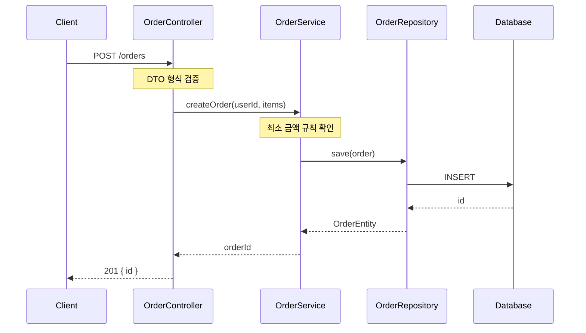

# Layered Architecture (계층형 아키텍처)

## 1. Layered Architecture란?

**Layered Architecture**는 애플리케이션을 **역할별 계층(Layer)으로 나누고, 위 계층이 바로 아래 계층만 사용하도록** 만든 구조입니다. 백엔드에서 가장 흔하게 볼 수 있는 구조이고, Nest.js나 Spring으로 프로젝트를 만들면 대부분 자연스럽게 이 모양이 됩니다.

```text
┌──────────────────────────────┐
│  Presentation (Controller)   │  HTTP 요청/응답 처리
├──────────────────────────────┤
│  Application / Business      │  유스케이스, 비즈니스 규칙
│  (Service)                   │
├──────────────────────────────┤
│  Persistence (Repository)    │  DB 읽기/쓰기
├──────────────────────────────┤
│  Database                    │
└──────────────────────────────┘
        요청은 위에서 아래로 흐른다
```

식당에 비유하면 다음과 같습니다.

| 계층 | 식당 | 하는 일 |
|---|---|---|
| Presentation | 홀 직원 | 손님 주문을 받고 음식을 내간다. 요리는 하지 않는다 |
| Business | 주방장 | 레시피(규칙)대로 요리한다. 손님을 직접 상대하지 않는다 |
| Persistence | 창고 담당 | 재료를 꺼내 오고 넣어 둔다. 요리법은 모른다 |

각자 자기 일만 하기 때문에 홀 직원이 바뀌어도 주방은 영향을 받지 않습니다. 이것이 계층을 나누는 이유입니다.

## 2. 왜 계층을 나눌까?

계층이 없다면 컨트롤러 하나에 모든 코드가 들어갑니다.

```typescript
// 계층이 없는 코드: 요청 파싱, 규칙, SQL이 한 곳에 섞여 있다
@Post('orders')
async create(@Body() body: any) {
  if (!body.items?.length) throw new BadRequestException('상품이 없습니다');

  const total = body.items.reduce((s, i) => s + i.price * i.quantity, 0);
  if (total < 10000) throw new BadRequestException('최소 주문 금액은 10,000원입니다');

  const result = await this.dataSource.query(
    'INSERT INTO orders (user_id, total) VALUES ($1, $2) RETURNING id',
    [body.userId, total],
  );
  return { id: result[0].id };
}
```

이 코드의 문제는 다음과 같습니다.

- "최소 주문 금액" 규칙을 테스트하려면 HTTP 서버와 DB를 모두 띄워야 합니다.
- 배치 작업이나 메시지 컨슈머에서도 주문을 만들어야 하면 같은 규칙을 복사해야 합니다.
- DB를 바꾸면 컨트롤러까지 고쳐야 합니다.

계층을 나누면 **바뀌는 이유가 다른 코드끼리 떨어지게** 됩니다. 이것을 **관심사의 분리(Separation of Concerns)**라고 합니다.

| 바뀌는 이유 | 담당 계층 |
|---|---|
| API 스펙 변경 (URL, 응답 형식) | Presentation |
| 비즈니스 규칙 변경 (최소 금액, 할인 정책) | Business |
| 저장 방식 변경 (MySQL → PostgreSQL, ORM 교체) | Persistence |

## 3. 계층별 역할

### 3-1. Presentation Layer

외부 요청을 받아 내부에서 쓸 형태로 바꾸고, 결과를 응답 형태로 바꿉니다. Nest.js에서는 **Controller**와 **DTO**가 여기에 속합니다.

- 할 일: 라우팅, 입력 형식 검증, DTO 변환, 상태 코드 결정
- 하지 말아야 할 일: 비즈니스 규칙 판단, DB 직접 접근

### 3-2. Business Layer (Service Layer)

애플리케이션이 **무엇을 하는지**가 담기는 곳입니다. Nest.js에서는 **Service**가 여기에 속합니다.

- 할 일: 유스케이스 흐름, 비즈니스 규칙, 트랜잭션 경계
- 하지 말아야 할 일: HTTP 개념(`Request`, 상태 코드) 사용, SQL 작성

### 3-3. Persistence Layer

데이터를 어디에 어떻게 저장하는지 담당합니다. Nest.js에서는 **Repository**(TypeORM, Prisma 등)가 여기에 속합니다.

- 할 일: 조회, 저장, 쿼리 최적화
- 하지 말아야 할 일: 비즈니스 규칙 판단

## 4. Nest.js로 구현하기

같은 주문 생성 기능을 계층으로 나눠 보겠습니다.

```text
src/order/
├── order.controller.ts      # Presentation
├── dto/create-order.dto.ts  # Presentation
├── order.service.ts         # Business
├── order.repository.ts      # Persistence
├── order.entity.ts          # 데이터 모델
└── order.module.ts
```

### 4-1. Presentation: Controller와 DTO

```typescript
// dto/create-order.dto.ts
export class CreateOrderDto {
  @IsInt()
  userId: number;

  @ValidateNested({ each: true })
  @Type(() => OrderItemDto)
  @ArrayNotEmpty()
  items: OrderItemDto[];
}

// order.controller.ts
@Controller('orders')
export class OrderController {
  constructor(private readonly orderService: OrderService) {}

  @Post()
  async create(@Body() dto: CreateOrderDto) {
    const orderId = await this.orderService.createOrder(dto.userId, dto.items);
    return { id: orderId };
  }
}
```

컨트롤러는 "요청을 받아서 서비스에 넘기고, 결과를 응답으로 감싼다"만 합니다. `@ArrayNotEmpty()` 같은 **형식 검증**은 여기서 하지만, "최소 주문 금액" 같은 **업무 규칙**은 하지 않습니다.

### 4-2. Business: Service

```typescript
// order.service.ts
@Injectable()
export class OrderService {
  private static readonly MIN_ORDER_AMOUNT = 10_000;

  constructor(private readonly orderRepository: OrderRepository) {}

  async createOrder(userId: number, items: OrderItemDto[]): Promise<number> {
    const total = items.reduce((sum, i) => sum + i.price * i.quantity, 0);

    if (total < OrderService.MIN_ORDER_AMOUNT) {
      throw new MinimumOrderAmountException(total);
    }

    const order = await this.orderRepository.save({ userId, total, status: 'PENDING' });
    return order.id;
  }
}
```

서비스는 `HttpException`이 아니라 도메인 예외(`MinimumOrderAmountException`)를 던집니다. 이 예외를 400으로 바꾸는 일은 Presentation 계층(Exception Filter)이 맡습니다. 그래야 이 서비스를 HTTP가 아닌 곳(배치, 메시지 컨슈머)에서도 그대로 쓸 수 있습니다.

### 4-3. Persistence: Repository

```typescript
// order.repository.ts
@Injectable()
export class OrderRepository {
  constructor(
    @InjectRepository(OrderEntity)
    private readonly repo: Repository<OrderEntity>,
  ) {}

  save(data: Partial<OrderEntity>): Promise<OrderEntity> {
    return this.repo.save(data);
  }

  findByUserId(userId: number): Promise<OrderEntity[]> {
    return this.repo.find({ where: { userId }, order: { createdAt: 'DESC' } });
  }
}
```

### 4-4. 요청 흐름



## 5. 의존 방향 규칙

Layered Architecture의 핵심 규칙은 **의존은 위에서 아래로만** 향한다는 것입니다.

```text
Controller ──> Service ──> Repository ──> DB
   (O) 위가 아래를 안다
   (X) 아래가 위를 안다: Repository가 Controller를 import 하면 안 된다
```

### 5-1. Strict Layering vs Relaxed Layering

| 방식 | 규칙 | 예 |
|---|---|---|
| Strict (엄격) | 바로 아래 계층만 호출할 수 있다 | Controller → Service → Repository |
| Relaxed (느슨) | 아래라면 몇 계층을 건너뛰어도 된다 | Controller → Repository 직접 호출 허용 |

단순 조회 API를 만들다 보면 "서비스가 리포지토리를 그대로 호출만 하는데 굳이 거쳐야 하나?"라는 고민이 생깁니다. 이렇게 아무 일도 하지 않고 아래로 넘기기만 하는 계층을 **Sinkhole(싱크홀) 안티패턴**이라고 부릅니다. 전체 요청 중 일부(흔히 20% 정도)가 그냥 통과만 하는 것은 괜찮지만, 대부분이 그렇다면 계층 구조가 과하다는 신호입니다.

일반적으로는 Strict를 기본으로 하고, 팀에서 합의한 경우(예: 단순 조회 전용 쿼리)에만 건너뛰기를 허용하는 편이 안전합니다.

## 6. 숨어 있는 문제: 비즈니스 계층이 DB에 의존한다

의존 방향을 다시 보면 **Service가 Repository에 의존**합니다. 가장 중요한 비즈니스 로직이 저장 기술(TypeORM, Prisma)에 끌려다니는 셈입니다.

```typescript
// Service가 TypeORM 엔티티를 그대로 쓰고 있다
async createOrder(...) {
  const order = await this.orderRepository.save({ ... }); // OrderEntity = TypeORM 엔티티
  // order.items 를 쓰려면 relations 설정을 신경 써야 한다 → DB 사정이 비즈니스 코드로 새어 나온다
}
```

이 때문에 생기는 문제는 다음과 같습니다.

- ORM을 바꾸면 Service까지 수정해야 합니다.
- Service를 단위 테스트하려면 DB나 ORM 목(mock)이 필요합니다.
- 엔티티가 "DB 테이블 모양"을 따라가게 되어 비즈니스 개념이 흐려집니다.

이 문제를 의존성 역전으로 풀어낸 것이 [[hexagonal-architecture|Hexagonal Architecture]]입니다. 두 구조의 차이는 [[layered-vs-hexagonal-vs-onion-vs-clean]]에서 따로 비교합니다.

## 7. 자주 보이는 안티패턴

### 7-1. 빈약한 도메인 모델 (Anemic Domain Model)

엔티티는 데이터만 담고 있고, 모든 규칙이 서비스에 몰려 있는 상태입니다.

```typescript
// 엔티티는 데이터만 가진다
class Order {
  status: string;
  total: number;
}

// 규칙은 전부 서비스에
class OrderService {
  cancel(order: Order) {
    if (order.status === 'SHIPPED') throw new Error('배송 후 취소 불가');
    order.status = 'CANCELLED';
  }
}
```

`order.status = 'CANCELLED'`는 서비스 어디에서든 할 수 있습니다. 누군가 규칙 검사 없이 상태를 바꿔도 막을 방법이 없습니다. 규칙을 엔티티 안으로 옮기면 다음과 같습니다.

```typescript
class Order {
  private status: OrderStatus;

  cancel() {
    if (this.status === OrderStatus.SHIPPED) {
      throw new CannotCancelShippedOrderException();
    }
    this.status = OrderStatus.CANCELLED;
  }
}
```

객체가 스스로 규칙을 지키게 만드는 방식은 [[ddd-tactical-design]]에서 자세히 다룹니다.

### 7-2. 비대해진 서비스 (Fat Service)

`OrderService` 하나에 주문 생성, 취소, 환불, 통계, 알림 발송까지 쌓여 수천 줄이 되는 경우입니다. 해결 방법은 다음과 같습니다.

- 유스케이스 단위로 서비스를 쪼갭니다 (`CreateOrderService`, `CancelOrderService`).
- 규칙은 엔티티로 옮깁니다 (7-1).
- 알림 같은 부가 작업은 이벤트로 분리합니다 ([[event-driven-architecture]]).

### 7-3. 계층 간 객체 누수

Controller가 TypeORM 엔티티를 그대로 응답으로 내보내면, DB 컬럼이 바뀔 때 API 응답도 같이 바뀝니다. 비밀번호 해시 같은 필드가 노출될 위험도 있습니다. 응답에는 별도의 Response DTO를 씁니다.

```typescript
// (X) 엔티티를 그대로 반환
return this.userRepository.findOne({ where: { id } });

// (O) 응답 DTO로 변환
const user = await this.userService.getUser(id);
return UserResponseDto.from(user);
```

## 8. 장점

| 장점 | 설명 |
|---|---|
| 이해하기 쉽다 | 구조가 단순하고 대부분의 개발자가 이미 익숙하다 |
| 프레임워크와 잘 맞는다 | Nest.js, Spring의 기본 구조와 같다 |
| 역할 분담이 명확하다 | 어떤 코드가 어디 있어야 하는지 규칙이 분명하다 |
| 시작이 빠르다 | 별도 설계 없이 바로 기능을 만들 수 있다 |

## 9. 단점

| 단점 | 설명 |
|---|---|
| 비즈니스가 DB에 의존한다 | 저장 기술이 바뀌면 서비스도 영향을 받는다 |
| 서비스가 비대해지기 쉽다 | 규칙이 모두 서비스로 모인다 |
| 테스트가 무거워진다 | 서비스 테스트에 DB나 리포지토리 목이 필요하다 |
| DB 중심 설계로 흐르기 쉽다 | 테이블을 먼저 설계하고 코드를 거기에 맞추게 된다 |

## 10. 언제 쓰면 좋을까?

- **CRUD 위주**의 서비스 (관리자 페이지, 게시판, 단순 API)
- 비즈니스 규칙이 많지 않은 초기 프로젝트, MVP
- 팀원 대부분이 익숙한 구조로 빠르게 시작해야 할 때

비즈니스 규칙이 복잡해지거나, 외부 시스템(결제, 메시지 큐, 외부 API) 연동이 늘어나 테스트가 어려워지면 [[hexagonal-architecture|Hexagonal Architecture]]나 [[ddd|DDD]]를 검토할 때입니다.

## 11. 핵심 정리

> Layered Architecture는 Presentation, Business, Persistence로 역할을 나누고 의존이 위에서 아래로만 흐르게 하는 구조다. 단순하고 익숙해서 CRUD 중심 서비스에 잘 맞는다. 하지만 비즈니스 계층이 저장 계층에 의존하기 때문에 규칙이 복잡해질수록 서비스가 비대해지고 테스트가 무거워진다. 이 한계를 의존성 역전으로 푼 것이 Hexagonal Architecture다.
