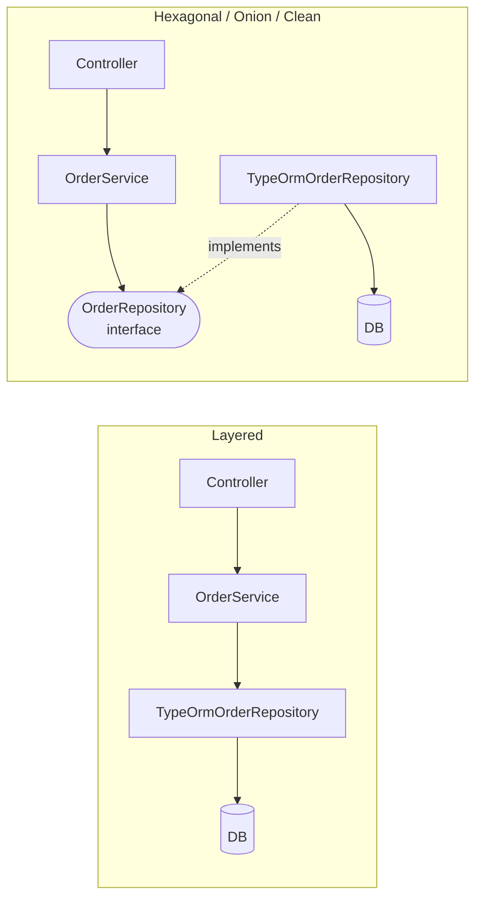
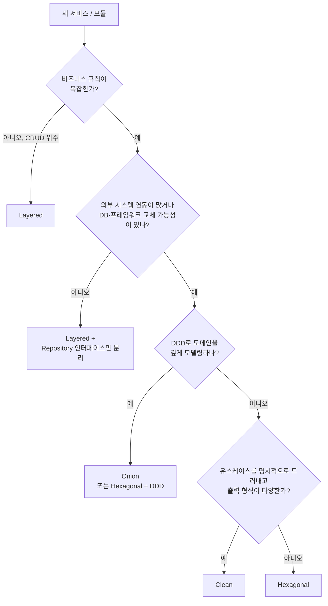

# Layered vs Hexagonal vs Onion vs Clean Architecture

## 1. 한눈에 비교

| 구분 | Layered | Hexagonal | Onion | Clean |
|---|---|---|---|---|
| 제안 | 오래된 관례 (1990년대~) | Alistair Cockburn, 2005 | Jeffrey Palermo, 2008 | Robert C. Martin, 2012 |
| 그림 | 위아래로 쌓은 층 | 육각형 안과 밖 | 양파 동심원 | 동심원 4겹 |
| 중심(기초) | **DB / Persistence** | Application Core | Domain Model | Entities |
| 의존 방향 | 위 → 아래 | 바깥 → 안 | 바깥 → 안 | 바깥 → 안 |
| 비즈니스가 DB에 의존? | **예** | 아니오 | 아니오 | 아니오 |
| 핵심 장치 | 관심사 분리 | 포트와 어댑터 | 안쪽이 인터페이스 정의 | 의존성 규칙 |
| 안쪽 세분화 | Business 하나 | 정하지 않음 | Domain Model / Domain Services / Application Services | Entities / Use Cases |
| 출력 처리 | 반환값 | 반환값 | 반환값 | Output Port + Presenter (선택) |
| 학습 비용 | 낮음 | 중간 | 중간~높음 | 중간~높음 |
| 코드량 | 적음 | 중간 | 많음 | 많음 |

가장 중요한 차이는 표의 네 번째 줄입니다. **Layered만 비즈니스가 DB 쪽을 향해 의존하고, 나머지 셋은 모두 그 방향을 뒤집었습니다.** Hexagonal, Onion, Clean은 같은 아이디어를 다르게 그린 것에 가깝습니다.

## 2. 의존 방향이 갈리는 지점

같은 기능(주문 저장)을 두고 의존 화살표만 비교해 보겠습니다.



| | Layered | 나머지 셋 |
|---|---|---|
| `OrderService`가 import 하는 것 | `TypeOrmOrderRepository` (구체 클래스) | `OrderRepository` (자기 쪽 인터페이스) |
| Repository 인터페이스 위치 | 없거나 Persistence 계층 | 안쪽(도메인/유스케이스) |
| ORM 교체 시 `OrderService` 수정 | 필요할 수 있음 | 불필요 |

코드 한 줄 차이처럼 보이지만, **인터페이스가 어느 쪽 소유인가**가 아키텍처 전체의 성격을 바꿉니다.

```typescript
// Layered: Service가 Persistence 계층의 클래스를 안다
import { OrderRepository } from '../persistence/order.repository'; // TypeORM 구현체

// Hexagonal / Onion / Clean: Service가 자기 쪽 인터페이스만 안다
import { OrderRepository } from '../domain/order.repository'; // interface
```

## 3. 같은 기능, 네 가지 폴더 구조

"주문하기" 기능을 각 구조로 배치하면 이렇게 됩니다.

### 3-1. Layered

```text
src/order/
├── order.controller.ts       # Presentation
├── order.service.ts          # Business
├── order.repository.ts       # Persistence (TypeORM 직접 사용)
└── order.entity.ts           # TypeORM 엔티티 = 도메인 모델
```

자세한 내용: [[layered-architecture]]

### 3-2. Hexagonal

```text
src/order/
├── domain/
│   └── order.ts
├── application/
│   ├── port/in/place-order.use-case.ts
│   ├── port/out/order.repository.ts
│   └── service/place-order.service.ts
└── adapter/
    ├── in/web/order.controller.ts
    └── out/persistence/typeorm-order.repository.ts
```

자세한 내용: [[hexagonal-architecture]]

### 3-3. Onion

```text
src/order/
├── domain/
│   ├── model/order.ts
│   └── services/
│       ├── discount-policy.ts
│       └── order.repository.ts        # 인터페이스
├── application/
│   └── place-order.service.ts
├── infrastructure/
│   └── persistence/typeorm-order.repository.ts
└── presentation/
    └── order.controller.ts
```

자세한 내용: [[onion-architecture]]

### 3-4. Clean

```text
src/order/
├── entities/
│   └── order.ts
├── use-cases/
│   ├── place-order/
│   │   ├── place-order.input-port.ts
│   │   ├── place-order.output-port.ts
│   │   └── place-order.interactor.ts
│   └── ports/order.gateway.ts         # 인터페이스
├── adapters/
│   ├── controllers/order.controller.ts
│   ├── presenters/place-order.presenter.ts
│   └── gateways/typeorm-order.gateway.ts
└── order.module.ts
```

자세한 내용: [[clean-architecture]]

> 폴더 이름은 달라도 Hexagonal, Onion, Clean의 **의존 그래프는 거의 같습니다**. 차이는 안쪽을 몇 겹으로 나누고 각 겹에 어떤 이름을 붙이느냐입니다.

## 4. 용어 대응표

같은 역할을 하는 것을 구조마다 다르게 부릅니다. 이 표가 있으면 다른 구조의 글을 읽을 때 헷갈리지 않습니다.

| 역할 | Layered | Hexagonal | Onion | Clean | DDD |
|---|---|---|---|---|---|
| 핵심 업무 규칙 | (Service에 섞임) | Domain | Domain Model | Entities | Entity, VO, Aggregate |
| 여러 객체에 걸친 규칙 | Service | Domain | Domain Services | Entities | Domain Service |
| 유스케이스 흐름 | Service | Application Service | Application Services | Use Case Interactor | Application Service |
| 유스케이스 진입 인터페이스 | 없음 | Inbound Port | (없음, 서비스 직접 호출) | Input Boundary | - |
| 저장소 인터페이스 | 없음 | Outbound Port | Domain Services 겹의 interface | Data Access Interface (Gateway) | Repository |
| 저장소 구현 | Repository | Driven Adapter | Infrastructure | Gateway | Repository 구현 |
| 요청 받는 쪽 | Controller | Driving Adapter | UI | Controller | - |
| 응답 형식 변환 | Controller / DTO | Driving Adapter | UI | Presenter | - |

## 5. 각 구조가 집중하는 질문

네 구조는 같은 문제를 다른 각도에서 봅니다.

| 구조 | 집중하는 질문 | 답 |
|---|---|---|
| Layered | 코드를 **역할별로** 어떻게 나눌까? | 표현, 비즈니스, 저장으로 층을 나눈다 |
| Hexagonal | 애플리케이션과 **바깥 세상의 경계**를 어떻게 그을까? | 포트로 규격을 정하고 어댑터로 연결한다 |
| Onion | **도메인 중심**으로 안쪽을 어떻게 쌓을까? | 도메인 모델 → 도메인 서비스 → 애플리케이션 서비스 |
| Clean | 모든 구조에 공통인 **원칙**은 무엇인가? | 의존성은 안쪽으로만 (의존성 규칙) |

```text
Hexagonal:  [ 안 ] │ [ 밖 ]          ← 경계(테두리)를 강조
Onion:      ((( 도메인 )))           ← 안쪽 겹(심)을 강조
Clean:      규칙: 바깥 → 안쪽만      ← 원칙을 강조
```

## 6. 차이를 만드는 세부 포인트

### 6-1. Hexagonal은 안쪽 구조를 정하지 않는다

Cockburn의 원문은 **"애플리케이션 안쪽은 어떻게 짜든 상관없다. 바깥과의 경계만 포트로 지켜라"**에 가깝습니다. 그래서 Hexagonal 안쪽에 DDD를 쓰든, 트랜잭션 스크립트를 쓰든 Hexagonal입니다.

### 6-2. Onion은 DDD 용어로 안쪽을 나눈다

Onion은 안쪽을 Domain Model, Domain Services, Application Services로 나누고, **Repository 인터페이스를 Domain Services 겹에** 둔다고 명시합니다. DDD를 쓰는 팀에게는 가장 자연스러운 구조입니다.

### 6-3. Clean은 유스케이스와 Presenter를 명시한다

Clean은 **Use Case를 독립된 원**으로 두고, 결과를 돌려줄 때 **Output Port(Presenter)**를 쓰는 모델을 제시합니다. 유스케이스 목록만 봐도 시스템이 하는 일을 알 수 있게 하는 것(Screaming Architecture)을 강조합니다.

### 6-4. 테스트를 보는 관점

| 구조 | 테스트 관점 |
|---|---|
| Layered | Service 테스트에 Repository 목(mock)이 필요하다 |
| Hexagonal | 테스트는 또 하나의 Driving Adapter다. Driven 쪽은 가짜 어댑터로 바꾼다 |
| Onion | 테스트는 UI, Infrastructure와 같은 바깥 껍질에 있다 |
| Clean | Interactor를 `new`로 만들고 가짜 Gateway, Spy Presenter를 넣는다 |

Layered를 제외한 셋은 **인터페이스에 가짜 구현을 꽂는 방식**이라 테스트하는 방법이 사실상 같습니다.

## 7. 같은 코드를 네 가지로 보기

"VIP 고객 10% 할인, 주문 저장" 유스케이스의 핵심만 비교합니다.

```typescript
// ── Layered ──────────────────────────────────────────
@Injectable()
export class OrderService {
  constructor(
    @InjectRepository(OrderEntity) private readonly orders: Repository<OrderEntity>, // TypeORM
    @InjectRepository(CustomerEntity) private readonly customers: Repository<CustomerEntity>,
  ) {}

  async place(dto: CreateOrderDto) {
    const customer = await this.customers.findOneByOrFail({ id: dto.customerId });
    const total = dto.lines.reduce((s, l) => s + l.price * l.quantity, 0);
    const discount = customer.grade === 'VIP' ? Math.floor(total * 0.1) : 0; // 규칙이 서비스에
    return this.orders.save({ customerId: customer.id, total: total - discount });
  }
}
```

```typescript
// ── Hexagonal / Onion / Clean (공통 골격) ───────────
export class PlaceOrderService {
  constructor(
    private readonly orders: OrderRepository,       // 안쪽 인터페이스
    private readonly customers: CustomerRepository, // 안쪽 인터페이스
    private readonly discountPolicy: DiscountPolicy,
  ) {}

  async execute(cmd: PlaceOrderCommand): Promise<OrderId> {
    const customer = await this.customers.findById(cmd.customerId);
    const order = Order.place(this.orders.nextId(), customer.id, cmd.lines); // 규칙은 도메인에
    order.applyDiscount(this.discountPolicy.calculate(order, customer));
    await this.orders.save(order);
    return order.id;
  }
}
```

뒤의 셋은 **이 골격이 같고**, 차이는 이렇게 나타납니다.

| 구조 | 이 골격에 더해지는 것 |
|---|---|
| Hexagonal | `PlaceOrderService implements PlaceOrderUseCase` (Inbound Port) |
| Onion | `DiscountPolicy`와 `OrderRepository`를 `domain/services/`에 둔다 |
| Clean | 이름이 `PlaceOrderInteractor`, 반환 대신 `presenter.placed(output)`을 호출할 수 있다 |

## 8. 어떤 구조를 고를까?



| 상황 | 추천 |
|---|---|
| 관리자 페이지, 게시판, MVP | Layered |
| CRUD지만 테스트는 편하게 하고 싶다 | Layered + Repository 인터페이스 분리 |
| 결제·배송·외부 API 연동이 많은 서비스 | Hexagonal |
| DDD로 설계한 복잡한 Core 도메인 | Onion (또는 Hexagonal + DDD) |
| 같은 유스케이스를 웹·배치·관리자 등 여러 출력으로 제공 | Clean |
| 팀이 처음 도입한다 | Hexagonal부터 (개념이 가장 단순하다) |

### 8-1. 섞어 써도 된다

한 시스템 안에서도 Bounded Context마다 다른 구조를 쓸 수 있습니다 ([[ddd-strategic-design]]).

```text
src/
├── ordering/     # Core 도메인       → Onion / Clean
├── payment/      # 외부 PG 연동      → Hexagonal
├── admin/        # 관리자 CRUD       → Layered
└── notification/ # 범용 (메일/푸시)  → Layered + 외부 SDK 어댑터
```

모든 모듈에 같은 구조를 강제하면 단순한 모듈에는 비용만 늘어납니다.

### 8-2. Layered에서 점진적으로 옮기기

처음부터 정답을 고를 필요는 없습니다. Layered로 시작해서 필요할 때 한 단계씩 옮길 수 있습니다.

```text
1단계  Layered (Service → TypeORM Repository)
  │    규칙이 늘고 테스트가 무거워진다
  ▼
2단계  Repository 인터페이스를 Service 쪽으로 옮긴다 (의존성 역전)
  │    → 이 시점부터 사실상 Hexagonal/Onion의 핵심을 갖춘다
  ▼
3단계  규칙을 Service에서 도메인 객체로 옮긴다 (빈약한 도메인 탈출)
  │
  ▼
4단계  외부 API, 메시지 발행도 인터페이스로 분리한다 (Outbound Port)
  │
  ▼
5단계  필요하면 유스케이스별 클래스, Presenter를 도입한다 (Clean)
```

**2단계 하나만 해도 효과의 대부분을 얻습니다.** 나머지는 복잡도가 실제로 커졌을 때 진행해도 늦지 않습니다.

## 9. 공통 오해 정리

| 오해 | 실제 |
|---|---|
| "Clean이 Hexagonal보다 발전된 구조다" | 같은 원칙을 다르게 표현했을 뿐이다. 우열이 아니다 |
| "Onion은 Layered의 일종이다" | 계층을 나누는 것은 같지만 **의존 방향이 반대**다 |
| "폴더를 나누면 그 아키텍처다" | 기준은 폴더가 아니라 **import 방향**이다 |
| "Layered는 나쁜 구조다" | 단순한 도메인에서는 가장 효율적인 선택이다 |
| "하나를 골라 전체에 적용해야 한다" | 모듈마다 복잡도에 맞게 다르게 써도 된다 |

## 10. 핵심 정리

> Layered는 비즈니스가 저장 계층에 의존하는 구조이고, Hexagonal·Onion·Clean은 그 의존을 뒤집어 비즈니스를 가운데 둔 구조다. 뒤의 셋은 "의존은 안쪽으로, 경계는 안쪽이 정의한 인터페이스로"라는 같은 원칙을 공유한다. Hexagonal은 안과 밖의 경계(포트와 어댑터)를, Onion은 도메인 중심의 안쪽 겹을, Clean은 의존성 규칙이라는 원칙과 유스케이스·Presenter를 강조한다. 복잡도에 맞춰 고르고, Layered에서 Repository 인터페이스를 뒤집는 것부터 점진적으로 옮겨 갈 수 있다.
