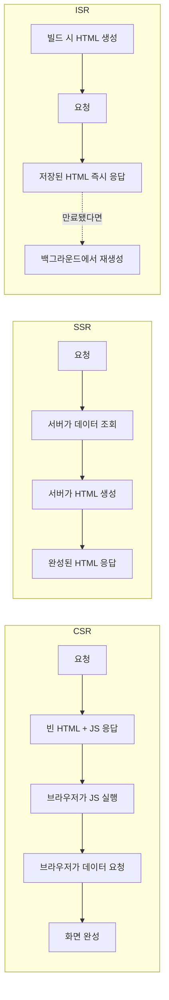
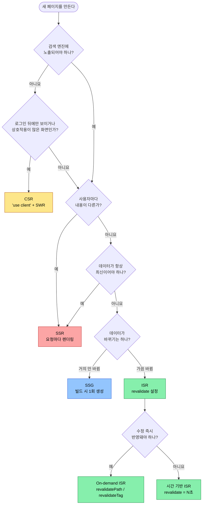
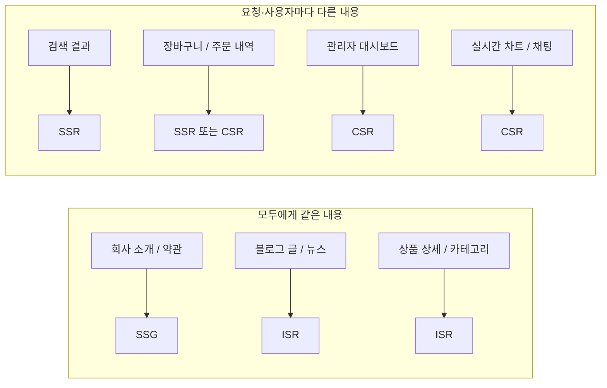
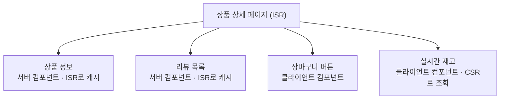

# CSR vs SSR vs ISR

## 1. 가장 큰 차이: 언제, 어디서 HTML을 만드는가

| 방식 | 어디서 | 언제 |
|---|---|---|
| [[nextjs-csr\|CSR]] | 브라우저 | 사용자가 페이지를 열었을 때 |
| [[nextjs-ssr\|SSR]] | 서버 | **요청이 올 때마다** |
| [[nextjs-isr\|ISR]] | 서버 | **미리** 만들고, 일정 시간이 지나면 다시 |

음식점에 비유하면 다음과 같습니다.

- **CSR**: 밀키트를 받아서 집에서 직접 조리한다. (조리는 손님 몫)
- **SSR**: 주문이 들어올 때마다 주방에서 새로 조리한다. (항상 갓 만든 음식, 주방은 바쁨)
- **ISR**: 미리 만들어 둔 도시락을 판다. 일정 시간이 지나면 새로 만들어 교체한다. (빠르지만 갓 만든 건 아닐 수 있음)

## 2. 흐름 비교



## 3. 항목별 비교

| 항목 | CSR | SSR | ISR |
|---|---|---|---|
| 렌더링 위치 | 브라우저 | 서버 | 서버 (미리) |
| 렌더링 시점 | 페이지 연 뒤 | 요청마다 | 빌드 시 + 만료 후 요청 시 |
| 첫 화면 속도 | 느림 (JS·데이터 대기) | 보통 (서버 처리 시간만큼) | 매우 빠름 |
| 데이터 최신성 | 최신 | 항상 최신 | 설정한 시간만큼 늦을 수 있음 |
| SEO | 불리 | 유리 | 유리 |
| 서버 부담 | 낮음 | 높음 | 낮음 |
| 사용자별 화면 | 가능 | 가능 | 불가 (모두 같은 HTML) |
| CDN 캐시 | 정적 파일만 | 어려움 | 쉬움 |
| 로딩 처리 | 직접 필요 | 거의 불필요 | 거의 불필요 |

## 4. 같은 페이지, 세 가지 방식

"상품 목록 페이지"를 각 방식으로 만들면 다음과 같습니다. (App Router 기준)

```tsx
// ① CSR: 브라우저에서 가져온다
'use client';
import useSWR from 'swr';

export default function Products() {
  const { data } = useSWR('/api/products', (url) =>
    fetch(url).then((r) => r.json())
  );
  if (!data) return <p>불러오는 중...</p>;
  return <List items={data} />;
}
```

```tsx
// ② SSR: 요청마다 서버에서 가져온다
export default async function Products() {
  const data = await fetch('https://api.example.com/products', {
    cache: 'no-store',
  }).then((r) => r.json());
  return <List items={data} />;
}
```

```tsx
// ③ ISR: 미리 만들고 60초가 지나면 다시 만든다
export const revalidate = 60;

export default async function Products() {
  const data = await fetch('https://api.example.com/products').then((r) =>
    r.json()
  );
  return <List items={data} />;
}
```

SSR과 ISR의 코드는 거의 같습니다. **캐시 설정 한 줄**이 렌더링 방식을 바꿉니다.

| 방식 | App Router | Pages Router |
|---|---|---|
| CSR | `'use client'` + `useEffect` / SWR | 컴포넌트 안에서 `useEffect` / SWR |
| SSR | `cache: 'no-store'`, `cookies()`, `dynamic = 'force-dynamic'` | `getServerSideProps` |
| ISR | `export const revalidate = N`, `next: { revalidate: N }` | `getStaticProps` + `revalidate` |

## 5. 기술 선택 흐름도

페이지 하나를 만들 때 아래 질문을 순서대로 따라가 봅니다.



## 6. 페이지 유형별 추천



| 페이지 | 추천 | 이유 |
|---|---|---|
| 회사 소개, 이용약관 | SSG | 거의 바뀌지 않는다 |
| 블로그, 뉴스 기사 | ISR | 검색 노출 필요, 가끔 수정된다 |
| 상품 상세 | ISR | 방문자가 많고, 몇 분 지연은 괜찮다 |
| 검색 결과 | SSR | 검색어마다 결과가 다르고 SEO도 필요하다 |
| 주문 내역, 장바구니 | SSR 또는 CSR | 사용자별 데이터, SEO 불필요 |
| 관리자 대시보드 | CSR | 로그인 뒤 화면, 상호작용이 많다 |
| 실시간 시세, 채팅 | CSR | 브라우저에서 계속 갱신해야 한다 |

## 7. 하나만 골라야 하는 것은 아니다

Next.js에서는 **페이지마다**, 심지어 **한 페이지 안의 컴포넌트마다** 다른 방식을 쓸 수 있습니다.



- 모두에게 같은 상품 정보는 ISR로 빠르게 보여주고
- 사용자마다 다르거나 실시간인 부분만 CSR로 가져옵니다.

이렇게 섞어 쓰는 것이 실무에서 가장 흔한 형태입니다.

> 참고: 최신 Next.js에는 정적 껍데기를 먼저 보내고 동적인 부분만 나중에 채우는 **PPR(Partial Prerendering)**, 컴포넌트·함수 단위로 캐시하는 `'use cache'` 같은 기능도 있습니다.

## 8. 핵심 정리

> CSR은 브라우저가, SSR은 서버가 요청마다, ISR은 서버가 미리 만들고 주기적으로 다시 HTML을 만든다. 검색 노출이 필요 없고 상호작용이 많으면 CSR, 사용자마다 다르거나 항상 최신이어야 하면 SSR, 모두에게 같은 내용이고 조금 늦어도 되면 ISR을 고른다. Next.js에서는 페이지·컴포넌트 단위로 섞어 쓸 수 있으므로, 부분마다 가장 알맞은 방식을 고르면 된다.
