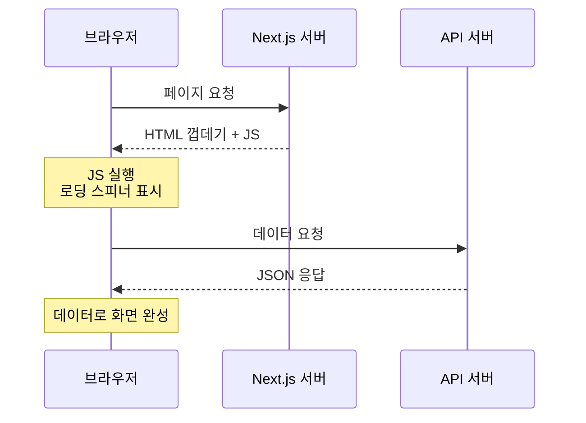

# CSR (Client-Side Rendering)

## 1. CSR이란?

**CSR(Client-Side Rendering)**은 화면을 **브라우저**에서 그리는 방식입니다.

서버는 거의 빈 HTML과 JavaScript 파일만 보내고, 브라우저가 JavaScript를 실행하면서 데이터를 가져오고 화면을 완성합니다.

```text
1. 브라우저 ── 페이지 요청 ──> 서버
2. 브라우저 <── 빈 HTML + JS ── 서버
3. 브라우저: JS 다운로드 & 실행
4. 브라우저 ── 데이터 요청(API) ──> 서버
5. 브라우저 <── JSON ── 서버
6. 브라우저: 받은 데이터로 화면 완성
```

가구 배송에 비유하면, 완성된 가구 대신 **부품과 설명서**를 받아서 집에서 직접 조립하는 것과 같습니다. 조립(렌더링)은 사용자의 브라우저가 맡습니다.

## 2. 흐름 한눈에 보기



사용자는 3~5단계 동안 로딩 화면을 보게 됩니다.

## 3. Next.js에서 CSR은 조금 다르다

순수 React(Vite, CRA 등)로 만든 앱은 처음 받은 HTML이 정말 비어 있습니다.

```html
<body>
  <div id="root"></div>  <!-- 아무것도 없음 -->
  <script src="/bundle.js"></script>
</body>
```

Next.js는 **클라이언트 컴포넌트도 처음 HTML은 서버에서 한 번 그려서** 보냅니다. 그래서 Next.js에서 말하는 CSR은 보통 이런 뜻입니다.

> 페이지 뼈대(레이아웃, 버튼, 로딩 표시)는 서버에서 HTML로 오고, **데이터는 브라우저가 나중에 가져와서 채운다.**

즉 "데이터를 어디서 가져오느냐"가 CSR인지를 가르는 기준입니다.

## 4. Next.js에서 CSR 구현하기

App Router에서는 파일 맨 위에 `'use client'`를 붙여 **클라이언트 컴포넌트**로 만들고, 브라우저에서 데이터를 가져옵니다.

### 4-1. useEffect로 직접 가져오기

```tsx
// app/dashboard/page.tsx
'use client';

import { useEffect, useState } from 'react';

export default function Dashboard() {
  const [data, setData] = useState(null);

  useEffect(() => {
    fetch('/api/stats')
      .then((res) => res.json())
      .then(setData);
  }, []);

  if (!data) return <p>불러오는 중...</p>;
  return <p>오늘 방문자: {data.visitors}</p>;
}
```

### 4-2. SWR 같은 라이브러리 사용하기

실무에서는 캐싱, 재시도, 자동 갱신을 해주는 SWR이나 TanStack Query를 많이 씁니다.

```tsx
'use client';

import useSWR from 'swr';

const fetcher = (url: string) => fetch(url).then((r) => r.json());

export default function Dashboard() {
  const { data, error, isLoading } = useSWR('/api/stats', fetcher);

  if (error) return <p>에러가 발생했습니다</p>;
  if (isLoading) return <p>불러오는 중...</p>;
  return <p>오늘 방문자: {data.visitors}</p>;
}
```

> 참고: Pages Router(`pages/` 폴더)에서도 방법은 같습니다. `getServerSideProps`나 `getStaticProps` 없이 컴포넌트 안에서 `useEffect`나 SWR로 데이터를 가져오면 CSR입니다.

## 5. 장점

| 장점 | 설명 |
|---|---|
| 서버 부담이 적다 | 서버는 정적 파일만 주면 되고, 렌더링은 브라우저가 한다 |
| 페이지 전환이 빠르다 | 한 번 로드한 뒤에는 필요한 데이터만 받아 화면을 바꾼다 |
| 상호작용이 풍부하다 | 클릭, 입력, 실시간 변화에 즉시 반응하는 UI를 만들기 쉽다 |
| 사용자별 데이터에 적합 | 로그인한 사용자만 보는 데이터는 브라우저에서 가져오면 된다 |

## 6. 단점

| 단점 | 설명 |
|---|---|
| 첫 화면이 늦다 | JS 다운로드 → 실행 → 데이터 요청까지 끝나야 내용이 보인다 |
| SEO에 불리하다 | 검색 엔진이 처음 받는 HTML에 실제 내용(데이터)이 없다 |
| 기기 성능의 영향을 받는다 | 저사양 휴대폰에서는 JS 실행이 느리다 |
| 로딩 상태 처리가 필요하다 | 스피너, 스켈레톤, 에러 화면을 직접 만들어야 한다 |

## 7. 언제 쓰면 좋을까?

- 로그인 후에만 보이는 **대시보드, 관리자 페이지, 마이페이지**
- 검색 노출이 필요 없는 페이지
- 사용자의 조작에 따라 화면이 자주 바뀌는 페이지 (필터, 차트, 에디터)
- 실시간으로 계속 바뀌는 데이터 (주식 시세, 알림)

반대로 블로그 글, 상품 상세처럼 **검색에 노출되어야 하는 페이지**에는 잘 맞지 않습니다. 이럴 때는 [[nextjs-ssr|SSR]]이나 [[nextjs-isr|ISR]]을 고려합니다.

## 8. 핵심 정리

> CSR은 브라우저가 JavaScript로 데이터를 가져와 화면을 그리는 방식이다. Next.js에서는 `'use client'` 컴포넌트에서 `useEffect`나 SWR로 데이터를 가져오면 CSR이 된다. 서버 부담이 적고 상호작용에 강하지만, 첫 화면이 늦고 SEO에 불리하므로 로그인 뒤 화면이나 대시보드에 주로 쓴다.
