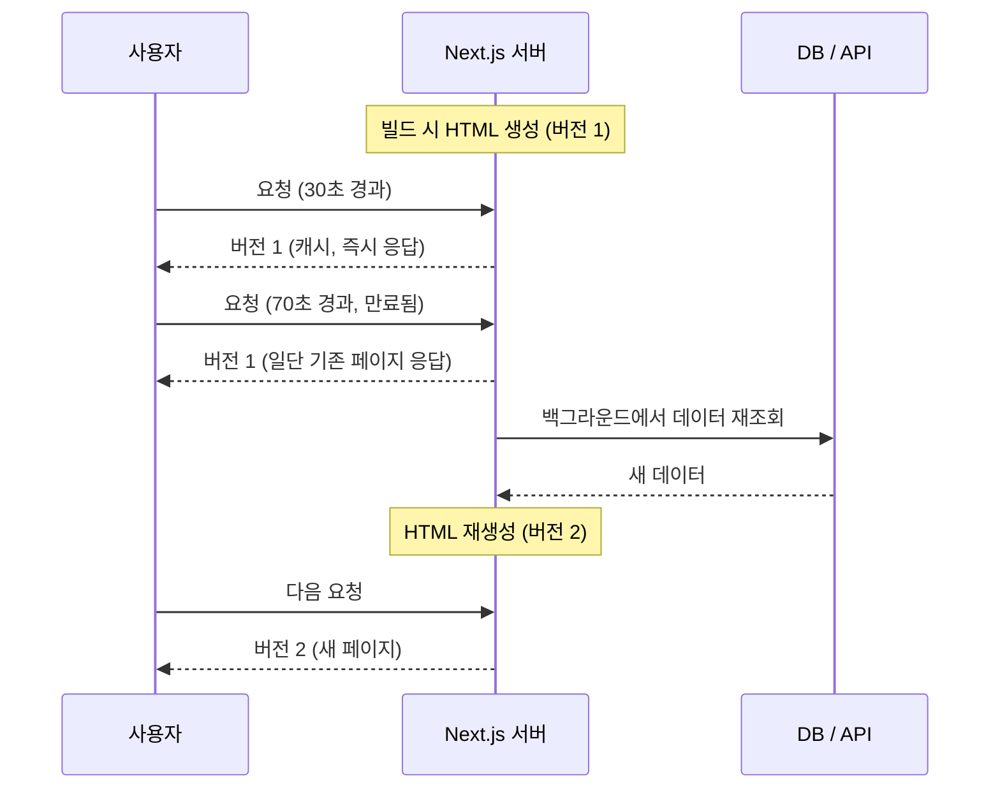

# ISR (Incremental Static Regeneration)

## 1. 먼저 알아야 할 것: SSG

ISR을 이해하려면 **SSG(Static Site Generation, 정적 생성)**를 먼저 알아야 합니다.

SSG는 **빌드할 때 HTML을 미리 다 만들어 두는** 방식입니다. 요청이 오면 만들어 둔 파일을 그대로 줍니다.

```text
빌드 시점:  서버가 데이터 조회 → HTML 파일 생성 → 저장
요청 시점:  저장된 HTML을 바로 응답 (매우 빠름)
```

빠르고 서버 부담도 거의 없지만, 데이터가 바뀌면 **다시 빌드하고 배포**해야 화면에 반영됩니다.

글 하나 고칠 때마다 사이트 전체를 다시 빌드하는 건 비효율적입니다. 이 문제를 해결한 것이 ISR입니다.

## 2. ISR이란?

**ISR(Incremental Static Regeneration)**은 미리 만들어 둔 정적 페이지를 **정해진 시간이 지나면 백그라운드에서 다시 만들어** 교체하는 방식입니다.

- Incremental(증분): 사이트 전체가 아니라 **필요한 페이지만**
- Static(정적): 미리 만들어 둔 HTML을
- Regeneration(재생성): **다시 만든다**

빵집에 비유해 보겠습니다.

- 아침에 빵을 미리 구워 진열해 둡니다. (SSG)
- 손님은 진열된 빵을 바로 사 갑니다. (빠른 응답)
- 빵이 구워진 지 1시간이 넘으면, 손님에게는 진열된 빵을 주면서 **뒤에서 새 빵을 굽습니다.**
- 다음 손님부터는 새로 구운 빵을 받습니다.

## 3. 동작 방식 (stale-while-revalidate)

`revalidate: 60`(60초)으로 설정했다고 가정합니다.



요청이 언제 들어왔느냐에 따라 받는 페이지가 다릅니다.

1. 60초 안의 요청은 **캐시된 페이지**를 바로 받습니다.
2. 60초가 지난 뒤 **첫 요청**도 기존(오래된) 페이지를 받습니다. 대신 이 요청이 재생성을 시작시킵니다.
3. 재생성이 끝나면 **그 다음 요청부터** 새 페이지를 받습니다.

> 60초마다 자동으로 다시 만드는 것이 아닙니다. 60초가 지난 뒤 **요청이 들어와야** 재생성이 시작됩니다. 아무도 방문하지 않으면 다시 만들지 않습니다.

재생성 중 에러가 나면 마지막으로 성공한 페이지를 계속 보여줍니다. 그래서 API가 잠깐 죽어도 사이트는 멀쩡히 보입니다.

## 4. Next.js에서 ISR 구현하기

### 4-1. App Router: 시간 기반 재검증

페이지 파일에서 `revalidate`를 내보내면 됩니다.

```tsx
// app/posts/[id]/page.tsx

// 60초마다 재검증
export const revalidate = 60;

export default async function PostPage({
  params,
}: {
  params: Promise<{ id: string }>;
}) {
  const { id } = await params;
  const post = await fetch(`https://api.example.com/posts/${id}`).then((r) =>
    r.json()
  );

  return (
    <article>
      <h1>{post.title}</h1>
      <p>{post.content}</p>
    </article>
  );
}
```

`fetch` 단위로 설정할 수도 있습니다.

```tsx
const res = await fetch('https://api.example.com/posts', {
  next: { revalidate: 60 },
});
```

### 4-2. 동적 경로 미리 만들기

`/posts/1`, `/posts/2`처럼 경로가 여러 개라면 `generateStaticParams`로 빌드 때 만들 페이지를 정합니다.

```tsx
// app/posts/[id]/page.tsx
export async function generateStaticParams() {
  const posts = await fetch('https://api.example.com/posts').then((r) =>
    r.json()
  );
  return posts.map((post) => ({ id: String(post.id) }));
}
```

빌드 때 만들지 않은 경로(예: 새로 쓴 글)로 요청이 오면, 그때 처음 만들고 이후에는 캐시해 둡니다.

### 4-3. 주문형(On-demand) 재검증

"60초마다"가 아니라 **데이터가 바뀐 순간** 바로 갱신하고 싶을 때 씁니다. 예를 들어 관리자가 글을 수정하면 해당 페이지만 즉시 다시 만듭니다.

```tsx
// app/actions.ts
'use server';

import { revalidatePath, revalidateTag } from 'next/cache';

export async function updatePost(id: string) {
  // ... DB 수정 ...

  revalidatePath(`/posts/${id}`); // 이 경로의 캐시를 무효화
  // 또는 태그 단위로: revalidateTag('posts');
}
```

태그를 쓰려면 `fetch`에 태그를 달아 둡니다.

```tsx
fetch('https://api.example.com/posts', { next: { tags: ['posts'] } });
```

CMS(헤드리스 CMS 등)에서 글이 수정되면 [[webhook|웹훅]]으로 Next.js의 API를 호출해 재검증하는 방식도 많이 씁니다.

### 4-4. Pages Router

`getStaticProps`에서 `revalidate`를 돌려주면 ISR이 됩니다.

```tsx
// pages/posts/[id].tsx
export async function getStaticProps({ params }) {
  const post = await fetch(`https://api.example.com/posts/${params.id}`).then(
    (r) => r.json()
  );
  return {
    props: { post },
    revalidate: 60, // 60초
  };
}

export async function getStaticPaths() {
  return { paths: [], fallback: 'blocking' };
}
```

주문형 재검증은 API Route에서 `res.revalidate('/posts/1')`을 호출합니다.

## 5. 장점

| 장점 | 설명 |
|---|---|
| 매우 빠르다 | 대부분의 요청이 미리 만든 HTML을 바로 받는다 |
| 서버 부담이 적다 | 재생성은 가끔, 필요한 페이지만 한다 |
| SEO에 유리하다 | 완성된 HTML을 준다 |
| 재배포 없이 갱신 | 데이터가 바뀌어도 빌드를 다시 할 필요가 없다 |
| 장애에 강하다 | 재생성이 실패해도 기존 페이지를 계속 보여준다 |

## 6. 단점

| 단점 | 설명 |
|---|---|
| 잠시 오래된 데이터가 보인다 | 만료 후 첫 요청자는 이전 버전을 본다 |
| 사용자별 화면에 못 쓴다 | 모두가 같은 HTML을 받으므로 쿠키·로그인 정보를 반영할 수 없다 |
| 캐시 동작을 이해해야 한다 | 언제 갱신되는지 헷갈리기 쉽다 |
| 호스팅 환경을 탄다 | Next.js 서버가 돌아가는 환경이 필요하다 (`output: 'export'` 정적 배포에서는 불가) |

## 7. 언제 쓰면 좋을까?

- **블로그, 뉴스, 문서** 페이지
- **상품 상세, 카테고리** 페이지 (가격·재고가 몇 분 늦어도 괜찮은 경우)
- **랜딩 페이지, 마케팅 페이지**
- 방문자는 많고, 데이터는 **가끔** 바뀌는 페이지

모든 사용자에게 **같은 내용**을 보여주고, 데이터가 **조금 늦게 반영돼도 괜찮다면** ISR이 가장 효율적입니다. 사용자마다 다르거나 반드시 최신이어야 한다면 [[nextjs-ssr|SSR]]을 씁니다.

## 8. 핵심 정리

> ISR은 미리 만든 정적 페이지를, 정해진 시간이 지난 뒤 요청이 오면 백그라운드에서 다시 만들어 교체하는 방식이다. App Router에서는 `export const revalidate = 60`이나 `fetch`의 `next.revalidate`로 설정하고, 즉시 갱신이 필요하면 `revalidatePath`/`revalidateTag`를 쓴다. SSG의 속도와 SSR의 최신성을 절충한 방식으로, 모두에게 같은 내용을 보여주는 페이지에 잘 맞는다.
