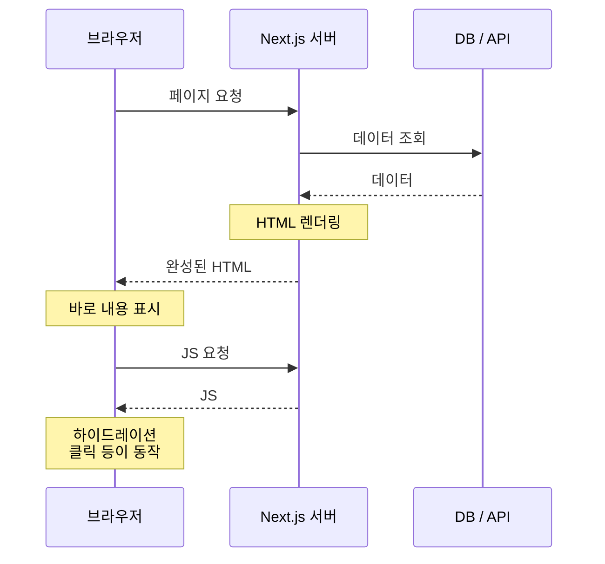

# SSR (Server-Side Rendering)

## 1. SSR이란?

**SSR(Server-Side Rendering)**은 **요청이 올 때마다 서버에서** 데이터를 가져와 HTML을 완성한 뒤 브라우저로 보내는 방식입니다.

```text
1. 브라우저 ── 페이지 요청 ──> 서버
2. 서버: 데이터 조회 → HTML 완성
3. 브라우저 <── 내용이 채워진 HTML ── 서버
4. 브라우저: 바로 화면 표시
5. 브라우저: JS 로드 후 버튼 등이 동작 (하이드레이션)
```

가구 배송에 비유하면, 주문이 들어올 때마다 공장에서 **완성된 가구를 조립해서** 보내주는 것과 같습니다. 받자마자 바로 쓸 수 있지만, 공장(서버)은 주문마다 일을 해야 합니다.

## 2. 흐름 한눈에 보기



## 3. 하이드레이션(Hydration)이란?

서버가 보낸 HTML은 **보이기만 하고 아직 동작하지 않는** 상태입니다. 버튼을 눌러도 반응이 없습니다.

브라우저가 JavaScript를 받아서 이 HTML에 이벤트(클릭, 입력 등)를 연결하는 과정을 **하이드레이션**이라고 합니다. 마른 HTML에 물(JS)을 부어 살아 움직이게 만든다는 뜻입니다.

```text
서버 HTML 도착 → 화면은 보임 (아직 클릭 안 됨)
         ↓
JS 로드 + 하이드레이션 → 이제 클릭, 입력 가능
```

## 4. Next.js에서 SSR 구현하기

### 4-1. App Router

App Router의 컴포넌트는 기본이 **서버 컴포넌트**라서, 컴포넌트 안에서 바로 `await`로 데이터를 가져올 수 있습니다.

요청마다 새로 렌더링하게 만드는 방법은 다음과 같습니다.

```tsx
// app/orders/page.tsx
export default async function OrdersPage() {
  // cache: 'no-store' → 캐시하지 않고 매 요청마다 새로 가져온다
  const res = await fetch('https://api.example.com/orders', {
    cache: 'no-store',
  });
  const orders = await res.json();

  return (
    <ul>
      {orders.map((o) => (
        <li key={o.id}>{o.name}</li>
      ))}
    </ul>
  );
}
```

다음 중 하나라도 쓰면 Next.js가 자동으로 **요청마다 렌더링(동적 렌더링)**합니다.

| 방법 | 예 |
|---|---|
| 요청 정보 읽기 | `cookies()`, `headers()` |
| URL 쿼리 사용 | 페이지의 `searchParams` |
| 캐시 끄기 | `fetch(url, { cache: 'no-store' })` |
| 강제 설정 | `export const dynamic = 'force-dynamic'` |

```tsx
import { cookies } from 'next/headers';

export default async function MyPage() {
  const token = (await cookies()).get('token'); // 요청마다 다른 값 → SSR
  // ...
}
```

> 참고: Next.js 버전에 따라 `fetch`의 기본 캐시 동작이 다릅니다. 14에서는 기본이 캐시였고, 15부터는 기본이 캐시하지 않음입니다. 의도를 분명히 하려면 `cache` 옵션을 직접 적는 것이 안전합니다.

### 4-2. Pages Router

`pages/` 폴더를 쓴다면 `getServerSideProps`를 사용합니다. 이 함수는 **요청마다 서버에서** 실행됩니다.

```tsx
// pages/orders.tsx
export async function getServerSideProps(context) {
  const res = await fetch('https://api.example.com/orders');
  const orders = await res.json();
  return { props: { orders } };
}

export default function OrdersPage({ orders }) {
  return (
    <ul>
      {orders.map((o) => (
        <li key={o.id}>{o.name}</li>
      ))}
    </ul>
  );
}
```

## 5. 장점

| 장점 | 설명 |
|---|---|
| 항상 최신 데이터 | 요청할 때마다 새로 조회한다 |
| SEO에 유리하다 | 검색 엔진이 받는 HTML에 내용이 모두 들어 있다 |
| 첫 화면이 빨리 보인다 | 브라우저가 데이터를 따로 요청할 필요가 없다 |
| 요청별 맞춤 가능 | 쿠키, 로그인 정보, 지역에 따라 다른 화면을 만들 수 있다 |
| 비밀 정보 보호 | DB 접속, API 키를 서버에서만 사용한다 |

## 6. 단점

| 단점 | 설명 |
|---|---|
| 서버 부담이 크다 | 요청마다 데이터 조회와 렌더링을 한다 |
| 응답이 느려질 수 있다 | 데이터 조회가 느리면 HTML 도착도 늦어진다 (TTFB 증가) |
| CDN 캐시가 어렵다 | 매번 결과가 달라서 미리 만들어 둘 수 없다 |
| 서버가 꼭 필요하다 | 정적 파일 호스팅만으로는 배포할 수 없다 |

> **TTFB(Time To First Byte)**: 요청을 보낸 뒤 서버에서 첫 응답 바이트가 도착하기까지 걸린 시간

## 7. 언제 쓰면 좋을까?

- **요청마다 결과가 달라야** 하는 페이지 (검색 결과, 필터링된 목록)
- 로그인 사용자별 화면인데 **SEO나 빠른 첫 화면**도 중요한 경우
- **항상 최신이어야** 하는 데이터 (재고, 가격, 주문 상태)
- 쿠키·헤더를 보고 화면을 바꿔야 하는 경우 (A/B 테스트, 지역별 콘텐츠)

몇 분 정도 오래된 데이터를 보여줘도 괜찮다면 [[nextjs-isr|ISR]]이 서버 부담을 크게 줄여줍니다.

## 8. 핵심 정리

> SSR은 요청마다 서버가 데이터를 가져와 완성된 HTML을 보내는 방식이다. App Router에서는 `cookies()`, `searchParams`, `cache: 'no-store'` 등을 쓰면 SSR이 되고, Pages Router에서는 `getServerSideProps`를 쓴다. 항상 최신이고 SEO에 유리하지만, 요청마다 서버가 일하므로 부담과 응답 지연이 생길 수 있다.
