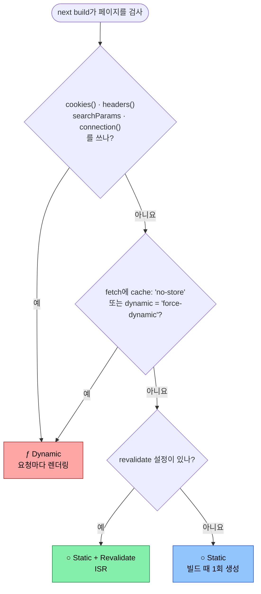
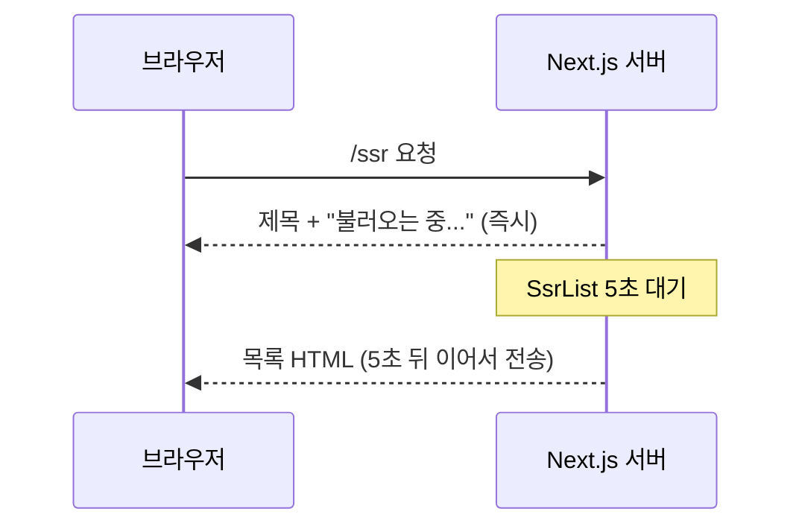

# ○ Static vs ƒ Dynamic

## 1. 빌드하면 보이는 기호

`next build`를 실행하면 마지막에 이런 표가 나옵니다.

```text
Route (app)                Revalidate  Expire
┌ ○ /
├ ○ /isr                           1m      1y
├ ○ /ssr
└ ƒ /search

○  (Static)   prerendered as static content
ƒ  (Dynamic)  server-rendered on demand
```

각 경로 앞의 기호는 **그 페이지의 HTML을 언제 만드는지**를 알려줍니다.

| 기호 | 이름 | 뜻 | HTML을 만드는 때 |
|---|---|---|---|
| ○ | Static | 정적 콘텐츠로 미리 렌더링됨 | **빌드할 때** 한 번 |
| ƒ | Dynamic | 요청이 올 때 서버에서 렌더링 | **요청마다** |

> 기호 이름의 ƒ는 function(함수)에서 왔습니다. 요청이 올 때마다 서버에서 함수를 실행해 페이지를 만든다는 뜻입니다.

## 2. ○ Static: 빌드할 때 만들어 둔다

```text
next build
  └─ 페이지 컴포넌트 실행 → 데이터 조회 → HTML 생성 → .next/server/app/xxx.html 저장

요청
  └─ 저장된 HTML을 그대로 응답 (컴포넌트를 다시 실행하지 않음)
```

빌드 결과 폴더(`.next/server/app/`)에 `페이지이름.html` 파일이 생깁니다. 서버는 요청이 오면 이 파일을 꺼내 줄 뿐입니다.

- 빠르고, 서버 부담이 거의 없습니다.
- 대신 빌드 이후에 바뀐 데이터는 반영되지 않습니다.
- `Revalidate` 칸에 값(예: `1m`)이 있으면 [[nextjs-isr|ISR]]입니다. 미리 만들어 두되, 그 시간이 지나면 다시 만듭니다.

## 3. ƒ Dynamic: 요청이 올 때 만든다

```text
next build
  └─ 페이지 코드만 준비 (HTML은 만들지 않음)

요청
  └─ 페이지 컴포넌트 실행 → 데이터 조회 → HTML 생성 → 응답
```

이것이 [[nextjs-ssr|SSR]]입니다. 요청마다 컴포넌트가 실행되므로 항상 최신이고, 쿠키나 쿼리에 따라 다른 화면을 만들 수 있습니다. 대신 요청마다 서버가 일합니다.

## 4. Next.js는 어떻게 ○와 ƒ를 정할까?

페이지가 ○인지 ƒ인지는 개발자가 지정하지 않아도 **Next.js가 빌드할 때 코드를 보고 자동으로 정합니다.**

기본값은 **○ Static**입니다. 아래 중 하나라도 쓰면 **ƒ Dynamic**으로 바뀝니다.

| 사용한 것 | 왜 Dynamic이 되나 |
|---|---|
| `cookies()`, `headers()` | 요청마다 값이 다르므로 미리 만들 수 없다 |
| 페이지의 `searchParams` | URL 쿼리(`?q=...`)는 요청이 와야 알 수 있다 |
| `connection()` (`next/server`) | "요청이 올 때까지 기다려라"라고 직접 표시한다 |
| `draftMode()` | 미리보기 모드는 요청마다 다르다 |
| `fetch(url, { cache: 'no-store' })` | 캐시하지 말라고 했으므로 미리 만들어 둘 수 없다 |
| `export const dynamic = 'force-dynamic'` | 강제로 Dynamic을 지정한다 |



## 5. 자주 하는 착각: "서버 컴포넌트 = SSR"

App Router의 컴포넌트는 기본이 **서버 컴포넌트**입니다. 그래서 "서버에서 실행되니까 SSR이겠지"라고 생각하기 쉽습니다.

하지만 서버 컴포넌트는 **어디서** 실행되는지(서버)를 말할 뿐, **언제** 실행되는지는 말하지 않습니다.

| 구분 | 실행 위치 | 실행 시점 |
|---|---|---|
| ○ Static 서버 컴포넌트 | 서버 | **빌드할 때** |
| ƒ Dynamic 서버 컴포넌트 | 서버 | **요청할 때** |

`fetch`도 마찬가지입니다. Next.js 15부터 `fetch`는 기본적으로 캐시하지 않지만, 그렇다고 페이지가 Dynamic이 되지는 않습니다. 빌드 때 한 번 호출되고, 그 결과가 HTML에 담겨 저장됩니다.

### 예시: 5초 딜레이를 걸었는데 페이지가 바로 뜬다

```tsx
// app/ssr/page.tsx → SsrList를 렌더링
export default async function SsrList() {
  const response = await fetch('https://jsonplaceholder.typicode.com/posts');
  const items = await response.json();

  await delay(5000); // 5초 대기

  return <ul>{items.map((item) => <li key={item.id}>{item.title}</li>)}</ul>;
}
```

이름은 SSR이지만 `cookies()`, `searchParams`, `cache: 'no-store'` 중 아무것도 쓰지 않았습니다. 그래서 빌드 결과는 이렇습니다.

```text
├ ○ /ssr
```

5초는 **`next build` 도중에 한 번** 기다렸고, 그때 만든 `ssr.html`이 저장됐습니다. `next start`로 띄운 서버는 이 파일을 바로 돌려주므로 딜레이 없이 페이지가 뜹니다.

진짜 SSR(ƒ)로 바꾸려면 다음 중 하나를 추가합니다.

```tsx
import { connection } from 'next/server';

export default async function SsrList() {
  await connection(); // 이 아래는 요청이 올 때 실행된다
  // ...
}
```

```tsx
// 또는 fetch에서 캐시를 끈다
const response = await fetch(url, { cache: 'no-store' });
```

```tsx
// 또는 페이지 파일에서 강제로 지정한다
export const dynamic = 'force-dynamic';
```

다시 빌드하면 `ƒ /ssr`로 바뀌고, 요청할 때마다 5초를 기다리게 됩니다.

## 6. 개발 모드에서는 차이가 안 보인다

`next dev`는 코드를 고칠 때마다 바로 보여주기 위해 **모든 페이지를 요청마다 렌더링**합니다. 그래서 ○ 페이지도 개발 중에는 ƒ처럼 동작합니다.

| 실행 방법 | ○ Static 페이지 | ƒ Dynamic 페이지 |
|---|---|---|
| `next dev` | 요청마다 렌더링 | 요청마다 렌더링 |
| `next build` → `next start` | 빌드 때 만든 HTML 응답 | 요청마다 렌더링 |

> Static/Dynamic이 실제로 어떻게 동작하는지 확인하려면 반드시 `next build && next start`로 실행해야 합니다.

## 7. Dynamic인데도 페이지가 바로 뜨는 경우

ƒ Dynamic이어도 페이지가 바로 보일 수 있습니다. **스트리밍** 때문입니다.

경로에 `loading.tsx`가 있거나 느린 컴포넌트를 `<Suspense>`로 감싸면, Next.js는 준비된 부분(제목, 레이아웃, 로딩 표시)을 먼저 보내고 느린 부분은 끝나는 대로 이어서 보냅니다.

```tsx
import { Suspense } from 'react';

export default function SsrPage() {
  return (
    <div>
      <h1>SSR Page</h1>                       {/* 바로 보임 */}
      <Suspense fallback={<p>불러오는 중...</p>}>
        <SsrList />                           {/* 5초 뒤에 채워짐 */}
      </Suspense>
    </div>
  );
}
```



그래서 "페이지가 바로 뜬다"는 것만으로는 Static인지 판단할 수 없습니다. 빌드 출력의 기호를 확인하는 것이 가장 확실합니다.

## 8. 어떻게 확인할까?

| 방법 | 확인할 것 |
|---|---|
| 빌드 출력 | 경로 앞 기호가 ○인지 ƒ인지 |
| 빌드 폴더 | `.next/server/app/`에 `경로.html` 파일이 있으면 Static |
| 응답 헤더 | `x-nextjs-cache: HIT`이면 캐시된 정적 페이지 |
| 화면 | 새로고침해도 시간(`new Date()`) 표시가 그대로면 Static |

시간 표시로 확인하는 방법이 가장 간단합니다.

```tsx
export default function Page() {
  return <p>렌더링 시각: {new Date().toLocaleTimeString()}</p>;
}
```

`next start`에서 새로고침할 때마다 시각이 바뀌면 ƒ, 빌드한 시각에 멈춰 있으면 ○입니다.

> 참고: Next.js 16에서 `cacheComponents` 옵션을 켜면 규칙이 달라집니다. 한 페이지 안에서 정적인 부분은 미리 만들고 동적인 부분만 요청 때 채우는 **PPR(Partial Prerendering)**이 기본이 되고, 빌드 출력에 ◐(Partial Prerender) 기호가 나타납니다.

## 9. 핵심 정리

> 빌드 출력의 ○ Static은 빌드할 때 HTML을 만들어 저장해 두는 페이지이고, ƒ Dynamic은 요청이 올 때마다 서버에서 HTML을 만드는 페이지다. Next.js는 기본으로 Static을 고르고, `cookies()`, `headers()`, `searchParams`, `connection()`, `cache: 'no-store'` 같은 요청 의존 코드가 있을 때만 Dynamic으로 바꾼다. 서버 컴포넌트라고 해서 SSR이 되는 것은 아니며, 실제 동작은 `next dev`가 아닌 `next build && next start`에서 확인해야 한다.
