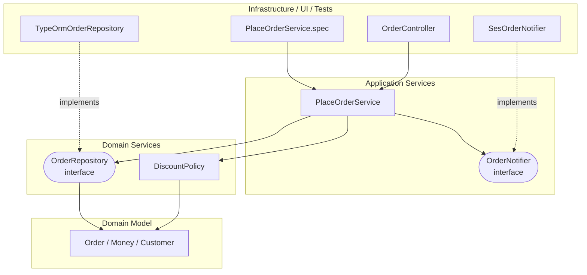

# Onion Architecture (어니언 아키텍처)

## 1. Onion Architecture란?

**Onion Architecture**는 제프리 팔레르모(Jeffrey Palermo)가 2008년 블로그 연재 글로 제안한 구조입니다. 애플리케이션을 **양파처럼 여러 겹의 동심원 계층**으로 나누고, 가장 안쪽에 **도메인 모델**을 둡니다.

```text
┌────────────────────────────────────────────────────┐
│ Infrastructure / UI / Tests                        │  ← 가장 바깥 껍질
│  ┌──────────────────────────────────────────────┐  │
│  │ Application Services                         │  │
│  │  ┌────────────────────────────────────────┐  │  │
│  │  │ Domain Services                        │  │  │
│  │  │  ┌──────────────────────────────────┐  │  │  │
│  │  │  │ Domain Model                     │  │  │  │  ← 양파의 심
│  │  │  └──────────────────────────────────┘  │  │  │
│  │  └────────────────────────────────────────┘  │  │
│  └──────────────────────────────────────────────┘  │
└────────────────────────────────────────────────────┘
          모든 의존은 바깥에서 안쪽으로
```

팔레르모가 정리한 핵심 원칙은 네 가지입니다.

1. 애플리케이션은 **독립적인 객체 모델(도메인 모델)**을 중심으로 만든다.
2. 안쪽 계층은 **인터페이스를 정의**하고, 바깥 계층은 그 **인터페이스를 구현**한다.
3. **결합(의존)은 항상 중심을 향한다.**
4. 애플리케이션 핵심(Core)은 **인프라 없이 컴파일하고 실행**할 수 있어야 한다.

## 2. 왜 등장했을까?

### 2-1. 전통적인 계층 구조의 문제

2008년 당시 .NET 진영에서 가장 흔한 구조는 [[layered-architecture|Layered Architecture]]였습니다.

```text
전통적 3계층

UI
 │
 ▼
Business Logic
 │
 ▼
Data Access ──> DB
```

팔레르모가 지적한 문제는 이것이었습니다.

> 이 구조에서 **모든 것이 데이터 접근 계층에 의존**한다. 결국 **인프라(DB)에 결합**된다.

UI는 Business에, Business는 Data Access에 의존합니다. 의존은 전이(transitive)되므로 **UI도 결국 DB에 의존**하는 셈입니다. 그래서 다음과 같은 일이 벌어집니다.

- DB 스키마를 바꾸면 비즈니스 로직이 영향을 받습니다.
- ORM을 바꾸려면 위 계층 전부를 손봐야 합니다.
- 비즈니스 로직을 테스트하려면 DB가 필요합니다.

### 2-2. 양파로 뒤집기

팔레르모는 그림을 **위아래 계층**에서 **안팎 동심원**으로 바꿨습니다. 그리고 DB를 **맨 아래(가장 기초)**에서 **맨 바깥(가장 갈아 끼우기 쉬운 것)**으로 옮겼습니다.

```text
전통적 계층                     양파
                               ┌─────────── 바깥 ───────────┐
UI                             │ UI   Infrastructure(DB)    │
Business                       │   ┌──── 안쪽 ────────┐     │
Data Access  ← 모두의 기초     │   │ Application      │     │
DB                             │   │  ┌────────────┐  │     │
                               │   │  │ Domain     │  │     │ ← 모두의 기초
                               │   │  └────────────┘  │     │
                               │   └──────────────────┘     │
                               └────────────────────────────┘
```

**DB와 UI는 같은 바깥 껍질에 있는 동급 존재**가 됩니다. 둘 다 "핵심을 사용하는 세부 사항"일 뿐입니다.

## 3. 계층별 역할

### 3-1. Domain Model (도메인 모델): 양파의 심

가장 안쪽입니다. **업무의 상태와 행동**을 담습니다. 아무것도 의존하지 않습니다.

- [[ddd-tactical-design|DDD]]의 Entity, Value Object, Aggregate가 여기에 들어갑니다.
- 프레임워크, ORM, HTTP를 전혀 모릅니다.

```typescript
// domain/model/order.ts
export class Order {
  private constructor(
    readonly id: OrderId,
    readonly customerId: CustomerId,
    private status: OrderStatus,
    private readonly lines: OrderLine[],
  ) {}

  static place(id: OrderId, customerId: CustomerId, lines: OrderLine[]): Order {
    if (lines.length === 0) throw new EmptyOrderException();
    return new Order(id, customerId, OrderStatus.PENDING, lines);
  }

  totalAmount(): Money {
    return this.lines.reduce((sum, l) => sum.add(l.amount()), Money.zero());
  }

  applyDiscount(discount: Money): void { /* ... */ }

  cancel(): void {
    if (this.status === OrderStatus.SHIPPED) {
      throw new CannotCancelShippedOrderException(this.id);
    }
    this.status = OrderStatus.CANCELLED;
  }
}
```

### 3-2. Domain Services (도메인 서비스): 도메인 규칙 + 인터페이스

두 번째 겹입니다. 두 가지가 들어갑니다.

1. **여러 도메인 객체에 걸친 업무 규칙** (DDD의 Domain Service)
2. **도메인이 바깥에 요구하는 인터페이스** (Repository 인터페이스 등)

```typescript
// domain/services/discount-policy.ts
export class DiscountPolicy {
  calculate(order: Order, customer: Customer): Money {
    return customer.isVip() ? order.totalAmount().percent(10) : Money.zero();
  }
}

// domain/services/order.repository.ts
// 인터페이스는 안쪽에서 정의한다
export interface OrderRepository {
  findById(id: OrderId): Promise<Order | null>;
  save(order: Order): Promise<void>;
  nextId(): OrderId;
}
```

> Onion Architecture의 가장 큰 특징은 **Repository 인터페이스를 도메인 쪽(안쪽 겹)에 둔다**는 점입니다. 팔레르모 원문에도 "Repository 인터페이스는 Domain Services 계층에, 구현은 Infrastructure에" 둔다고 나옵니다. 이것이 2-1의 "모든 것이 DB에 의존하는 문제"를 뒤집는 장치입니다.

### 3-3. Application Services (애플리케이션 서비스): 유스케이스

세 번째 겹입니다. **"주문하기", "주문 취소하기" 같은 작업 흐름**을 조율합니다.

- 도메인 객체를 조회하고, 도메인 규칙을 실행시키고, 저장합니다.
- 트랜잭션 경계를 정합니다.
- 외부 서비스(메일, 결제) 인터페이스를 정의하고 사용합니다.

```typescript
// application/place-order.service.ts
export class PlaceOrderService {
  constructor(
    private readonly orders: OrderRepository,
    private readonly customers: CustomerRepository,
    private readonly discountPolicy: DiscountPolicy,
    private readonly notifier: OrderNotifier, // 애플리케이션이 정의한 인터페이스
  ) {}

  async execute(command: PlaceOrderCommand): Promise<string> {
    const customer = await this.customers.findById(CustomerId.of(command.customerId));
    if (!customer) throw new CustomerNotFoundException(command.customerId);

    const order = Order.place(this.orders.nextId(), customer.id, toLines(command.lines));
    order.applyDiscount(this.discountPolicy.calculate(order, customer));

    await this.orders.save(order);
    await this.notifier.orderPlaced(order.id, customer.email);
    return order.id.value;
  }
}

// application/ports/order-notifier.ts
export interface OrderNotifier {
  orderPlaced(orderId: OrderId, email: Email): Promise<void>;
}
```

### 3-4. 바깥 껍질: Infrastructure, UI, Tests

가장 바깥입니다. 팔레르모 그림에는 세 가지가 **같은 겹에 나란히** 있습니다.

| 구성 요소 | 내용 |
|---|---|
| **Infrastructure** | Repository 구현(TypeORM), 메일 발송 구현, 외부 API 클라이언트, 파일 저장 |
| **User Interface** | Controller, GraphQL Resolver, CLI |
| **Tests** | 단위 테스트, 통합 테스트 |

**테스트가 UI, 인프라와 같은 바깥 겹에 있다**는 점이 흥미롭습니다. 테스트도 핵심을 "사용하는" 바깥 존재 중 하나라는 뜻입니다. UI가 Application Service를 호출하듯 테스트도 똑같이 호출합니다.

```typescript
// infrastructure/persistence/typeorm-order.repository.ts
@Injectable()
export class TypeOrmOrderRepository implements OrderRepository {
  constructor(
    @InjectRepository(OrderOrmEntity) private readonly repo: Repository<OrderOrmEntity>,
  ) {}

  async findById(id: OrderId): Promise<Order | null> {
    const row = await this.repo.findOne({ where: { id: id.value }, relations: { lines: true } });
    return row ? OrderMapper.toDomain(row) : null;
  }

  async save(order: Order): Promise<void> {
    await this.repo.save(OrderMapper.toOrm(order));
  }

  nextId(): OrderId {
    return OrderId.generate();
  }
}

// infrastructure/notification/ses-order-notifier.ts
@Injectable()
export class SesOrderNotifier implements OrderNotifier {
  constructor(private readonly ses: SESClient) {}

  async orderPlaced(orderId: OrderId, email: Email): Promise<void> {
    await this.ses.send(new SendEmailCommand({ /* ... */ }));
  }
}
```

## 4. 의존 방향 다이어그램



모든 화살표가 **안쪽을 향합니다**. 바깥 껍질끼리는 서로를 모릅니다. Controller는 `TypeOrmOrderRepository`가 있는지조차 모릅니다.

### 4-1. 계층 건너뛰기는 허용된다

Onion에서는 바깥 계층이 **자기보다 안쪽이면 어느 계층이든** 의존할 수 있습니다. 바로 안쪽만 써야 하는 것은 아닙니다.

```text
(O) Application Services → Domain Model     (두 겹 건너뜀, 허용)
(O) Infrastructure → Domain Model           (세 겹 건너뜀, 허용)
(X) Domain Model → Application Services     (바깥 방향, 금지)
(X) Domain Services → Infrastructure        (바깥 방향, 금지)
```

[[layered-architecture|Layered Architecture]]의 Relaxed Layering과 비슷하지만, **방향이 반대**(아래가 아니라 안쪽)라는 점이 다릅니다.

## 5. Nest.js 프로젝트 구조

```text
src/ordering/
├── domain/
│   ├── model/                         # ① Domain Model
│   │   ├── order.ts
│   │   ├── order-line.ts
│   │   ├── customer.ts
│   │   └── money.ts
│   └── services/                      # ② Domain Services
│       ├── discount-policy.ts
│       ├── order.repository.ts        # 인터페이스
│       └── customer.repository.ts     # 인터페이스
├── application/                       # ③ Application Services
│   ├── place-order.service.ts
│   ├── place-order.command.ts
│   └── ports/
│       └── order-notifier.ts          # 인터페이스
├── infrastructure/                    # ④ 바깥 껍질
│   ├── persistence/
│   │   ├── typeorm-order.repository.ts
│   │   ├── order.orm-entity.ts
│   │   └── order.mapper.ts
│   └── notification/
│       └── ses-order-notifier.ts
├── presentation/                      # ④ 바깥 껍질
│   ├── order.controller.ts
│   └── place-order.request.ts
└── ordering.module.ts                 # 조립
```

### 5-1. 조립: 바깥에서 안쪽을 끼워 맞춘다

```typescript
// ordering.module.ts
export const ORDER_REPOSITORY = Symbol('ORDER_REPOSITORY');
export const CUSTOMER_REPOSITORY = Symbol('CUSTOMER_REPOSITORY');
export const ORDER_NOTIFIER = Symbol('ORDER_NOTIFIER');

@Module({
  imports: [TypeOrmModule.forFeature([OrderOrmEntity, CustomerOrmEntity])],
  controllers: [OrderController],
  providers: [
    { provide: ORDER_REPOSITORY, useClass: TypeOrmOrderRepository },
    { provide: CUSTOMER_REPOSITORY, useClass: TypeOrmCustomerRepository },
    { provide: ORDER_NOTIFIER, useClass: SesOrderNotifier },
    DiscountPolicy,
    {
      provide: PlaceOrderService,
      useFactory: (orders, customers, policy, notifier) =>
        new PlaceOrderService(orders, customers, policy, notifier),
      inject: [ORDER_REPOSITORY, CUSTOMER_REPOSITORY, DiscountPolicy, ORDER_NOTIFIER],
    },
  ],
})
export class OrderingModule {}
```

팔레르모는 이 조립을 **IoC 컨테이너(의존성 주입 컨테이너)**가 맡는다고 설명합니다. Onion Architecture는 DI 컨테이너가 있어야 실용적으로 쓸 수 있는 구조이고, Nest.js의 모듈 시스템이 바로 그 역할을 합니다.

### 5-2. 테스트: 바깥 껍질의 하나

```typescript
// test/place-order.service.spec.ts
describe('PlaceOrderService', () => {
  it('VIP 고객은 10% 할인된 금액으로 주문된다', async () => {
    const orders = new InMemoryOrderRepository();
    const customers = new InMemoryCustomerRepository([vipCustomer('c-1')]);
    const notifier = new SpyNotifier();
    const service = new PlaceOrderService(orders, customers, new DiscountPolicy(), notifier);

    const id = await service.execute({
      customerId: 'c-1',
      lines: [{ productId: 'p-1', unitPrice: 10_000, quantity: 1 }],
    });

    expect(orders.get(id)!.totalAmount().amount).toBe(9_000);
    expect(notifier.sent).toHaveLength(1);
  });
});
```

테스트는 Controller와 똑같이 Application Service를 호출합니다. Infrastructure 대신 메모리 구현을 끼울 뿐입니다.

## 6. Onion Architecture의 특징 정리

### 6-1. 다른 구조와 다른 점

| 특징 | 설명 |
|---|---|
| **도메인 모델이 절대적 중심** | Hexagonal이 "Application Core"라는 뭉뚱그린 중심을 두는 것과 달리, Onion은 중심을 Domain Model → Domain Services → Application Services로 **잘게 나눈다** |
| **DDD와 친화적** | 계층 이름 자체가 DDD 용어(Domain Model, Domain Service, Application Service)다 |
| **Repository 인터페이스 위치를 명시** | Domain Services 겹에 둔다고 분명히 정한다 |
| **UI, Infra, Tests가 동급** | 셋 다 바깥 껍질에서 핵심을 사용하는 존재다 |
| **IoC 컨테이너를 전제** | 바깥에서 구현을 주입하는 것을 기본 메커니즘으로 삼는다 |

### 6-2. Hexagonal, Clean과의 관계

```text
           Hexagonal (2005)         Onion (2008)              Clean (2012)
           ─────────────────        ─────────────────         ─────────────────
바깥       Adapters                 Infrastructure / UI /     Frameworks & Drivers
                                    Tests                     Interface Adapters
           Ports                    (인터페이스는 안쪽 겹에)    (Port는 Use Cases 원에)
           ─────────────────        ─────────────────         ─────────────────
           Application Core         Application Services      Use Cases
                                    Domain Services           Entities
안쪽                                Domain Model
```

- [[hexagonal-architecture|Hexagonal]]은 **안과 밖의 경계**(포트와 어댑터)에 집중하고, 안쪽을 어떻게 나눌지는 말하지 않습니다.
- Onion은 Hexagonal의 아이디어를 받아들이면서 **안쪽을 DDD 개념으로 여러 겹 나눴습니다.**
- [[clean-architecture|Clean]]은 둘을 정리해 **의존성 규칙**이라는 하나의 원칙으로 일반화하고, 유스케이스와 Presenter를 명시했습니다.

세 구조 모두 **"비즈니스를 가운데, 의존은 안쪽으로, 경계는 의존성 역전으로"**라는 같은 이야기를 다른 그림으로 한 것입니다. 자세한 비교는 [[layered-vs-hexagonal-vs-onion-vs-clean]]에서 다룹니다.

## 7. 흔한 실수

| 실수 | 증상 | 해결 |
|---|---|---|
| Repository 인터페이스를 Infrastructure에 둔다 | 도메인/애플리케이션이 Infrastructure를 import 한다 | 인터페이스는 Domain Services 겹으로 옮긴다 |
| 도메인 모델에 ORM 데코레이터를 붙인다 | 심(Core)이 TypeORM에 의존한다 | ORM 엔티티를 Infrastructure에 따로 두고 Mapper로 변환한다 |
| 겹 이름만 따르고 내용은 빈약하다 | Domain Model은 데이터만, 규칙은 전부 Application Services에 | 규칙은 Domain Model과 Domain Services로 내린다 |
| Domain Services와 Application Services를 혼동한다 | 도메인 서비스에서 Repository를 호출하고 트랜잭션을 연다 | 업무 규칙은 Domain, 흐름 조율은 Application ([[ddd-tactical-design]] 4-2 참고) |
| 단순 CRUD에 적용한다 | 겹마다 비슷한 코드가 반복된다 | Layered로 충분하다 |

## 8. 장점과 단점

| 장점 | 설명 |
|---|---|
| 도메인이 보호된다 | 인프라 변경이 도메인에 영향을 주지 않는다 |
| DDD와 잘 맞는다 | 계층 이름과 역할이 DDD 개념과 1:1로 맞는다 |
| 테스트가 쉽다 | 인프라 없이 Core를 컴파일하고 실행하고 테스트할 수 있다 |
| 안쪽 구조가 명확하다 | 도메인 규칙, 도메인 서비스, 유스케이스의 위치가 분명하다 |

| 단점 | 설명 |
|---|---|
| 계층이 많다 | 작은 기능에도 여러 겹을 거친다 |
| 경계 판단이 어렵다 | Domain Service와 Application Service의 구분이 팀마다 다르다 |
| 매핑 코드가 늘어난다 | 도메인 객체와 ORM 엔티티, DTO 사이 변환이 필요하다 |
| DI 컨테이너가 필요하다 | 수동 조립은 번거롭다 (Nest.js에서는 문제 없음) |

## 9. 언제 쓰면 좋을까?

- [[ddd|DDD]]로 설계한 **복잡한 도메인**을 코드 구조에 그대로 드러내고 싶을 때
- 도메인 규칙을 Domain Model, Domain Service, Application Service로 **세밀하게 나눠 관리**해야 할 때
- 오래 유지보수할 서비스에서 **인프라(DB, 외부 API) 교체 가능성**이 있을 때

규칙이 단순하다면 [[layered-architecture|Layered]]로 충분하고, 안쪽을 굳이 여러 겹으로 나눌 필요가 없다면 [[hexagonal-architecture|Hexagonal]]이 더 가볍습니다.

## 10. 핵심 정리

> Onion Architecture는 도메인 모델을 양파의 심에 두고 Domain Services, Application Services, 그리고 Infrastructure·UI·Tests로 이루어진 바깥 껍질을 동심원으로 쌓는 구조다. 모든 의존은 중심을 향하고, 안쪽 계층이 인터페이스(특히 Repository)를 정의하면 바깥 계층이 구현한다. 전통적 계층 구조에서 DB가 모두의 기초였던 것을 뒤집어 도메인을 기초로, DB를 갈아 끼울 수 있는 바깥 부품으로 만들었다. Hexagonal의 안/밖 개념에 DDD식 안쪽 계층 구분을 더한 것이라 볼 수 있다.
