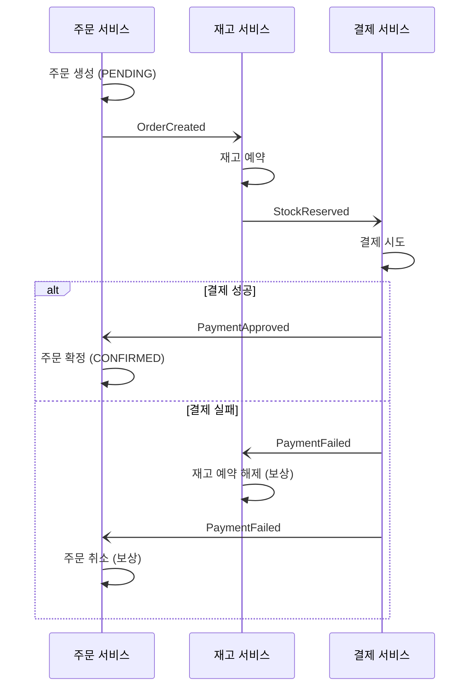
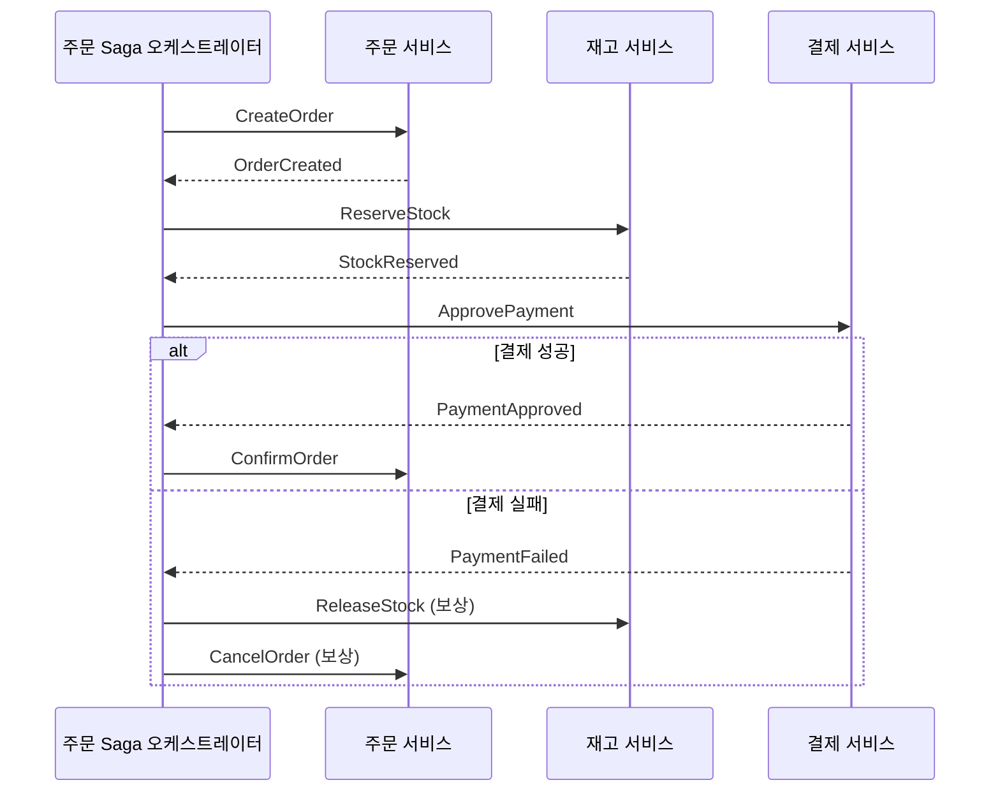
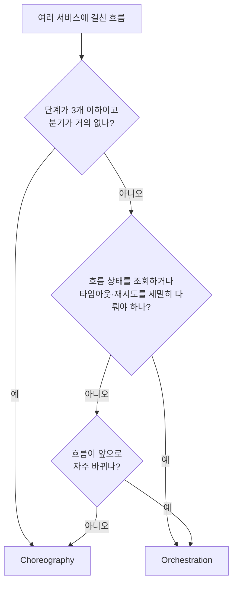
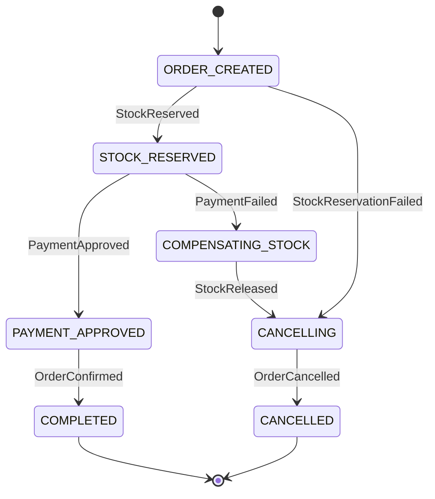

# Saga Pattern (사가 패턴)

## 1. Saga란?

**Saga**는 여러 서비스(또는 여러 Aggregate)에 걸친 하나의 업무 흐름을 각자의 로컬 트랜잭션들의 연속으로 나누고, 중간에 실패하면 이미 완료된 단계들을 "보상 트랜잭션"으로 되돌리는 패턴입니다. 1987년 헥터 가르시아-몰리나(Hector Garcia-Molina)와 케네스 세일럼(Kenneth Salem)의 논문에서 처음 소개되었습니다.

여행 예약에 비유하면 이해하기 쉽습니다.

```text
여행 예약 = 항공권 + 호텔 + 렌터카

1. 항공권 예약    ✓
2. 호텔 예약      ✓
3. 렌터카 예약    ✗ (매진)

→ 여행 전체를 포기해야 한다
→ 호텔 예약 취소 (보상)
→ 항공권 예약 취소 (보상)
```

항공사, 호텔, 렌터카 회사는 서로 다른 회사라 **하나의 트랜잭션으로 묶을 수 없습니다.** 대신 하나씩 예약하고, 실패하면 앞에서 한 것을 하나씩 취소합니다. Saga가 바로 이런 방식입니다.

## 2. 왜 필요할까?

### 2-1. 하나의 DB였다면

모놀리스에 DB가 하나라면 간단합니다.

```sql
BEGIN;
  INSERT INTO orders ...;          -- 주문 생성
  UPDATE stocks SET qty = qty - 1; -- 재고 차감
  INSERT INTO payments ...;        -- 결제 기록
COMMIT;  -- 하나라도 실패하면 전부 ROLLBACK
```

### 2-2. 서비스와 DB가 나뉘면

```text
주문 서비스 ── orders DB
재고 서비스 ── stocks DB
결제 서비스 ── payments DB + 외부 PG
```

이제 `BEGIN ... COMMIT`으로 세 DB를 묶을 수 없습니다. 같은 서비스 안이라도 [[ddd-aggregate|Aggregate 규칙]]에 따라 "한 트랜잭션에 하나의 Aggregate"를 지키면 같은 상황이 됩니다.

| 대안 | 문제 |
|---|---|
| 분산 트랜잭션 (2PC) | 모든 참여자가 지원해야 하고, 코디네이터 장애 시 전체가 락에 걸린다. 외부 PG는 참여할 수 없다 |
| 그냥 순서대로 호출 | 중간 실패 시 앞 단계가 남는다 (재고는 빠졌는데 주문은 실패) |
| **Saga** | 각자 로컬 트랜잭션으로 커밋하고, 실패 시 보상으로 되돌린다 |

## 3. 핵심 개념

### 3-1. 로컬 트랜잭션과 보상 트랜잭션

Saga의 각 단계는 **자기 서비스 안에서 완결되는 로컬 트랜잭션**입니다. 그리고 각 단계마다 **그 효과를 의미적으로 되돌리는 보상 트랜잭션(Compensating Transaction)**을 정의합니다.

| 단계 | 로컬 트랜잭션 | 보상 트랜잭션 |
|---|---|---|
| T1 | 주문 생성 (`PENDING`) | 주문 취소 (`CANCELLED`) |
| T2 | 재고 예약 | 재고 예약 해제 |
| T3 | 결제 승인 | 결제 취소 (환불) |
| T4 | 주문 확정 (`CONFIRMED`) | - (마지막 단계) |

```text
성공 흐름:   T1 ──> T2 ──> T3 ──> T4  완료

T3 실패:     T1 ──> T2 ──> T3 ✗
                    │      │
             C1 <── C2 <───┘   (완료된 것을 역순으로 보상)
```

### 3-2. 보상은 "롤백"이 아니다

DB 롤백은 **아무 일도 없었던 것처럼** 만듭니다. 보상은 **반대 효과를 내는 새로운 작업**입니다.

| 구분 | DB 롤백 | 보상 트랜잭션 |
|---|---|---|
| 기록 | 흔적이 남지 않는다 | "결제됨" 후 "환불됨"이 모두 남는다 |
| 중간 상태 | 다른 트랜잭션에 보이지 않는다 | 보인다 (재고가 잠시 줄어든 상태가 조회될 수 있다) |
| 가능 여부 | 항상 가능 | 되돌릴 수 없는 작업도 있다 (이메일 발송) |

그래서 Saga는 ACID 중 **격리성(Isolation)**이 없습니다. 이 문제는 7장에서 다룹니다.

### 3-3. 단계의 세 종류

크리스 리처드슨(Chris Richardson)은 Saga 단계를 세 가지로 나눕니다.

| 종류 | 설명 | 예 |
|---|---|---|
| **보상 가능 트랜잭션** (Compensatable) | 뒤에서 실패하면 보상으로 되돌린다 | 주문 생성, 재고 예약 |
| **피벗 트랜잭션** (Pivot) | 이 단계가 성공하면 Saga는 **반드시 끝까지 간다**. 되돌릴 수 없는 분기점 | 결제 승인 |
| **재시도 가능 트랜잭션** (Retriable) | 피벗 이후 단계. 실패하면 성공할 때까지 재시도한다 | 주문 확정, 배송 요청 |

```text
[보상 가능] ──> [보상 가능] ──> [피벗] ──> [재시도 가능] ──> [재시도 가능]
 주문 생성       재고 예약       결제 승인    주문 확정         배송 요청
 ◄──── 실패 시 보상 ────►                  ◄── 실패 시 재시도 ──►
```

**되돌리기 어려운 작업(외부 결제, 메일 발송)은 최대한 뒤로** 배치하는 것이 설계 요령입니다. 재고 예약처럼 쉽게 되돌릴 수 있는 것은 앞에 둡니다.

## 4. 두 가지 방식: Choreography vs Orchestration

[[event-driven-architecture]]에서 짧게 본 두 방식입니다.

### 4-1. Choreography (코레오그래피, 안무)

**중앙 지휘자 없이** 각 서비스가 이벤트를 듣고 스스로 다음 행동을 결정합니다.



```typescript
// inventory/application/order-events.consumer.ts
@Controller()
export class InventorySagaParticipant {
  constructor(private readonly stocks: StockService) {}

  @EventPattern('ordering.order-created.v1')
  async onOrderCreated(@Payload() e: OrderCreatedV1) {
    try {
      await this.stocks.reserve(e.data.orderId, e.data.lines); // outbox로 StockReserved 발행
    } catch (err) {
      if (err instanceof OutOfStockException) {
        await this.stocks.publishReservationFailed(e.data.orderId, err.message);
        return;
      }
      throw err; // 일시적 오류는 재시도
    }
  }

  @EventPattern('payment.payment-failed.v1')
  async onPaymentFailed(@Payload() e: PaymentFailedV1) {
    await this.stocks.release(e.data.orderId); // 보상: 멱등하게 구현
  }
}
```

| 장점 | 단점 |
|---|---|
| 단순하다. 별도 컴포넌트가 없다 | **전체 흐름이 코드 어디에도 없다.** 여러 서비스를 다 읽어야 파악된다 |
| 서비스 간 결합이 느슨하다 | 단계가 늘면 이벤트가 거미줄처럼 얽힌다 |
| 단일 장애 지점이 없다 | 순환 의존이 생기기 쉽다 (A가 B를 듣고, B가 A를 듣고) |
| | "지금 이 주문의 Saga가 어디까지 왔나?" 확인이 어렵다 |

### 4-2. Orchestration (오케스트레이션, 지휘)

**Saga 오케스트레이터**라는 중앙 컴포넌트가 각 참여자에게 **명령(Command)**을 보내고, **응답(Reply)**을 받아 다음 단계를 결정합니다.



| 장점 | 단점 |
|---|---|
| **흐름이 한 곳에 명시적으로 있다** | 오케스트레이터라는 컴포넌트가 하나 더 생긴다 |
| 현재 진행 상태를 쉽게 조회한다 | 오케스트레이터에 로직이 몰리기 쉽다 |
| 참여자는 명령만 처리하면 된다 (서로를 모른다) | 오케스트레이터가 모든 참여자를 알아야 한다 |
| 복잡한 분기, 타임아웃, 재시도를 다루기 쉽다 | |

### 4-3. 비교와 선택

| 기준 | Choreography | Orchestration |
|---|---|---|
| 단계 수 | 2~3개 | 4개 이상 |
| 흐름 가시성 | 낮음 | 높음 |
| 결합 | 이벤트로 느슨 | 오케스트레이터 ↔ 참여자 |
| 변경 용이성 | 단계 추가 시 여러 서비스 수정 | 오케스트레이터만 수정 |
| 디버깅 | 어렵다 | 상대적으로 쉽다 |
| 추천 상황 | 단순한 흐름, 독립적인 반응 | 복잡한 업무 흐름, 분기와 보상이 많을 때 |



## 5. Orchestration Saga를 Nest.js로 구현하기

### 5-1. 상태 머신으로 설계

오케스트레이터는 **상태 머신**입니다. 현재 상태와 받은 응답으로 다음 상태와 보낼 명령을 정합니다.



### 5-2. Saga 상태 저장

오케스트레이터가 죽었다 살아나도 이어서 진행해야 하므로 **상태를 DB에 저장**합니다.

```sql
CREATE TABLE order_saga (
  saga_id     UUID PRIMARY KEY,
  order_id    TEXT NOT NULL UNIQUE,
  state       TEXT NOT NULL,
  data        JSONB NOT NULL,           -- 단계 진행에 필요한 데이터 (금액, 라인 등)
  version     INT  NOT NULL DEFAULT 0,  -- 동시 응답 처리 시 낙관적 락
  updated_at  TIMESTAMPTZ NOT NULL DEFAULT now(),
  deadline_at TIMESTAMPTZ               -- 타임아웃 감지용
);
```

### 5-3. 오케스트레이터

```typescript
// ordering/saga/place-order.saga.ts
type SagaState =
  | 'ORDER_CREATED'
  | 'STOCK_RESERVED'
  | 'PAYMENT_APPROVED'
  | 'COMPENSATING_STOCK'
  | 'CANCELLING'
  | 'COMPLETED'
  | 'CANCELLED';

type Reply =
  | { type: 'StockReserved' }
  | { type: 'StockReservationFailed'; reason: string }
  | { type: 'PaymentApproved'; transactionId: string }
  | { type: 'PaymentFailed'; reason: string }
  | { type: 'StockReleased' }
  | { type: 'OrderConfirmed' }
  | { type: 'OrderCancelled' };

type Command = { target: 'inventory' | 'payment' | 'ordering'; type: string; payload: object };

// 순수 로직: 상태 + 응답 → 다음 상태 + 보낼 명령. 테스트하기 쉽다
export function transition(
  state: SagaState,
  reply: Reply,
  data: { orderId: string; amount: number; lines: object[] },
): { next: SagaState; commands: Command[] } {
  switch (state) {
    case 'ORDER_CREATED':
      if (reply.type === 'StockReserved')
        return {
          next: 'STOCK_RESERVED',
          commands: [{ target: 'payment', type: 'ApprovePayment', payload: { orderId: data.orderId, amount: data.amount } }],
        };
      if (reply.type === 'StockReservationFailed')
        return {
          next: 'CANCELLING',
          commands: [{ target: 'ordering', type: 'CancelOrder', payload: { orderId: data.orderId, reason: reply.reason } }],
        };
      break;

    case 'STOCK_RESERVED':
      if (reply.type === 'PaymentApproved')
        return {
          next: 'PAYMENT_APPROVED',
          commands: [{ target: 'ordering', type: 'ConfirmOrder', payload: { orderId: data.orderId } }],
        };
      if (reply.type === 'PaymentFailed')
        return {
          next: 'COMPENSATING_STOCK',
          commands: [{ target: 'inventory', type: 'ReleaseStock', payload: { orderId: data.orderId } }],
        };
      break;

    case 'PAYMENT_APPROVED':
      if (reply.type === 'OrderConfirmed') return { next: 'COMPLETED', commands: [] };
      break;

    case 'COMPENSATING_STOCK':
      if (reply.type === 'StockReleased')
        return {
          next: 'CANCELLING',
          commands: [{ target: 'ordering', type: 'CancelOrder', payload: { orderId: data.orderId, reason: 'PAYMENT_FAILED' } }],
        };
      break;

    case 'CANCELLING':
      if (reply.type === 'OrderCancelled') return { next: 'CANCELLED', commands: [] };
      break;
  }

  // 예상하지 못한 응답 (중복, 순서 뒤바뀜): 상태를 바꾸지 않고 무시
  return { next: state, commands: [] };
}
```

```typescript
// ordering/saga/place-order-saga.manager.ts
@Injectable()
export class PlaceOrderSagaManager {
  constructor(
    private readonly dataSource: DataSource,
    private readonly outbox: OutboxWriter,
  ) {}

  // 사가 시작: 주문 생성 직후 같은 트랜잭션에서 호출
  async start(tx: EntityManager, order: { id: string; amount: number; lines: object[] }) {
    await tx.query(
      `INSERT INTO order_saga (saga_id, order_id, state, data, deadline_at)
       VALUES ($1, $2, 'ORDER_CREATED', $3, now() + interval '10 minutes')`,
      [randomUUID(), order.id, { orderId: order.id, amount: order.amount, lines: order.lines }],
    );
    await this.outbox.append(tx, 'inventory.commands', {
      type: 'ReserveStock',
      payload: { orderId: order.id, lines: order.lines },
    });
  }

  // 참여자의 응답 처리
  async handle(orderId: string, reply: Reply) {
    await this.dataSource.transaction(async (tx) => {
      const [saga] = await tx.query(
        `SELECT * FROM order_saga WHERE order_id = $1 FOR UPDATE`,
        [orderId],
      );
      if (!saga) return;

      const { next, commands } = transition(saga.state, reply, saga.data);
      if (next === saga.state) return; // 중복/무관한 응답

      await tx.query(
        `UPDATE order_saga SET state = $2, version = version + 1, updated_at = now() WHERE order_id = $1`,
        [orderId, next],
      );
      for (const cmd of commands) {
        // 상태 변경과 명령 발행을 같은 트랜잭션으로 → Transactional Outbox
        await this.outbox.append(tx, `${cmd.target}.commands`, cmd);
      }
    });
  }
}
```

```typescript
// ordering/saga/saga-replies.consumer.ts
@Controller()
export class SagaRepliesConsumer {
  constructor(private readonly saga: PlaceOrderSagaManager) {}

  @EventPattern('order-saga.replies')
  async onReply(@Payload() msg: { orderId: string; reply: Reply }) {
    await this.saga.handle(msg.orderId, msg.reply);
  }
}
```

핵심 포인트는 다음과 같습니다.

- **상태 전이 로직(`transition`)은 순수 함수**로 분리해 단위 테스트합니다.
- **Saga 상태 변경과 다음 명령 발행은 같은 트랜잭션**입니다. 이를 위해 [[transactional-outbox]]를 씁니다. 그렇지 않으면 상태는 바뀌었는데 명령이 안 나가 Saga가 멈춥니다.
- 예상하지 못한 응답은 **무시**합니다. 메시지는 중복되거나 늦게 올 수 있습니다.

### 5-4. 순수 함수 테스트

```typescript
describe('PlaceOrder saga transition', () => {
  const data = { orderId: 'o-1', amount: 30_000, lines: [] };

  it('결제 실패 시 재고 해제 명령을 보낸다', () => {
    const r = transition('STOCK_RESERVED', { type: 'PaymentFailed', reason: 'DECLINED' }, data);
    expect(r.next).toBe('COMPENSATING_STOCK');
    expect(r.commands).toEqual([
      { target: 'inventory', type: 'ReleaseStock', payload: { orderId: 'o-1' } },
    ]);
  });

  it('이미 완료된 사가에 늦게 온 응답은 무시한다', () => {
    const r = transition('COMPLETED', { type: 'StockReserved' }, data);
    expect(r.next).toBe('COMPLETED');
    expect(r.commands).toHaveLength(0);
  });
});
```

### 5-5. 타임아웃 처리

참여자가 응답하지 않으면 Saga가 영원히 멈춥니다. 마감 시간을 넘긴 Saga를 주기적으로 찾아 처리합니다.

```typescript
@Cron('*/30 * * * * *') // 30초마다
async handleTimeouts() {
  const stuck = await this.dataSource.query(
    `SELECT order_id, state FROM order_saga
      WHERE deadline_at < now() AND state NOT IN ('COMPLETED', 'CANCELLED')`,
  );
  for (const s of stuck) {
    // 상태에 따라: 보상 시작, 명령 재발행, 또는 사람에게 알림
    await this.alertOrCompensate(s);
  }
}
```

> 직접 구현이 부담스럽다면 **Temporal**, **AWS Step Functions** 같은 워크플로 엔진을 오케스트레이터로 쓰는 방법도 있습니다. 상태 저장, 재시도, 타임아웃, 진행 상황 조회를 엔진이 대신 해 줍니다.

## 6. 참여자 설계 원칙

Saga에 참여하는 서비스(재고, 결제 등)가 지켜야 할 원칙입니다.

| 원칙 | 이유 | 방법 |
|---|---|---|
| **멱등성** | 같은 명령이 여러 번 올 수 있다 | 명령 ID 또는 `orderId`로 중복 확인 |
| **보상도 멱등** | 보상 명령도 중복될 수 있다 | "이미 해제됨"이면 성공으로 응답 |
| **보상은 실패하면 안 된다** | 보상이 실패하면 시스템이 어정쩡한 상태로 남는다 | 성공할 때까지 재시도, 최후에는 사람이 개입 |
| **순서 뒤바뀜 대비** | 예약 명령보다 해제 명령이 먼저 올 수 있다 | "해제됨" 기록을 남겨, 나중에 온 예약 명령을 거절 |
| **응답을 반드시 보낸다** | 응답이 없으면 Saga가 멈춘다 | 실패도 명시적으로 응답 |

```typescript
// 재고 서비스: 멱등한 예약과 해제
async reserve(orderId: string, lines: Line[]) {
  const existing = await this.reservations.findByOrderId(orderId);
  if (existing?.status === 'RESERVED') return this.replyReserved(orderId);   // 중복 명령
  if (existing?.status === 'RELEASED') return this.replyFailed(orderId, 'ALREADY_CANCELLED'); // 해제가 먼저 옴
  // ... 실제 예약
}

async release(orderId: string) {
  const existing = await this.reservations.findByOrderId(orderId);
  if (!existing) {
    // 예약이 아직 안 왔는데 해제가 먼저 왔다 → 해제 기록을 남겨 이후 예약을 막는다
    await this.reservations.markReleased(orderId);
    return this.replyReleased(orderId);
  }
  if (existing.status === 'RELEASED') return this.replyReleased(orderId); // 중복
  // ... 실제 해제
}
```

## 7. 격리성 부족 문제와 대응

Saga는 각 단계가 바로 커밋되므로, **진행 중인 Saga의 중간 상태가 다른 요청에 보입니다.**

| 이상 현상 | 예 |
|---|---|
| **Lost Update** | Saga A가 주문을 확정하는 사이 Saga B가 같은 주문을 취소한다 |
| **Dirty Read** | 재고 예약 후 결제 실패로 곧 해제될 재고를, 다른 사용자가 "품절"로 본다 |
| **Fuzzy Read** | 같은 Saga 안에서 두 번 읽은 값이 다르다 |

대응 방법(Countermeasures)은 다음과 같습니다.

| 대응 | 설명 | 예 |
|---|---|---|
| **Semantic Lock** | 진행 중임을 나타내는 상태로 다른 작업을 막는다 | 주문 상태 `PENDING` 동안은 취소 요청을 대기시키거나 거절 |
| **Commutative Update** | 순서와 무관하게 같은 결과가 나오는 연산으로 설계 | 잔액을 덮어쓰지 않고 증감 기록으로 처리 |
| **Pessimistic View** | 위험한 단계를 뒤로 미룬다 | 실제 재고 차감은 결제 성공 후에, 앞에서는 "예약"만 |
| **Reread Value** | 갱신 전에 다시 읽어 바뀌었는지 확인 | 낙관적 락 (버전 비교) |
| **Version File** | 받은 명령을 기록해 순서를 재정렬 | 6장의 "해제가 먼저 온 경우" 기록 |

가장 많이 쓰는 것은 **Semantic Lock**입니다. 주문을 바로 `CONFIRMED`로 만들지 않고 `PENDING`으로 만들어 두는 이유가 이것입니다. 화면에도 "주문 처리 중"을 보여줍니다.

## 8. 보상할 수 없는 작업 다루기

| 작업 | 문제 | 대처 |
|---|---|---|
| 이메일/푸시 발송 | 보낸 메일은 회수할 수 없다 | Saga가 **완료된 후에** 발송한다 |
| 외부 결제 승인 | 환불은 가능하지만 수수료, 고객 경험 문제 | 결제를 **피벗**으로 두고 그 뒤는 재시도만 |
| 외부 배송사 접수 | 취소 API가 없을 수 있다 | 마지막 단계로 두고, 실패 시 사람이 처리 |
| 포인트 사용 | 되돌릴 수는 있지만 고객이 이미 봤다 | "보류" 상태로 차감하고 완료 시 확정 |

## 9. 장점과 단점

| 장점 | 설명 |
|---|---|
| 서비스 독립성 유지 | 각자 자기 DB와 로컬 트랜잭션만 쓴다 |
| 분산 락이 없다 | 2PC처럼 긴 락을 잡지 않아 처리량이 좋다 |
| 장애 내성 | 참여자가 잠시 죽어도 복구 후 이어서 진행한다 |
| 외부 시스템 포함 가능 | PG, 배송사처럼 트랜잭션에 참여할 수 없는 곳도 흐름에 넣는다 |

| 단점 | 설명 |
|---|---|
| 복잡하다 | 모든 단계에 보상 로직, 멱등 처리, 타임아웃이 필요하다 |
| 격리성이 없다 | 중간 상태가 보이고, 이를 막는 설계가 필요하다 |
| 결과적 일관성 | 완료까지 시간이 걸린다. 사용자에게 "처리 중"을 보여줘야 한다 |
| 디버깅이 어렵다 | 흐름이 여러 서비스에 흩어진다 (특히 Choreography) |
| 보상 실패 | 보상까지 실패하면 수동 개입이 필요하다 |

## 10. 언제 쓰면 좋을까?

- 하나의 업무 흐름이 **여러 서비스(DB)에 걸쳐** 있고, 실패 시 **앞 단계를 되돌려야** 한다
- **외부 시스템**(결제, 배송, 예약)이 흐름에 포함되어 있다
- 마이크로서비스, 또는 Aggregate를 엄격히 나눈 모놀리스

**쓰지 않는 게 나은 경우**
- 모든 데이터가 **하나의 DB**에 있고 한 트랜잭션으로 묶을 수 있다 → 그냥 DB 트랜잭션을 쓴다
- 실패해도 되돌릴 필요가 없는 부가 작업 (알림, 통계) → 단순 이벤트 구독으로 충분하다
- 즉시 일관성이 반드시 필요하다 → 서비스 경계를 다시 검토한다 ([[ddd-strategic-design]])

> "Saga가 너무 많이 필요하다"는 것은 **서비스 경계가 잘못 나뉘었다는 신호**일 수 있습니다. 항상 함께 바뀌어야 하는 것들이 다른 서비스에 흩어져 있지 않은지 먼저 확인하세요.

## 11. 핵심 정리

> Saga는 여러 서비스에 걸친 업무 흐름을 각자의 로컬 트랜잭션 연속으로 나누고, 중간에 실패하면 완료된 단계를 역순으로 보상 트랜잭션을 실행해 되돌리는 패턴이다. 이벤트로 각 서비스가 스스로 다음 단계를 잇는 Choreography와, 중앙 오케스트레이터가 명령과 응답으로 흐름을 지휘하는 Orchestration이 있으며, 단계가 많고 복잡할수록 Orchestration이 유리하다. 되돌리기 어려운 작업은 피벗 이후로 미루고, 모든 참여자는 멱등하게, 상태 변경과 메시지 발행은 Outbox로 함께 처리하며, 격리성 부족은 PENDING 같은 Semantic Lock으로 보완한다.
