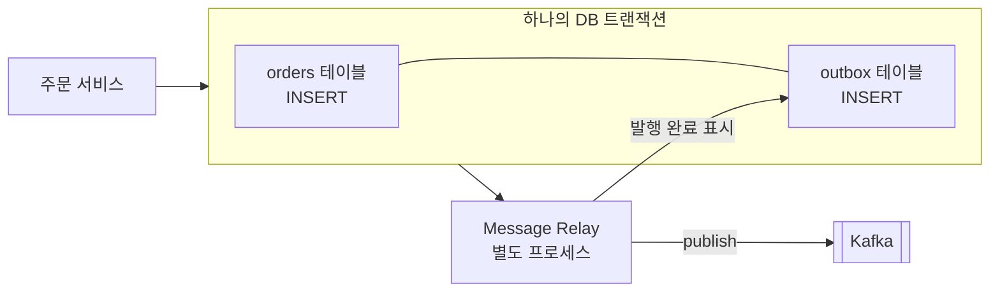
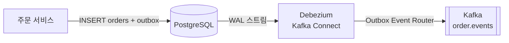

# Transactional Outbox (트랜잭셔널 아웃박스)

## 1. Transactional Outbox란?

**Transactional Outbox**는 DB에 데이터를 저장하는 일과 메시지 브로커에 이벤트를 발행하는 일을 확실하게 함께 처리하기 위해, 이벤트를 먼저 같은 DB의 "보낼 편지함(outbox) 테이블"에 같은 트랜잭션으로 저장해 두고 별도의 프로세스가 그 테이블을 읽어 브로커로 보내는 패턴입니다.

회사 우편 시스템에 비유하면 이렇습니다.

```text
직원이 직접 우체국에 가는 방식         사내 발송함을 쓰는 방식
──────────────────────────             ──────────────────────────
1. 서류 작성 완료                       1. 서류 작성 + 발송함에 편지 넣기 (한 번에)
2. 우체국으로 출발                      2. 우편 담당자가 주기적으로 발송함을 비우며
   (가는 길에 일이 생기면                  우체국에 보낸다
    편지는 영영 안 간다)                   (담당자가 아파도 편지는 발송함에 남아 있다)
```

## 2. 해결하려는 문제: Dual Write

[[event-driven-architecture]]에서 본 것처럼, 주문을 저장하고 이벤트를 발행하는 코드는 보통 이렇게 생깁니다.

```typescript
async placeOrder(cmd: PlaceOrderCommand) {
  const order = Order.place(cmd);
  await this.orderRepo.save(order);                     // ① DB
  await this.kafka.emit('ordering.events', event);      // ② 브로커
}
```

**서로 다른 두 시스템(DB, 브로커)에 쓰는 것**을 **Dual Write(이중 쓰기)**라고 합니다. 두 시스템을 하나의 트랜잭션으로 묶을 수 없기 때문에, 중간에 문제가 생기면 둘이 어긋납니다.

| 상황 | 결과 |
|---|---|
| ① 성공 → 서버 다운 → ② 실행 안 됨 | 주문은 있는데 이벤트가 없다. **배송, 포인트가 영원히 처리되지 않는다** |
| ① 성공 → ② 브로커 장애로 실패 | 위와 같다 |
| ② 먼저 실행 → ① 실패 (롤백) | 없는 주문에 대한 이벤트가 나간다. **유령 배송** |
| 트랜잭션 안에서 ② 실행 → 커밋 실패 | 위와 같다 |

```mermaid
sequenceDiagram
    participant S as 주문 서비스
    participant DB as PostgreSQL
    participant K as Kafka

    S->>DB: BEGIN; INSERT order; COMMIT
    DB-->>S: OK
    Note over S: 여기서 프로세스 종료
    S--xK: emit(OrderPlaced) 실행되지 않음
    Note over DB,K: DB에는 주문이 있지만<br/>아무도 그 사실을 모른다
```

"재시도하면 되지 않나?"라고 생각할 수 있지만, 프로세스가 죽으면 재시도할 주체도 사라집니다. **분산 트랜잭션(2PC)**으로 묶는 방법도 있지만, Kafka 같은 대부분의 브로커는 이를 지원하지 않고, 지원하더라도 느리고 복잡합니다.

## 3. 해결 방법: 같은 DB에 함께 쓴다

핵심 아이디어는 단순합니다.

> **DB 하나에 대한 쓰기는 트랜잭션으로 원자성을 보장할 수 있다.** 그러니 이벤트도 일단 같은 DB에 쓰자.



| 단계 | 하는 일 | 보장 |
|---|---|---|
| 1. 저장 | 비즈니스 데이터와 outbox 레코드를 **같은 트랜잭션**으로 저장한다 | 둘 다 저장되거나, 둘 다 저장되지 않는다 |
| 2. 릴레이 | 별도 프로세스(Message Relay)가 outbox를 읽어 브로커로 보낸다 | 서버가 죽어도 outbox에 남아 있어 언젠가 발행된다 |
| 3. 완료 표시 | 발행에 성공하면 outbox 레코드를 완료 처리하거나 삭제한다 | 같은 이벤트를 계속 보내지 않는다 |

## 4. Outbox 테이블 설계

```sql
CREATE TABLE outbox (
  id             UUID        PRIMARY KEY,          -- 이벤트 ID (소비자 멱등 처리에 사용)
  aggregate_type TEXT        NOT NULL,             -- 'Order'
  aggregate_id   TEXT        NOT NULL,             -- '1001' → Kafka 파티션 키
  type           TEXT        NOT NULL,             -- 'ordering.order-placed.v1'
  payload        JSONB       NOT NULL,             -- 이벤트 본문
  headers        JSONB       NOT NULL DEFAULT '{}',-- correlationId 등
  created_at     TIMESTAMPTZ NOT NULL DEFAULT now(),
  published_at   TIMESTAMPTZ                       -- NULL이면 아직 발행 안 됨
);

-- 미발행 이벤트만 빠르게 찾기 위한 부분 인덱스
CREATE INDEX outbox_unpublished_idx ON outbox (created_at) WHERE published_at IS NULL;
```

| 컬럼 | 이유 |
|---|---|
| `id` | 소비자가 중복을 걸러낼 때 쓰는 고유 키 |
| `aggregate_id` | 같은 Aggregate의 이벤트를 같은 파티션으로 보내 **순서 보장** |
| `type` | 소비자가 이벤트 종류를 구분한다 |
| `published_at` | 발행 여부. 삭제 대신 표시만 하면 감사 기록이 된다 |

## 5. Nest.js로 구현하기

### 5-1. 저장: 같은 트랜잭션에 outbox 레코드 추가

```typescript
// shared/outbox/outbox.entity.ts
@Entity('outbox')
export class OutboxEntity {
  @PrimaryColumn('uuid') id: string;
  @Column() aggregateType: string;
  @Column() aggregateId: string;
  @Column() type: string;
  @Column('jsonb') payload: object;
  @Column('jsonb', { default: {} }) headers: object;
  @CreateDateColumn() createdAt: Date;
  @Column({ type: 'timestamptz', nullable: true }) publishedAt: Date | null;
}
```

```typescript
// ordering/application/place-order.handler.ts
@CommandHandler(PlaceOrderCommand)
export class PlaceOrderHandler implements ICommandHandler<PlaceOrderCommand> {
  constructor(private readonly dataSource: DataSource) {}

  async execute(cmd: PlaceOrderCommand): Promise<string> {
    const order = Order.place(OrderId.generate(), CustomerId.of(cmd.customerId), cmd.lines);

    await this.dataSource.transaction(async (tx) => {
      // ① 비즈니스 데이터
      await tx.getRepository(OrderOrmEntity).save(OrderMapper.toOrm(order));

      // ② 같은 트랜잭션에 outbox 레코드
      const events = order.pullEvents().map((e) => toIntegrationEvent(e));
      await tx.getRepository(OutboxEntity).insert(
        events.map((e) => ({
          id: e.eventId,
          aggregateType: 'Order',
          aggregateId: order.id.value,
          type: e.type,
          payload: e.data,
          headers: { correlationId: cmd.correlationId },
        })),
      );
    }); // 커밋: 둘 다 저장되거나 둘 다 롤백된다

    return order.id.value;
  }
}
```

반복되는 부분은 Repository나 Unit of Work 안으로 숨길 수 있습니다.

```typescript
// Repository가 Aggregate 저장과 outbox 기록을 함께 처리한다
async save(order: Order): Promise<void> {
  await this.dataSource.transaction(async (tx) => {
    await tx.getRepository(OrderOrmEntity).save(OrderMapper.toOrm(order));
    await this.outbox.append(tx, 'Order', order.id.value, order.pullEvents());
  });
}
```

### 5-2. 릴레이: Polling Publisher

가장 단순한 릴레이는 **주기적으로 outbox 테이블을 조회해서 보내는** 방식입니다.

```typescript
// shared/outbox/outbox-relay.ts
@Injectable()
export class OutboxRelay {
  private readonly logger = new Logger(OutboxRelay.name);

  constructor(
    private readonly dataSource: DataSource,
    @Inject('KAFKA') private readonly kafka: ClientKafka,
  ) {}

  @Interval(500) // @nestjs/schedule
  async relay() {
    await this.dataSource.transaction(async (tx) => {
      // FOR UPDATE SKIP LOCKED: 릴레이 인스턴스가 여러 개여도 같은 행을 동시에 집지 않는다
      const rows: OutboxEntity[] = await tx.query(
        `SELECT * FROM outbox
          WHERE published_at IS NULL
          ORDER BY created_at
          LIMIT 100
          FOR UPDATE SKIP LOCKED`,
      );

      for (const row of rows) {
        try {
          await lastValueFrom(
            this.kafka.emit(`${row.aggregate_type.toLowerCase()}.events`, {
              key: row.aggregate_id, // 같은 주문 → 같은 파티션 → 순서 보장
              value: JSON.stringify({
                eventId: row.id,
                type: row.type,
                occurredAt: row.created_at,
                data: row.payload,
              }),
              headers: row.headers,
            }),
          );
          await tx.query(`UPDATE outbox SET published_at = now() WHERE id = $1`, [row.id]);
        } catch (err) {
          this.logger.error(`outbox ${row.id} 발행 실패, 다음 주기에 재시도`, err);
          break; // 같은 Aggregate의 뒤 이벤트가 먼저 나가지 않도록 이번 배치는 멈춘다
        }
      }
    });
  }
}
```

### 5-3. 꼭 알아둘 점: 중복 발행은 피할 수 없다

```text
1. Kafka 발행 성공
2. UPDATE outbox SET published_at = now() 직전에 릴레이 다운
3. 재시작 후 같은 행을 다시 읽음 → 같은 이벤트를 한 번 더 발행
```

Outbox는 **"최소 한 번(at-least-once)"** 발행을 보장할 뿐, "정확히 한 번"은 보장하지 않습니다. 그래서 **소비자는 반드시 멱등하게** 만들어야 합니다. outbox의 `id`를 이벤트 ID로 넘기는 이유가 이것입니다.

```typescript
// 소비자: 이벤트 ID로 중복 처리 방지 (Inbox 패턴)
await tx.query(
  `INSERT INTO inbox (event_id) VALUES ($1) ON CONFLICT DO NOTHING RETURNING event_id`,
  [event.eventId],
);
```

소비자 쪽에서 처리한 이벤트 ID를 기록하는 테이블을 **Inbox**라고 부르기도 합니다. Outbox(보내는 쪽)와 짝을 이룹니다.

| 쪽 | 패턴 | 보장 |
|---|---|---|
| 발행 | Outbox | 저장된 것은 **반드시 한 번 이상** 나간다 |
| 소비 | Inbox (멱등 소비자) | 같은 것을 **여러 번 받아도 한 번만** 처리한다 |
| 합치면 | | **결과적으로 정확히 한 번 처리한 효과** |

## 6. 릴레이의 두 가지 방식

### 6-1. Polling Publisher

5-2에서 본 방식입니다. 주기적으로 `SELECT ... WHERE published_at IS NULL`을 실행합니다.

| 장점 | 단점 |
|---|---|
| 구현이 단순하다 | 폴링 주기만큼 지연이 생긴다 |
| 추가 인프라가 필요 없다 | 빈 테이블도 계속 조회하므로 DB 부하가 있다 |
| 이해하고 디버깅하기 쉽다 | 처리량이 아주 많으면 한계가 있다 |

### 6-2. Transaction Log Tailing (CDC)

DB의 **트랜잭션 로그**(PostgreSQL WAL, MySQL binlog)를 읽어서 outbox 테이블에 INSERT 된 행을 감지하고 브로커로 보냅니다. 이것을 **CDC(Change Data Capture)**라고 하며, 대표 도구는 **Debezium**입니다.



| 장점 | 단점 |
|---|---|
| 지연이 매우 짧다 (거의 실시간) | Kafka Connect, Debezium 운영이 필요하다 |
| DB 폴링 부하가 없다 | DB 설정(논리 복제 슬롯 등) 권한이 필요하다 |
| 커밋 순서대로 정확히 읽는다 | 장애 시 복제 슬롯이 WAL을 붙잡아 디스크가 찰 수 있다 |
| 애플리케이션 코드에 릴레이가 없다 | 학습 비용이 있다 |

Debezium은 outbox 테이블 전용 변환기(**Outbox Event Router**)를 제공합니다. `aggregate_type`으로 토픽을, `aggregate_id`로 파티션 키를 정해 줍니다.

### 6-3. 어떤 것을 고를까?

| 상황 | 추천 |
|---|---|
| 처음 도입, 이벤트가 초당 수백 건 이하 | Polling |
| 초당 수천 건 이상, 지연에 민감 | CDC (Debezium) |
| Kafka Connect를 이미 운영 중 | CDC |
| 인프라를 늘리기 어렵다 | Polling |

## 7. 운영 시 고려할 점

| 항목 | 설명 | 방법 |
|---|---|---|
| **테이블 정리** | outbox가 계속 쌓이면 느려진다 | 발행된 행을 주기적으로 삭제하거나 파티션 단위로 정리 |
| **순서** | 실패한 이벤트를 건너뛰면 순서가 뒤집힌다 | 같은 Aggregate는 실패 시 뒤 이벤트를 보내지 않는다 |
| **독성 메시지** | 계속 실패하는 레코드가 뒤를 막는다 | 재시도 횟수 컬럼, 한도 초과 시 별도 테이블로 격리하고 알림 |
| **모니터링** | 릴레이가 멈춰도 쓰기는 정상이라 늦게 발견된다 | "가장 오래된 미발행 이벤트의 나이"를 지표로 알림 |
| **여러 인스턴스** | 릴레이가 여러 개면 같은 행을 중복 처리한다 | `FOR UPDATE SKIP LOCKED` 또는 리더 선출 |

```sql
-- 모니터링: 가장 오래된 미발행 이벤트가 몇 초 전에 생겼나
SELECT EXTRACT(EPOCH FROM now() - MIN(created_at)) AS oldest_unpublished_seconds
  FROM outbox WHERE published_at IS NULL;

-- 정리: 7일 지난 발행 완료 이벤트 삭제
DELETE FROM outbox WHERE published_at < now() - interval '7 days';
```

## 8. 다른 방법과 비교

| 방법 | 원자성 | 복잡도 | 비고 |
|---|---|---|---|
| 그냥 순서대로 쓰기 | 보장 안 됨 | 낮음 | 가끔 이벤트가 사라져도 되는 경우만 |
| 분산 트랜잭션 (2PC/XA) | 보장 | 매우 높음 | 대부분 브로커가 미지원, 느림 |
| **Transactional Outbox** | 보장 (at-least-once) | 중간 | **표준 해법** |
| [[event-sourcing\|Event Sourcing]] | 보장 | 높음 | 이벤트 저장소 자체가 outbox 역할을 한다 |
| CDC로 비즈니스 테이블 직접 감시 | 보장 | 중간 | 테이블 구조가 곧 외부 계약이 되는 단점 |

> 비즈니스 테이블(`orders`)을 CDC로 바로 내보내면 컬럼 이름 하나 바꾸는 것도 다른 팀 서비스를 깨뜨립니다. outbox에 **의도적으로 설계한 이벤트**를 쓰고 그것만 내보내는 편이 안전합니다.

## 9. 언제 쓰면 좋을까?

- DB 저장과 이벤트 발행이 **반드시 함께 일어나야** 하는 모든 경우
- 이벤트가 유실되면 **돈, 재고, 배송처럼 업무에 실제 피해**가 생기는 경우
- [[saga-pattern|Saga]]처럼 이벤트가 다음 단계를 이어가는 흐름 (하나라도 유실되면 흐름이 멈춘다)
- [[cqrs|CQRS]] 3단계에서 읽기 모델을 이벤트로 갱신하는 경우

반대로 같은 프로세스 안의 메모리 이벤트(`@nestjs/event-emitter`)로 충분하고, 유실되어도 큰 문제가 없는 부가 작업(캐시 무효화, 통계 집계 등)이라면 굳이 필요하지 않습니다.

## 10. 핵심 정리

> Transactional Outbox는 DB 저장과 이벤트 발행을 하나의 트랜잭션으로 묶을 수 없는 Dual Write 문제를 푸는 패턴이다. 비즈니스 데이터와 이벤트를 같은 DB의 outbox 테이블에 하나의 트랜잭션으로 저장하고, 별도의 릴레이(Polling 또는 CDC)가 outbox를 읽어 브로커로 발행한다. 이렇게 하면 저장된 이벤트는 반드시 한 번 이상 발행되지만 중복 발행은 생길 수 있으므로, 소비자는 이벤트 ID로 멱등하게 처리해야 한다(Inbox). Aggregate ID를 파티션 키로 써서 순서를 지키고, 미발행 이벤트의 나이를 모니터링한다.
